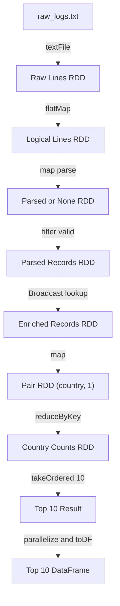

# 1. Low-Level APIs: RDDs and Shared Variables

## 1.1. RDD Fundamentals

### 1.1.1. Definition and Core Characteristics

A Resilient Distributed Dataset (RDD) is one of the core distributed data
structures in Apache Spark. An RDD contains a collection of records divided
into partitions, which can be processed in parallel by Spark executors. Unlike
a DataFrame, an RDD is a low-level API that gives developers direct control
over record-level transformations and partition-level operations.

An RDD has three main characteristics:

- **Distributed:** Data is divided into partitions that can be processed
  concurrently across multiple executors.
- **Immutable:** An existing RDD cannot be modified in place. Each
  transformation creates a new RDD.
- **Resilient:** If a partition is lost, Spark can reconstruct it from the RDD
  lineage instead of maintaining a complete replica of every intermediate
  dataset.

An RDD can be created from an external data source, such as
`SparkContext.textFile()`, or derived from another RDD through transformations.
In Task 1, the raw access log is loaded as a Text RDD so that parsing,
validation, enrichment, and aggregation can be performed with Spark's
Low-Level API.

### 1.1.2. Immutability and Lineage

RDDs are immutable. Transformations such as `map()`, `flatMap()`, `filter()`,
and `reduceByKey()` do not modify their input RDD. Instead, each operation
creates a new RDD. This design makes distributed processing more predictable
because concurrent tasks do not update the same shared dataset.

Whenever a new RDD is created, Spark records its dependencies on the source
RDDs. This dependency chain is called the **lineage graph**. The lineage shows
where the data originated and which transformations were applied. It therefore
serves both as a description of the RDD processing pipeline and as the basis
for fault recovery.

### 1.1.3. Lazy Evaluation, Transformations, and Actions

Spark evaluates RDD operations lazily. Declaring a transformation only adds an
operation to the lineage; it does not immediately process the data. Execution
begins when the application invokes an action that requires a result.

Task 1 uses the following operation groups:

- **Transformations:** `flatMap()`, `map()`, `filter()`, and `reduceByKey()`
  create new RDDs from existing RDDs. Operations such as `map()` and `filter()`
  are narrow transformations because each output partition depends on a small
  number of input partitions. `reduceByKey()` causes a shuffle because values
  with the same key must be brought together for aggregation. However, it
  performs local combining within each partition before the shuffle, reducing
  network traffic compared with `groupByKey()` for counting operations.
- **Actions:** `count()` is used to materialize a cached RDD, while
  `takeOrdered(10)` executes the lineage and returns at most ten results to the
  Driver for the final DataFrame conversion.

When an Accumulator is used to count malformed log records, the parsed and
filtered RDD should be cached and materialized once before multiple downstream
actions are executed. Without caching, Spark may recompute the lineage and
apply the same Accumulator update more than once if a task is evaluated again.

### 1.1.4. Fault Tolerance

RDD fault tolerance is based on lineage. If an executor failure causes a
partition to be lost, Spark follows the recorded dependencies and reruns only
the transformations required to reconstruct that partition from the original
data source or a parent RDD. Spark therefore does not need to replicate every
intermediate dataset solely for recovery.

Caching or persistence can reduce recomputation costs for an RDD that is used
repeatedly, but neither mechanism replaces lineage. If a cached partition is
lost, Spark can still reconstruct it from the recorded dependency chain.

### 1.1.5. RDD and DataFrame Comparison

| Criterion | RDD | DataFrame |
|---|---|---|
| Data model | Distributed collection of objects; no schema is required | Tabular data with named columns and a defined schema |
| Abstraction level | Low-level API for direct record and partition operations | High-level API based on columns and relational expressions |
| Automatic optimization | Spark has limited structural information for optimization | Catalyst Optimizer improves logical and physical query plans |
| Execution | Performance depends heavily on transformation and partition design | Tungsten improves memory representation and execution efficiency |
| Processing control | Supports custom logic and fine-grained partition operations | Best suited to standard filtering, joins, aggregation, and SQL |
| Typical use cases | Unstructured logs, custom formats, and low-level algorithms | Structured data, analytical queries, and conventional ETL pipelines |

The appropriate API depends on the structure of the data and the required
level of control:

- **Use RDDs** for unstructured log parsing, custom data formats, or
  fine-grained partition manipulation. Task 1 uses RDDs because its input is a
  raw access log and the assignment explicitly requires Low-Level API
  transformations.
- **Use DataFrames** when the data has a clear schema and the workload mainly
  consists of filtering, joins, aggregation, or SQL queries. In these cases,
  Catalyst and Tungsten allow Spark to optimize the execution automatically.

In Task 1, a DataFrame is created only after parsing, enrichment, aggregation,
and Top 10 selection have been completed. This design preserves the required
RDD processing flow while providing a structured final result with the columns
`country` and `access_count`.

### 1.1.6. RDD Pipeline for Task 1

#### Processing Flow

The pipeline is organized as follows:

1. Read the access log with `SparkContext.textFile()`.
2. Normalize and parse each log entry with `flatMap()` and `map()`.
3. Remove invalid records with `filter()`.
4. Enrich each valid record with a country code through a Broadcast Variable.
5. Convert the enriched records into Pair RDD entries of `(country, 1)`.
6. Aggregate access counts by country with `reduceByKey()`.
7. Select the ten countries with the highest access counts by using
   `takeOrdered(10)`.
8. Convert the final small result set into a DataFrame with the columns
   `country` and `access_count`.

The following code is a condensed extract from the functions implemented in
`rdd_processing.py`. The `enriched_rdd` variable represents the integration
point between the RDD parser and the Broadcast enrichment described in the
Shared Variables section.

```python
raw_rdd = spark_context.textFile(input_path)
logical_lines_rdd = raw_rdd.flatMap(_expand_text_record)
parsed_or_none_rdd = logical_lines_rdd.map(
    lambda line: _parse_with_counter(line, invalid_log_counter)
)
parsed_rdd = parsed_or_none_rdd.filter(lambda record: record is not None)

# Broadcast enrichment integration point:
# parsed_rdd -> IP-to-Country lookup -> enriched_rdd
records_with_country = enriched_rdd.filter(
    lambda record: bool(record.get("country"))
)
country_pairs = records_with_country.map(lambda record: (record["country"], 1))
country_counts_rdd = country_pairs.reduceByKey(add)

top_ten = country_counts_rdd.takeOrdered(
    10, key=lambda item: (-item[1], item[0])
)
top10_dataframe = spark.sparkContext.parallelize(top_ten).toDF(
    ["country", "access_count"]
)
```

The corresponding API sequence is:

```text
textFile
-> flatMap
-> map (parse)
-> filter (valid records)
-> Broadcast enrichment
-> Pair RDD (country, 1)
-> reduceByKey
-> Top 10
-> toDF
```

#### RDD Lineage Graph

Figure 1 illustrates the dependencies between the RDDs in Task 1. The
DataFrame does not participate in the Low-Level API processing stage; it is
created only after the Top 10 result has been returned to the Driver.



**Figure 1. RDD lineage for the Task 1 log-processing pipeline.**
