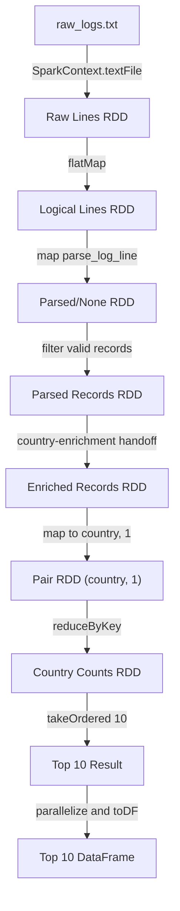
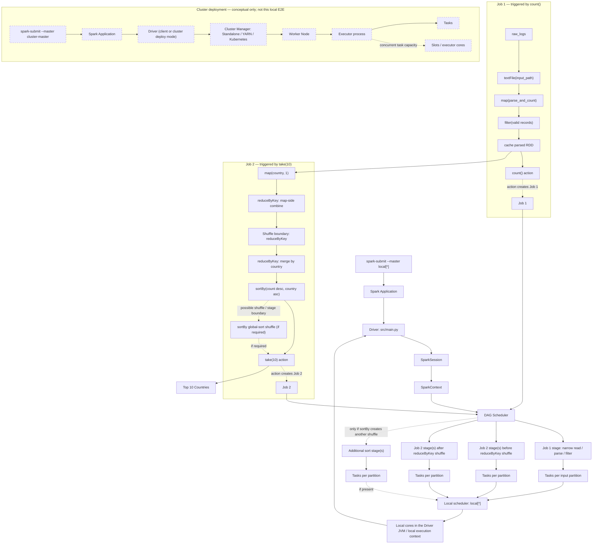
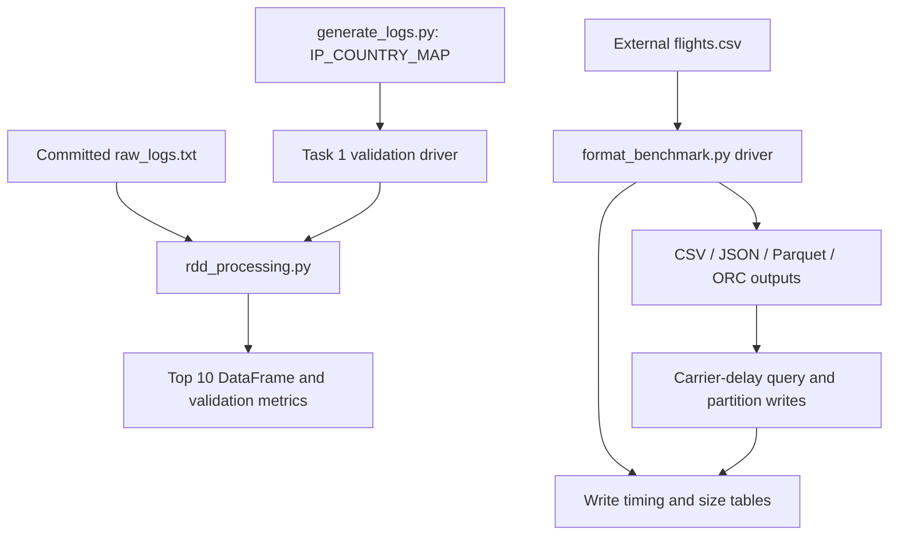
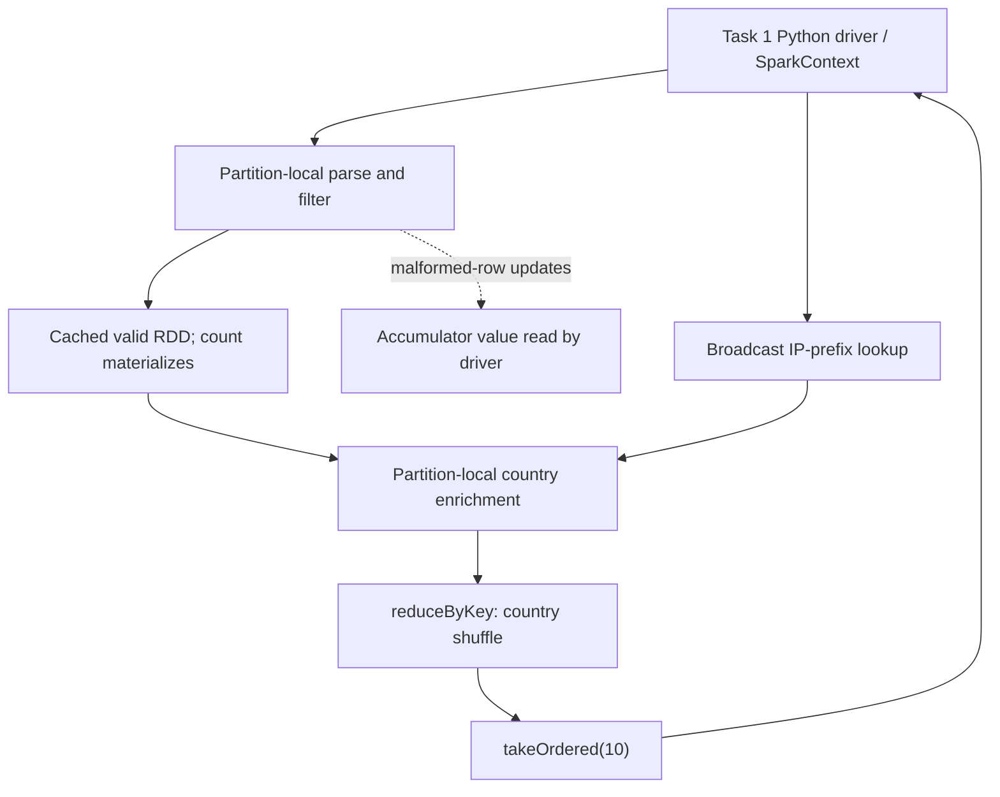
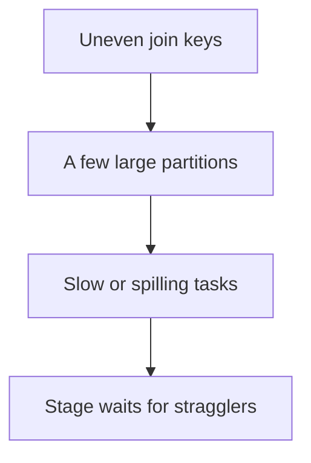

# Big Data Project Report

> **Project:** Low-level RDD Processing, File-format Benchmarking and Spark Deployment<br>
> **Team:** Group 3<br>
> **Last updated:** 2026-10-09


<!-- Source header retained from REPORT (4).md:
> **Project:** Low-level RDD Processing, File-format Benchmarking and Spark Deployment  
> **Team:** [Update team name]  
> **Last updated:** 9 October 2026 — code descriptions, notebook figures and analysis synchronized with the selected P0 results 
> **P0 update to Section 4.2:** 9 October 2026 — source-machine validation evidence recorded
-->

## Table of Contents

1. [Project Overview](#1-project-overview)
2. [RDD Processing and Shared Variables](#2-rdd-processing-and-shared-variables)
3. [Spark Architecture and Deployment](#3-spark-architecture-and-deployment)
4. [File Formats and Partition Benchmark](#4-file-formats-and-partition-benchmark)
5. [Debugging and Performance Optimisation](#5-debugging-and-performance-optimisation)
6. [Results and Conclusion](#6-results-and-conclusion)
7. [References](#7-references)
8. [Appendix A — Presentation Cheat-Sheet](#appendix-a--presentation-cheat-sheet)
9. [Appendix B — Report and Repository Checklist](#appendix-b--report-and-repository-checklist)

## 1. Project Overview

### 1.1 Objective

This project implements and evaluates three complementary Apache Spark tasks.
Task 1 uses the low-level RDD API to parse web access logs, reject malformed
records, enrich valid records with a country lookup, aggregate access counts,
and produce a deterministic Top 10. Task 2 benchmarks CSV, JSON, Parquet, and
ORC write/read behaviour and evaluates partition control with `repartition`,
`coalesce`, and `partitionBy`. Task 3 packages the application for reproducible
execution through `spark-submit`, including separate Task 1 and Task 2 entry
paths and an optional live Spark UI observation period.

The two inputs are the committed, reproducible Task 1 sample
`data/raw_logs.txt` and the locally downloaded Task 2 dataset
`data/raw/airline/flights.csv`. Principal outputs are the Task 1 country summary
and the generated Task 2 format, read, and partition benchmark results.


<!-- Team lead: define problem, input, expected output and scope. -->

### 1.2 Repository Structure and Reproducibility

From a clean clone, the Python dependency is installed from
`requirements.txt`; Task 1 can then run immediately against the versioned log
sample. Task 2 requires an explicit download of the public flight dataset
before the benchmark is launched. Both tasks are dispatched by `src/main.py`
and can be submitted through `submit_job.sh`.

The large airline dataset and generated benchmark output directories are local
runtime data and are not committed. Source code, the report, operational
documentation, and the verified Task 2 benchmark table/chart artefacts remain
in the repository so that the workflow, evidence, and presentation material
can be reviewed independently of those large files.


<!-- Describe how to run from a clean clone. -->

### 1.3 Team Responsibilities and Integration Workflow

<!-- Missing content supplied by REPORT_COMPLETE_EN.md; original source wording retained. -->

The README assigns ownership by workstream and report section:

| Owner | Main responsibility | Expected handoff |
|---|---|---|
| ID1 | Core RDD parser, filtering, Pair RDD aggregation and RDD theory | `src/rdd_processing.py`; report Sections 2.1–2.2 |
| ID2 | Synthetic input, broadcast lookup and malformed-record accumulator | `src/generate_logs.py`, `data/raw_logs.txt`; Section 2.3 |
| ID3 | Format theory, output sizes and write benchmark | `src/format_benchmark.py`, benchmark tables; Sections 4.1–4.2 |
| ID4 | Read query and partition experiments | Read/partition code and results; Section 4.3 |
| ID5 | Spark architecture and deployment packaging | Entry point, shared helpers, submission script and architecture; Section 3 |
| ID6 — Gia Minh | Git review/merge, report editing and debugging/performance analysis | README, repository governance, merged report and Section 5 |
| ID7 | Clean-clone QA, presentation and live demo | QA record, slides, demo script and backup evidence |

The Phase 1 integration contract requires ID1 and ID2 to agree on the log
schema before connecting the broadcast and accumulator. Task 1 must ultimately
print both Top 10 Countries and the invalid-log count. The format benchmark has
a separate ID3-to-ID4 handoff: one canonical schema, a locked measurement
protocol, and one frozen write-result set are shared across the write, read and
report stages.

Contributors work on their assigned feature/documentation branches, update
from `main`, and submit pull requests with changed files, run commands, expected
output and limitations. The README assigns review/merge responsibility to ID6
and prohibits direct pushes to `main`. Small sample input and reproducibility
metadata are committed; large benchmark datasets, generated format outputs,
Spark runtime directories and sensitive credentials are excluded from the
intended repository contents.

### 1.4 Report Scope and Acceptance Criteria

<!-- Missing content supplied by REPORT_COMPLETE_EN.md; original source wording retained. -->

Sections 2–5 explain the RDD/shared-variable implementation, Spark architecture
and deployment, format/partition experiments, and debugging. Section 6 combines
the measured results and implementation limitations; Section 7 records the
technical and project sources. Appendices retain the presentation material and
repository checklist from the merged source reports.

The intended acceptance criteria are a reproducible Top 10 pipeline with the
malformed-record count, comparable format measurements from one canonical
dataset, recorded partition/file-size effects, an executable submission package,
and QA/demo evidence. Availability of code, historical execution records and
completion of planned deliverables are assessed separately. In particular, the
README defines the target organization, while the ZIP determines which files
are available for this review.

**Project evidence:** archived `README.md`, `src/generate_logs.py`,
`src/rdd_processing.py`, `src/format_benchmark.py`,
`scripts/validate_task1_pipeline.py`, and the ID1/ID3 handoff documents; see
Section 7, especially references 17–20.

## 2. RDD Processing and Shared Variables

### 2.1 RDD Fundamentals

A **Resilient Distributed Dataset (RDD)** is Spark's low-level abstraction for
a collection of records distributed across partitions and processed in parallel.
RDDs are immutable: an operation does not update an existing RDD, but creates a
new one. They are also resilient because Spark records how each RDD depends on
its predecessors. This dependency history, or **lineage**, allows Spark to
recompute a lost partition from its source and the required transformations
without maintaining a full replica of every intermediate dataset.
Unlike replication-based fault tolerance, which stores redundant data copies
in advance, lineage reconstructs only missing partitions when recovery is
needed. This reduces the need for full replication of intermediate RDDs, at the
cost of recomputation after a failure.

RDD transformations are evaluated lazily. Calls such as `flatMap()`, `map()`,
`filter()`, and `reduceByKey()` first extend the lineage and the associated
directed acyclic graph (DAG); computation begins only when an action requires a
result. In Task 1, `reduceByKey()` is also a transformation, but it introduces a
shuffle boundary because values with the same key may reside in different
partitions. The relevant actions are `count()` and `takeOrdered(10)`. In
particular, `count()` materialises the cached parsed RDD so that every partition
is evaluated before the malformed-record accumulator is inspected. This makes
the accumulator useful for validation while avoiding normal downstream lineage
re-evaluation; the detailed accumulator limitations are discussed in Section
2.3.

Lineage is the basis of RDD fault tolerance. If an executor loses a partition,
Spark can reconstruct only the missing data by replaying its dependencies.
Caching or persistence can reduce the cost of repeated computation, but it does
not replace lineage: a lost cached partition is still recovered from the
recorded transformations.

| Criterion | RDD | DataFrame |
|---|---|---|
| Data model | Distributed collection of records without a required schema | Tabular data with named columns and a schema |
| Abstraction level | Low-level record and partition API | High-level relational API |
| Optimisation | Limited automatic optimisation because record semantics are opaque to Spark | Logical and physical plans are optimised by Spark's query engine |
| Control | Fine-grained control over custom transformations and partition-level processing | Declarative control through column expressions, SQL, joins, and aggregations |
| Typical use cases | Unstructured input, custom parsers, and low-level algorithms | Structured ETL, analytical queries, and schema-based processing |

At code level, the RDD path expresses the key-value mechanics explicitly,
whereas the equivalent DataFrame path declares a relational aggregation:

```python
rdd_counts = enriched_rdd.map(lambda row: (row["country"], 1)).reduceByKey(add)
df_counts = enriched_df.groupBy("country").count()
```

Task 1 deliberately uses RDDs because `data/raw_logs.txt` contains raw web
access-log text that requires custom parsing, and the assignment explicitly
requires Spark's Low-Level API. A DataFrame is introduced only after the RDD
pipeline has produced the small, structured Top 10 result.

The verified `local[*]` execution exercises the same lazy transformations,
actions, shuffle, broadcast, and accumulator APIs, but all components share one
machine. It therefore does not reproduce cluster-network costs, executor-host
failures, or multi-node scheduling behaviour. Caching reduces repeated work in
either mode; it does not replace lineage-based recovery.


<!-- Owner: ID1. RDD definition, immutability, lineage, lazy evaluation,
transformations vs actions, fault tolerance and RDD vs DataFrame comparison. -->

### 2.2 Core RDD Pipeline

Task 1 processes `data/raw_logs.txt`, a generated Common/Combined Log Format
dataset containing 10,000 records: 9,000 valid records and 1,000 malformed
records. Its conceptual flow is:

`raw_logs.txt` -> `SparkContext.textFile()` -> `flatMap()` ->
`map(parse_log_line)` -> `filter(valid records)` -> Pair RDD ->
`reduceByKey()` -> Top 10.

`SparkContext.textFile()` loads the file as an RDD whose elements are raw text
records. `flatMap(_expand_text_record)` then normalises each raw record into one
or more logical lines before parsing; for the generated one-record-per-line
input, it preserves one logical line per record. The following `map()` invokes
`parse_log_line` through `_parse_with_counter`. The parser validates the IPv4
address, overall log/request layout, numeric HTTP status in the valid range,
and the request method, endpoint, and HTTP version. It extracts the bracketed
timestamp text but does not validate its calendar semantics. A valid line
becomes a `LogRecord` dictionary with `ip`, `timestamp`, `method`, `endpoint`,
and `status_code`; malformed input becomes `None`. The subsequent `filter()`
removes these `None` values, leaving only parsed records.

After the downstream country-enrichment handoff described in Section 2.3, each
enriched record is mapped to the Pair RDD entry `(country, 1)`. This is the
integration point for the shared-variable step rather than an implementation of
that step in the ID1.3 pipeline. `reduceByKey(add)` combines entries with the
same country into `(country, access_count)`. Equal keys must be grouped across
partitions, so this transformation causes a shuffle; its map-side local
combining reduces the amount of data transferred over the network.

Finally, `takeOrdered(10, key=lambda item: (-item[1], item[0]))` returns the ten
countries with the highest access counts, using country name as a deterministic
tie-breaker. Only this small result is parallelised and converted to a DataFrame
with the columns `country` and `access_count`.


```mermaid
flowchart TD
    A[raw_logs.txt] -->|SparkContext.textFile| B[Raw Lines RDD]
    B -->|flatMap| C[Logical Lines RDD]
    C -->|map parse_log_line| D[Parsed/None RDD]
    D -->|filter valid records| E[Parsed Records RDD]
    E -->|country-enrichment handoff| F[Enriched Records RDD]
    F -->|map to country, 1| G["Pair RDD (country, 1)"]
    G -->|reduceByKey| H[Country Counts RDD]
    H -->|takeOrdered 10| I[Top 10 Result]
    I -->|parallelize and toDF| J[Top 10 DataFrame]
```

**Figure 1. RDD lineage for the Task 1 log-processing pipeline.**

The following concise excerpt from `src/rdd_processing.py` shows the core
operations across the parsing, aggregation, and result-conversion functions:

```python
def build_parsed_rdd(
    spark_context: Any,
    input_path: str,
    invalid_log_counter: Any = None,
    cache_result: bool = False,
):
    raw_rdd = spark_context.textFile(input_path)
    logical_lines_rdd = raw_rdd.flatMap(_expand_text_record)
    parsed_or_none_rdd = logical_lines_rdd.map(
        lambda line: _parse_with_counter(line, invalid_log_counter)
    )
    parsed_rdd = parsed_or_none_rdd.filter(lambda record: record is not None)

    if cache_result:
        parsed_rdd.cache()
        parsed_rdd.count()

    return parsed_rdd


def aggregate_country_access(enriched_rdd: Any):
    records_with_country = enriched_rdd.filter(
        lambda record: bool(record.get("country"))
    )
    country_pairs = records_with_country.map(
        lambda record: (record["country"], 1)
    )
    return country_pairs.reduceByKey(add)


def to_top10_dataframe(country_counts_rdd: Any, spark: Any):
    top_ten = country_counts_rdd.takeOrdered(
        10, key=lambda item: (-item[1], item[0])
    )
    if not top_ten:
        return spark.createDataFrame([], "country string, access_count long")

    return spark.sparkContext.parallelize(top_ten).toDF(
        ["country", "access_count"]
    )
```


<!-- Owner: ID1. textFile -> parse -> filter -> Pair RDD -> reduceByKey -> Top 10. -->

### 2.3 Broadcast Variables and Accumulators

When Spark executes a transformation, the function passed to it (for example the
lambda inside `map()`) is serialised and shipped to **every task** on the
executors. Any variable the function references is copied along with it. This
creates two problems: a large read-only variable is re-sent many times over, and
any change an executor makes to its copy never travels back to the driver.

**Shared variables** are the mechanism Spark provides for exactly these two
problems. Spark offers two kinds, serving opposite directions of data flow:

| Kind | Direction | Property | Purpose |
|---|---|---|---|
| Broadcast variable | Driver → Executor | Read-only | Distribute shared lookup data |
| Accumulator | Executor → Driver | Add-only | Aggregate statistics during execution |

#### 2.3.1 Broadcast Variable

A **broadcast variable** is a read-only value distributed from the driver and
cached for reuse by executor tasks, instead of being serialised with every task
closure. Application code creates one with `sc.broadcast(value)` and reads it
through `.value`; executors must not use it as mutable shared state.

Spark's `TorrentBroadcast` implementation divides a broadcast into blocks and
can distribute those blocks with peer-assisted, BitTorrent-like fetching. This
describes the available distribution mechanism, not a guarantee that every
executor communicates directly with another executor in every run.

In this project, a broadcast variable carries the `ip_country_map` lookup table,
which maps an IPv4 `/24` prefix to a country name. Every record needs this table
during the enrichment step, so without broadcasting it would be serialised again
for each task:

```python
# Driver
ip_country_broadcast = sc.broadcast(IP_COUNTRY_MAP)

# Executor
def enrich_with_country(record):
    prefix = record["ip"].rsplit(".", 1)[0]
    record["country"] = ip_country_broadcast.value.get(prefix)
    return record

enriched_rdd = parsed_rdd.map(enrich_with_country)
```

A concrete illustration: suppose a job has 200 tasks and the lookup table is
10 MB. Without broadcasting, Spark transfers `200 × 10 MB = 2 GB` over the
network. With broadcasting, it transfers 10 MB to each executor — 100 MB across
10 executors, roughly a twenty-fold reduction.

A broadcast variable is **immutable**. If the source data changes after
broadcasting, the distributed copy does not update itself; the variable must be
released with `unpersist()` or `destroy()` and a new one broadcast in its place.

**When not to use a broadcast variable:**

1. **The data is too large for executor memory.** A broadcast variable must fit
   entirely in the memory of *every* executor. A table of several gigabytes will
   trigger `OutOfMemoryError` or push executors into a garbage-collection loop.
   For large data, a shuffle join lets Spark partition the work instead.
2. **The data is trivially small.** For a single constant or a list of a few
   elements, the bookkeeping cost of a broadcast variable outweighs the benefit;
   letting Spark serialise it with the closure is enough.
3. **The data is used once, or changes constantly.** Broadcasting pays off
   through repeated reuse. If the value is consulted only once, or must be
   destroyed and rebuilt every few operations, the distribution cost is never
   recovered.
4. **The data must be written to from executors.** Broadcast variables are
   read-only; mutating `.value` on an executor changes only that local copy.
   That requirement belongs to an accumulator.

#### 2.3.2 Accumulator

An **accumulator** is an add-only variable that lets executors send figures back
to the driver. The driver creates one with `sc.accumulator(0)`; each task keeps a
local copy and calls `.add()` on it; when a task **completes**, Spark sends its
local contribution to the driver and merges it into the running total.

Only the driver may read `.value`. Reading `.value` on an executor raises an
error, because at that point only the local value of the currently running task
exists, not the global total.

In this project, an accumulator counts malformed log records without a second
pass over the data and without stopping the job:

```python
# Driver
invalid_log_counter = sc.accumulator(0)

# Executor
def parse_with_counter(line):
    record = parse_log_line(line)
    if record is None:
        invalid_log_counter.add(1)
    return record

parsed_rdd = raw_rdd.map(parse_with_counter).filter(lambda r: r is not None)
parsed_rdd.cache()
parsed_rdd.count()                  # action that materialises the whole dataset

print(invalid_log_counter.value)    # driver only, and only after an action
```

Because Spark evaluates lazily, `invalid_log_counter.value` is **meaningful only
after an action has run**. Reading it beforehand always returns 0 — not because
there are no malformed records, but because the lineage has not been executed at
all.

#### 2.3.3 Limitation: accumulators are not exactly-once

The guarantee Spark offers depends on where `.add()` is called:

| Location of `.add()` | Spark's guarantee |
|---|---|
| Inside an **action** (for example `foreach`) | **Exactly-once** — Spark discards updates from retried tasks |
| Inside a **transformation** (for example `map`) | **No guarantee** — the count may be inflated or short |

Within a transformation, three situations distort the count:

1. **A task fails and is retried.** If a task dies partway through, Spark
   reschedules that partition. The contribution of the failed attempt may or may
   not already have been merged, which can double-count.
2. **Speculative execution.** With `spark.speculation=true`, Spark launches a
   duplicate of a slow task. Both copies add to the accumulator even though only
   one result is used.
3. **Lineage recomputation (the most common cause).** An RDD does not retain its
   results. If an uncached RDD feeds two actions, Spark replays the whole lineage
   for the second one, and the `map` containing `.add()` runs again from the
   start — doubling the count.

**The mitigation used in this project** is to cache the parsed and filtered RDD,
then materialise it exactly once with a single action before any downstream
action runs:

```python
parsed_rdd.cache()     # or .persist()
parsed_rdd.count()     # materialises the whole dataset exactly once
```

`count()` is preferred over `collect()`, which pulls the entire dataset to the
driver and risks exhausting driver memory, and over `take(n)`, which reads only
enough elements to satisfy `n` and therefore leaves the remaining partitions
unvisited, producing an undercount.

Even with caching, this remains risk reduction rather than a guarantee: it does
**not** make an accumulator exactly-once. If a cached partition is lost, Spark
rebuilds it from the lineage and the count drifts again. Accumulators are
therefore suited to observability and debugging figures, and should **not** be
treated as the source of truth for a business result. Where an exact number is
required, derive it from a deterministic transformation over the cached RDD —
for example `raw_rdd.count() - parsed_rdd.count()`.

#### 2.3.4 Classification of malformed records

The generator `src/generate_logs.py` produces `data/raw_logs.txt` with 90% valid
records and 10% malformed ones. The malformed 10% is split evenly across **four
error types**, which are precisely the cases where `parse_log_line()` returns
`None` and the accumulator counts.

The four types are checked **in the priority order below, stopping at the first
match**, so every malformed record belongs to exactly one type:

| # | Error type | Condition | Example |
|---|---|---|---|
| 1 | **Missing field** | Fewer fields parsed than the schema requires | `10.10.1.7 - - [22/Sep/2026:08:15:03 +0700] "GET /cart HTTP/1.1" 200` (no `bytes`) |
| 2 | **Malformed IPv4** | All fields present, but the IP field is not valid IPv4 | `999.12.44 - - [...] "GET / HTTP/1.1" 200 1234` |
| 3 | **Non-numeric status code** | All fields present, IP valid, status does not parse as an integer | `10.20.1.9 - - [...] "GET / HTTP/1.1" OK 1234` |
| 4 | **Malformed request** | All fields present, IP and status valid, but the method, endpoint or HTTP version is structurally wrong | `10.30.1.4 - - [...] "GET-only" 200 1234` |

The priority order is essential because one record can violate several
conditions at once. A line that both omits the `bytes` field and carries a bad
IP is classified as type 1, not type 2 — until the fields have been separated,
nothing can be concluded about the contents of any individual field. Because of
this rule, the four type counts always sum to exactly the number of malformed
records, with no record counted twice.

#### 2.3.5 Verification results

The 10,000-line `data/raw_logs.txt` contract and country totals were rechecked
directly against the repository parser and lookup table. The current automated
test run uses Python 3.11.9, PySpark 3.5.6, `local[1]`, and OpenJDK 8:

| Measure | Result |
|---|---|
| Valid records | 9,000 (90.00%) |
| `invalid_log_counter.value` | 1,000 (10.00%) |
| Count after three further downstream actions | still 1,000 — no double counting |
| Records resolved to a country by the broadcast lookup | 9,000 of 9,000, across 14 countries |
| Sum of values from `reduceByKey(country)` | 9,000 = the number of valid records |
| Valid plus malformed | 9,000 + 1,000 = 10,000 = total input lines |


<!-- Owner: ID2. ip_country_map broadcast, invalid_log_counter and retry caveat. -->

### 2.4 Task 1 Result

The Task 1 pipeline was validated end to end against the 10,000-record
synthetic access-log dataset. The validation covered log parsing, malformed-row
filtering, Broadcast IP-to-Country enrichment, Pair RDD aggregation,
`takeOrdered(10)`, and the final DataFrame conversion.

Parsing produced 9,000 valid records and safely rejected 1,000 malformed
records without terminating the Spark job. After materialization,
`invalid_log_counter` reported 1,000 and remained stable across repeated actions
on the cached parsed RDD.

The Broadcast map enriched all 9,000 valid records, leaving no record without a
country. This map-side lookup did not require a distributed join. The enriched
records were then mapped to `(country, 1)` pairs and aggregated with
`reduceByKey()` into `(country, access_count)` results for 14 countries. The
aggregated counts preserved all 9,000 valid records.

#### Validation Summary

| Metric | Result |
|---|---:|
| Total input records | 10,000 |
| Valid parsed records | 9,000 |
| Malformed records | 1,000 |
| Enriched records | 9,000 |
| Records without country | 0 |
| Distinct countries | 14 |
| Aggregated access count | 9,000 |
| Top 10 rows | 10 |
| Unit tests | 10/10 PASS |
| Accumulator stability | YES |

#### Top 10 Countries by Access Count

| Rank | Country | Access Count |
|------|---------|-------------:|
| 1 | Vietnam | 1967 |
| 2 | United States | 1676 |
| 3 | Japan | 1059 |
| 4 | Singapore | 780 |
| 5 | Germany | 617 |
| 6 | India | 575 |
| 7 | South Korea | 505 |
| 8 | Brazil | 428 |
| 9 | Australia | 357 |
| 10 | France | 322 |

Broadcast enrichment and the Pair RDD `reduceByKey()` aggregation operated
correctly and preserved all 9,000 valid records. The final Top 10 result was
converted to a DataFrame with the `country` and `access_count` columns. Task 1
end-to-end validation: **PASS**.


<!-- Insert final Top 10 Countries result, invalid-record count and screenshot. -->

## 3. Spark Architecture and Deployment

### 3.1 Spark Application Architecture

<!-- Owner: ID5. Driver, Cluster Manager, Worker, Executor, Job, Stage and Task. -->


<!-- Missing content supplied by REPORT_COMPLETE_EN.md; original source wording retained. -->

**Reading this section:** Sections 3.1.1–3.1.6 below preserve the earlier
architecture source, including its separate deployment implementation claims.
The ZIP's current RDD module uses `flatMap` and `takeOrdered(10)`; it does not
contain `process_log_file()`, `parse_and_count()`, or the reported `sortBy`/`take`
pipeline. Section 3.1.7 provides the repository-verified architecture and should
be used when explaining this supplied snapshot. No entry-point files absent
from the ZIP are treated as verified implementation.

<!-- Source content: REPORT (1).md -->

In this project, `spark-submit` launches the application and selects the deployment master; the `Driver` creates the `SparkSession`/`SparkContext` and coordinates the RDD pipeline. The actual flow is `textFile -> map(parse_and_count) -> filter -> cache -> count() -> map(country, 1) -> reduceByKey -> sortBy -> take(top_n)`. `count()` and `take()` are separate actions, so they create separate jobs. `sortBy` orders the counts in descending order, then countries in ascending order when counts are equal.

#### 3.1.1 Driver, SparkSession / SparkContext, and This Application

`main.py` is the application's entry point. During execution, the application creates a `SparkSession` (and indirectly a `SparkContext`) through `utils.py`, then calls `process_log_file()` in `src/rdd_processing.py`. `SparkSession` coordinates the Spark application at the high level; beneath it, `SparkContext` is the lowest-level object used to create RDDs, register jobs, and coordinate tasks. The Driver is the process responsible for building the DAG, dividing work into stages, dispatching tasks, and collecting results.

In this project, the Driver performs the following operations:

- initialize the `SparkSession`; the deployment master is selected through `spark-submit --master` and is not overridden by application code;
- read `data/raw_logs.txt` into an `RDD[String]` through `sc.textFile(...)`;
- parse each line using `map(parse_and_count)`;
- retain valid records using `filter(lambda r: r is not None)`;
- cache the parsed/filtered RDD, then run `count()` to materialize it before downstream actions;
- convert valid records into `(country, 1)` pairs, aggregate them with `reduceByKey`, then apply `sortBy(lambda item: (-item[1], item[0]))`;
- use `take(top_n)` to display the Top N.

RDD transformations are lazy. `count()` is the first action: it traverses the parsed RDD and materializes the cache. `take(top_n)` is the second action: it reads the cached parsed RDD and triggers aggregation and sorting. `parse_and_count` increments the accumulator when the parser returns an invalid record; `count()` counts only valid records and is not the source of the invalid-record count.

#### 3.1.2 Cluster Manager, Worker Node, Executor

In the standard Spark architecture:

- The `Cluster Manager` is the resource-allocation layer: Standalone, YARN, or Kubernetes.
- A `Worker Node` is a machine/container allocated to the application by the Cluster Manager.
- An `Executor` is a process running on a Worker Node, responsible for executing tasks and caching reusable data.

In the project's local demo, `spark-submit --master local[*]` runs the local scheduler within the Driver JVM; there are no separate Cluster Manager, Worker Node, or Executor processes as in cluster deployment. Worker/Executor roles are described as part of the general cluster architecture. The discussion of YARN/Standalone/Kubernetes provides general deployment knowledge and does not confirm that the project has run on those clusters.

#### 3.1.3 Job, Stage, Task, DAG, and RDD Lineage

An RDD is an immutable, distributed data abstraction constructed through lineage. Each transformation does not immediately produce results. In the code, the job triggered by `count()` executes `textFile -> map/parse -> filter invalid -> cache`; the job triggered by `take(top_n)` then continues from the cached parsed RDD: `map(country, 1) -> reduceByKey -> sortBy -> take(top_n)`. The Driver represents these dependencies as a DAG (Directed Acyclic Graph).

- A `Job` is an execution unit triggered by an action. In the repository, both `count()` and `take()` create jobs. A job is divided into multiple `Stage` units.
- A `Stage` is a set of tasks that can run in parallel without requiring a shuffle.
- A `Task` is the smallest processing unit for an RDD partition, and each task runs on an Executor.
- A `Slot` describes the capacity to run tasks concurrently, typically associated with the number of cores allocated to an Executor; it is a capacity concept, not a separate Spark process.

A key point is that not every transformation creates a new stage. `map` and `filter` have narrow dependencies. `reduceByKey` is a wide transformation and creates a shuffle boundary to group records for the same country. `sortBy` orders records by the key `(-count, country)` and may also require a shuffle for global sorting. The DAG Scheduler divides stages at shuffle boundaries; a fixed stage count should not be inferred from the conceptual diagram alone.

#### 3.1.4 Job → Stage → Task → Executor Relationships in the Actual Project

The repository's data flow can be described as follows:

- `sc.textFile(input_path)` creates an RDD of log lines.
- `map(parse_and_count)` and `filter(...)` process data within each partition. These are narrow transformations.
- `count()` is the first action and creates Job 1. This job executes `textFile -> map(parse_and_count) -> filter -> cache`; `count()` counts valid records to materialize the cache. The invalid-record count is updated separately by the accumulator inside `parse_and_count`.
- After Job 1, `take(top_n)` is the second action and creates Job 2. This job starts from the cached parsed RDD, then executes `map(country, 1) -> reduceByKey -> sortBy -> take`.
- `reduceByKey` shuffles by the `country` key, creating a boundary between stages. `sortBy` orders counts in descending order/countries in ascending order and may introduce another shuffle for global sorting. Tasks are created according to partitions and executed by the scheduler/mode in use.

In other words, a `Job` is associated with an action; `Stage` boundaries follow dependencies and shuffles; a `Task` performs work on each partition; and an `Executor` is where tasks run.

#### 3.1.5 How the Driver Coordinates Execution

The Driver performs 3 main operations:

1. Build the plan: use RDD lineage and the action to construct the execution DAG.
2. Divide the work into stages: use narrow versus wide dependencies; partitions within the same stage can be processed in parallel.
3. Dispatch tasks: distribute each task to an Executor on a suitable Worker, then collect the results and return the output.

In cluster mode, the Driver sends closures and tasks to Executors on Worker Nodes. In `local[*]`, the local scheduler runs tasks within the same JVM as the Driver using local cores; there are no Executors on independent Worker Nodes.

#### 3.1.6 Runtime architecture: local RDD jobs and stage split

The diagram below combines Spark Application startup, the two actions/jobs of
the RDD pipeline, stages/shuffles, and task execution in `local[*]`. The cluster
branch is shown separately and is conceptual only; the project has not tested
cluster deployment.


```mermaid
flowchart TD
    Submit["spark-submit --master local[*]"] --> Application["Spark Application"]
    Application --> Driver["Driver: src/main.py"]
    Driver --> Session["SparkSession"]
    Session --> Context["SparkContext"]
    Context --> Scheduler["DAG Scheduler"]

    subgraph Job1["Job 1 — triggered by count()"]
        Raw["raw_logs"] --> TextFile["textFile(input_path)"]
        TextFile --> Parse["map(parse_and_count)"]
        Parse --> Filter["filter(valid records)"]
        Filter --> Cache["cache parsed RDD"]
        Cache --> Count["count() action"]
        Count -. "action creates Job 1" .-> CountJob["Job 1"]
    end
    CountJob --> Scheduler
    Scheduler --> J1Stage["Job 1 stage: narrow read / parse / filter"]
    J1Stage --> J1Tasks["Tasks per input partition"]

    subgraph Job2["Job 2 — triggered by take(10)"]
        Cache --> Country["map(country, 1)"]
        Country --> ReduceMap["reduceByKey: map-side combine"]
        ReduceMap --> ReduceShuffle["Shuffle boundary: reduceByKey"]
        ReduceShuffle --> ReduceMerge["reduceByKey: merge by country"]
        ReduceMerge --> Sort["sortBy(count desc, country asc)"]
        Sort --> Take["take(10) action"]
        Sort -. "possible shuffle / stage boundary" .-> SortShuffle["sortBy global-sort shuffle (if required)"]
        SortShuffle -. "if required" .-> Take
        Take -. "action creates Job 2" .-> TakeJob["Job 2"]
    end
    TakeJob --> Scheduler
    Scheduler --> J2Before["Job 2 stage(s) before reduceByKey shuffle"]
    J2Before --> J2BeforeTasks["Tasks per partition"]
    Scheduler --> J2After["Job 2 stage(s) after reduceByKey shuffle"]
    J2After --> J2AfterTasks["Tasks per partition"]
    Scheduler -. "only if sortBy creates another shuffle" .-> J2SortStage["Additional sort stage(s)"]
    J2SortStage --> J2SortTasks["Tasks per partition"]
    Take --> TopCountries["Top 10 Countries"]

    J1Tasks --> LocalScheduler["Local scheduler: local[*]"]
    J2BeforeTasks --> LocalScheduler
    J2AfterTasks --> LocalScheduler
    J2SortTasks -. "if present" .-> LocalScheduler
    LocalScheduler --> LocalExecution["Local cores in the Driver JVM / local execution context"]
    LocalExecution --> Driver

    subgraph ClusterConcept["Cluster deployment — conceptual only; not this local E2E"]
        ClusterSubmit["spark-submit --master cluster-master"] --> ClusterApp["Spark Application"]
        ClusterApp --> ClusterDriver["Driver (client or cluster deploy mode)"]
        ClusterDriver --> ClusterManager["Cluster Manager: Standalone / YARN / Kubernetes"]
        ClusterManager --> Worker["Worker Node"]
        Worker --> Executor["Executor process"]
        Executor --> ClusterTasks["Tasks"]
        Executor -. "concurrent task capacity" .-> Slots["Slots / executor cores"]
    end

    classDef conceptual stroke-dasharray: 5 5
    class ClusterSubmit,ClusterApp,ClusterDriver,ClusterManager,Worker,Executor,ClusterTasks,Slots conceptual
```

RDD transformations build lineage/DAG lazily; an action triggers a job. The
DAG Scheduler divides jobs into stages at dependency and shuffle boundaries,
and each stage runs as tasks over partitions. `reduceByKey` introduces a
shuffle boundary; `sortBy` may introduce a further shuffle and stage boundary.
Stage/task counts depend on Spark runtime, input partitions, and configuration;
the diagram does not assert fixed counts. In `local[*]`, tasks run through the
local scheduler on local cores in the Driver JVM, without separate Worker Node
or Executor processes. The cluster branch is conceptual and is not a tested
project execution path. Accumulator updates for invalid records occur during
parsing and are separate from the count returned by `count()`.

#### 3.1.7 Repository-Verified Application Architecture

##### Component Boundaries and Entry Points

The README describes one mini-project, but the supplied implementation has two
independently runnable paths. Task 1 is connected by the validation harness;
Task 2 has its own `main()` in `src/format_benchmark.py`. There is no archived
shared application entry point that launches both paths.

| Component | Driver-side responsibility | Distributed work or artifact boundary |
|---|---|---|
| `src/generate_logs.py` | Generate the small input with a fixed seed and expose `IP_COUNTRY_MAP` | Ordinary Python preparation; no Spark job is needed for generation |
| `scripts/validate_task1_pipeline.py` | Create `SparkSession`/`SparkContext`, initialize the accumulator, connect the Task 1 functions and assert results | Actual archived Task 1 orchestration; launches multiple validation actions |
| `src/rdd_processing.py` | Define reusable parsing, enrichment, aggregation and result-conversion functions | Record transformations run over RDD partitions; country counting introduces a shuffle |
| `src/format_benchmark.py` | Create a separate Spark session, validate the canonical input, execute timed operations and export summaries | Spark SQL/DataFrame scans, aggregation and writes; format datasets and partition directories |
| `docs/id1_handoff/` and `docs/id3_handoff/` | Preserve validation and benchmark evidence for downstream owners | Documentation/metadata boundary; not a runtime processing service |
| Planned `main.py`, `utils.py`, `submit_job.sh` | Intended unified argument handling, session setup and Spark submission | Described in the README and earlier source report; unavailable in the ZIP |


```mermaid
flowchart TD
    Logs["Committed raw_logs.txt"] --> RDD["rdd_processing.py"]
    Generator["generate_logs.py: IP_COUNTRY_MAP"] --> Harness["Task 1 validation driver"]
    Harness --> RDD
    RDD --> Top["Top 10 DataFrame and validation metrics"]
    Flights["External flights.csv"] --> Benchmark["format_benchmark.py driver"]
    Benchmark --> Formats["CSV / JSON / Parquet / ORC outputs"]
    Formats --> Read["Carrier-delay query and partition writes"]
    Benchmark --> Evidence["Write timing and size tables"]
    Read --> Evidence
```

**Figure 3.1.7a. Implemented component and artifact boundaries.** The two
processing paths have separate inputs and orchestration. The diagram does not
imply that deployment packaging or a shared entry point is present.

##### Task 1 Runtime, Shared Variables and Shuffle Boundary

The validation driver creates `SparkSession` with `local[*]` and obtains its
`SparkContext`. It creates `sc.accumulator(0)` and calls
`build_parsed_rdd(..., cache_result=True)`. Inside that function, the sequence is
`textFile → flatMap(_expand_text_record) → map(_parse_with_counter) → filter`.
The parser returns a dictionary or `None`; the mapping wrapper increments the
accumulator on malformed input. The valid-record RDD is cached and materialized
with `count()` before subsequent validation and aggregation actions.

The driver broadcasts a copy of `IP_COUNTRY_MAP` through
`build_country_broadcast()`. `enrich_with_country()` performs a per-record
lookup using the first three IP octets and the broadcast's `.value`; no
distributed join is introduced for this enrichment. The aggregation first
filters out records without a country, maps the remaining records to
`(country, 1)`, and runs `reduceByKey(add)`. This is the country-key shuffle
boundary. Dropping unknown prefixes is explicit implementation behavior; the
supplied sample has complete country coverage.

`to_top10_dataframe()` selects the result with
`takeOrdered(10, key=lambda item: (-item[1], item[0]))`. This action brings only
the selected country/count pairs to the driver. The driver parallelizes that
small list and converts it to the final two-column DataFrame; an empty result
uses an explicit empty schema. The archived code does not perform a full
`sortBy()` followed by `take()`.


```mermaid
flowchart TD
    Driver["Task 1 Python driver / SparkContext"] --> Narrow["Partition-local parse and filter"]
    Narrow --> Cache["Cached valid RDD; count materializes"]
    Driver --> Broadcast["Broadcast IP-prefix lookup"]
    Cache --> Enrich["Partition-local country enrichment"]
    Broadcast --> Enrich
    Narrow -. "malformed-row updates" .-> Counter["Accumulator value read by driver"]
    Enrich --> Shuffle["reduceByKey: country shuffle"]
    Shuffle --> Top["takeOrdered(10)"]
    Top --> Driver
```

**Figure 3.1.7b. Task 1 execution and shared-variable relationships.** Narrow
record transformations are separated from the wide country aggregation.
Caching reduces normal repeated parsing, but the accumulator remains a
diagnostic metric rather than an exactly-once record ledger.

An action requests execution; Spark's scheduler follows the lineage, splits
work at shuffle dependencies and schedules tasks over partitions. The harness
includes extra `count()`, `take(5)`, `sum()`, DataFrame `count()` and `collect()`
calls for validation, so its execution cannot be described as exactly two jobs.
Actual job, stage and task counts require the runtime Spark UI or event logs;
they are not inferred from the diagram. See Sections 2.1–2.3 for lineage and
accumulator behavior and Section 6.1 for the result/evidence distinction.

##### Task 2 DataFrame and Storage Architecture

Task 2 deliberately uses structured DataFrame operations. The benchmark driver
reads the source CSV, infers the source schema, applies the four canonical
renames, persists the canonical input with `DISK_ONLY`, and triggers validation
actions. Format writes then reuse that materialized input. This separates input
preparation from the measured format-write operation.

| Phase | Implemented operations | Architectural effect |
|---|---|---|
| Canonical preparation | Source CSV read; four renames; persistence; row/schema/domain checks | Establish one reusable input with 31 columns and preserved nulls |
| Format write benchmark | CSV/JSON/Parquet/ORC writes; one warm-up and three official runs per format | Measure actual write actions; report median time, recursive part-file size and count |
| Read benchmark | Explicit canonical schema for CSV/JSON; format readers for Parquet/ORC; `groupBy("Carrier").agg(avg("ArrDelay")).collect()` | Trigger the same analytical aggregation for each stored format; this is read-plus-query timing |
| Partition experiments | Parquet writes after `repartition(20)`, `coalesce(2)` and `partitionBy("Year", "Month")` | Compare redistribution, reduced parallelism and directory partitioning through measured output files |
| Finalization | Save result tables, release the persisted input and stop the session | Keep reproducibility evidence separate from generated datasets |

The DataFrame path uses Spark SQL's planning machinery, whereas Task 1's
native RDD transformations are scheduled from RDD lineage. The final Task 1
DataFrame conversion does not retroactively optimize the preceding Python RDD
parser with Catalyst. The benchmark query has no `WHERE` predicate, so these
measurements do not establish a predicate-pushdown or partition-pruning speedup.

##### Local Execution and Planned Cluster Deployment

Both archived execution entry points select `local[*]`. In local mode, Spark
schedules work using local cores in the same JVM execution context rather than
allocating independent executor JVMs on remote worker nodes. PySpark may use
Python worker processes for Python task code; this should not be confused with
a multi-node cluster. The snapshot supplies no evidence of a Standalone, YARN
or Kubernetes deployment.

For a cluster deployment, the driver coordinates the application, the cluster
manager allocates resources, and executor processes on worker nodes execute
tasks and hold cached data. A task processes a partition within a stage;
executor cores determine concurrent task capacity, often described as slots.
Client versus cluster deploy mode determines the driver's location. These are
the general runtime concepts discussed in Sections 3.1.2–3.2, not observed
cluster components in the local demo.

The assignment's integrated deployment target uses `spark-submit`, application
name `LowLevel_FileFormat_Job`, `local[*]`, 2 GB driver/executor settings,
`spark.sql.shuffle.partitions=10`, a shared Python helper supplied through
`--py-files`, and input/output arguments. The archived benchmark instead uses
application name `AirlineFileFormatBenchmark` and shuffle setting 8, while the
Task 1 harness uses `Task1 Pipeline Validation`. Those are concrete standalone
configurations, not proof that the assignment's packaging target is complete.

Consequently, the repository architecture is verified at the module and
validation/benchmark entry-point level. The unified deployment layer remains a
README-defined integration target in this supplied ZIP. Existing source E2E
claims are preserved below/elsewhere for traceability and assessed in Section
6.4–6.5.

**Architecture evidence:** archived README, `src/rdd_processing.py`,
`scripts/validate_task1_pipeline.py`, `src/format_benchmark.py`, and the handoff
documents (Section 7, references 17–20); general Spark runtime concepts are
supported by references 2–4.

#### 3.1.8 DataFrame/SQL Plans and Native RDDs

DataFrame/SQL execution proceeds through the logical plan, optimized logical plan, and physical plan. Catalyst analyzes and optimizes the logical plan before Spark executes the physical plan. Native RDD transformations in this project use RDD lineage and Spark's schedulers; they do not pass through the Catalyst optimizer as DataFrame/SQL operations do.

<!-- Source content: REPORT.md -->

<!-- Owner: ID5. Driver, Cluster Manager, Worker, Executor, Job, Stage and Task. -->

### 3.2 spark-submit and Deploy Modes

#### 3.2.1 What deploy mode decides

A Spark application always comprises two kinds of process. The **driver** runs
`main()`, builds the `SparkContext`, analyses the lineage, splits the job into
stages and tasks, and receives the results. The **executors** are the worker
processes that run those tasks and hold cached data.

Executors **always** run on cluster nodes. The only thing `--deploy-mode`
decides is: **where the driver runs.**

```text
client mode                              cluster mode
-----------------------------------      -----------------------------------
[Submit machine]                         [Submit machine]
  └── Driver  ◄──── results ────┐          └── spark-submit (exits after submit)
        │                       │                     │
        ▼                       │                     ▼
[Cluster]                       │        [Cluster]
  Executor 1 ───────────────────┤          Driver  ◄── runs INSIDE the cluster
  Executor 2 ───────────────────┤            ├── Executor 1
  Executor 3 ───────────────────┘            ├── Executor 2
                                             └── Executor 3
```

> `--deploy-mode` is unrelated to `--master local[*]`. In `local` mode there is
> no cluster at all — the driver and executors share a single JVM on one
> machine — and `--deploy-mode` is ignored.

#### 3.2.2 `--deploy-mode client`

The driver runs on the machine that issued `spark-submit`, which makes that
machine a live component of the application.

- Driver logs, `print()` output and stack traces appear directly in the
  terminal; results of `collect()`, `take()` and `show()` are displayed
  immediately.
- All scheduling traffic crosses the network between the submit machine and the
  cluster.
- **Closing the terminal or losing the network kills the application** — once
  the driver is gone, the executors are reclaimed.
- The submit machine must accept inbound connections from the executors back to
  the driver, which is often impossible behind NAT, a VPN or a firewall.
- The driver consumes local CPU and memory, so `collect()` on a large dataset
  exhausts the laptop's memory rather than the cluster's.

**Use for:** development, debugging, demonstrations, and interactive notebooks
(`spark-shell`, `pyspark`, Jupyter — these tools run *only* in client mode
because they require an interactive REPL loop).

#### 3.2.3 `--deploy-mode cluster`

The cluster manager allocates a container or node inside the cluster to host the
driver; `spark-submit` merely submits the application and exits.

- The submit machine can be shut down immediately afterwards and the job
  continues.
- The driver shares the cluster's internal network with the executors, so
  scheduling latency is far lower.
- The driver consumes cluster resources, declared with `--driver-memory` and
  `--driver-cores`.
- **Logs are not visible directly** — they must be retrieved through the Spark
  History Server, `yarn logs -applicationId <id>` or `kubectl logs`.
- The cluster manager can restart the driver automatically when it dies
  (`--supervise` on Standalone, `spark.yarn.maxAppAttempts` on YARN).
- Dependencies must live somewhere the cluster can reach (HDFS, S3) or be
  shipped with the job; they **cannot** be referenced by a local path on the
  submit machine.

**Use for:** production runs, long-running jobs, scheduled jobs and jobs
submitted from CI/CD.

#### 3.2.4 Comparison of client and cluster mode

| Criterion | `client` | `cluster` |
|---|---|---|
| Driver location | Submit machine | Node inside the cluster |
| Executor location | Inside the cluster | Inside the cluster |
| Viewing driver logs | Directly in the terminal | History Server / `yarn logs` / `kubectl logs` |
| Shutting down the submit machine | Application dies | Application keeps running |
| Scheduling latency | High (across WAN/VPN) | Low (within the cluster) |
| Driver resources | Local CPU and memory | Cluster resources |
| Automatic driver restart | No | Yes, if enabled |
| Network requirement | Executors must reach the submit machine | None |
| Dependency location | Local paths work | Must be on shared storage (HDFS/S3) |
| Interactive shell | Supported | Not supported |
| Typical use | Development, debugging, demos | Production, scheduled jobs |

#### 3.2.5 The three cluster managers

A **cluster manager** allocates resources — CPU, memory, containers — to a Spark
application. It answers *where the machines come from* to run the driver and
executors, which is a separate question from *where the driver runs*, decided by
the deploy mode.

> Mesos was formerly a fourth cluster manager but was deprecated in Spark 3.2
> and removed in Spark 4.0, so it is not covered here.

**Standalone** ships with the Spark distribution itself and consists of a master
process and worker processes. Nothing beyond Spark and a JVM is required.
`--master spark://<master-host>:7077`

- *Strengths:* the simplest to set up, lightweight, few moving parts. Well
  suited to a cluster dedicated to Spark.
- *Weaknesses:* runs Spark only, so resources cannot be shared with Hive, Flink
  or MapReduce; queueing and access control are rudimentary (FIFO by default);
  the master is a single point of failure unless configured for high
  availability with ZooKeeper.

**YARN** is the resource manager of the Hadoop ecosystem. Spark runs as an
ordinary YARN application in which an ApplicationMaster negotiates containers
with the ResourceManager. `--master yarn`

- *Strengths:* mature in enterprise environments; shares one cluster across
  several frameworks; offers hierarchical queues, quotas and priorities through
  the Capacity and Fair schedulers; integrates with Kerberos; exploits data
  locality with HDFS.
- *Weaknesses:* requires operating a full Hadoop cluster; configuration is
  involved; containers share host-level libraries, making dependency isolation
  between jobs difficult.
- In `cluster` mode the driver runs *inside* the ApplicationMaster. In `client`
  mode the ApplicationMaster only requests containers while the driver stays on
  the submit machine.

**Kubernetes** support has been generally available since Spark 3.1. The driver
and each executor run in their own pod.
`--master k8s://https://<api-server>:<port>`

- *Strengths:* thorough dependency isolation, since each job carries its own
  container image; fits cloud-native infrastructure and CI/CD; shares a cluster
  with other kinds of workload.
- *Weaknesses:* requires Kubernetes operational knowledge; pod start-up time
  adds latency to short jobs; the shuffle service and temporary storage need
  additional configuration.
- Primarily used in `cluster` mode; `client` mode requires the driver to sit in
  a pod with an address the executors can call back to.

| Criterion | Standalone | YARN | Kubernetes |
|---|---|---|---|
| Additional installation | None (ships with Spark) | Hadoop cluster | Kubernetes cluster |
| Shared with other frameworks | No | Yes | Yes |
| Dependency isolation | Weak | Moderate | Strong (container image) |
| Queues and quotas | Rudimentary (FIFO) | Strong (Capacity/Fair) | Namespaces and quotas |
| Security and authentication | Basic | Kerberos | RBAC and secrets |
| Operational complexity | Low | High | High |
| HDFS data locality | Only if co-located | Best | Weak (storage is separate) |
| Deploy modes supported | client and cluster | client and cluster | mainly cluster |

#### 3.2.6 Measured constraint: Python workers do not inherit `sys.path`

This subsection reports figures measured on a real machine rather than theory.

On PySpark 3.5 — the version pinned in `requirements.txt` (`>=3.5,<4`) — Python
workers **do not inherit the driver's `sys.path`**. A worker that cannot import
the module holding a pickled function dies at stage 0: the JVM reports
`Connection reset by peer`, which is in fact the worker failing to `import`
`rdd_processing` while unpickling a function that references it.

Because this repository keeps its modules in `src/`, the workers' working
directory never contains them, so the failure occurs **even when the job is
launched from the repository root**. This was measured against the repository
layout itself:

| Module location | Launched from repository root | PySpark |
|---|---|---|
| Repository root (earlier scaffold) | 3/3 passed | 3.5.9 |
| **`src/` (this repository)** | **fails — worker dies** | 3.5.9 |
| `src/`, with `src` on the worker's path | 11/11 checks passed | 3.5.9 |
| Either location | passes | 4.2.0 |

The cause was established by a controlled experiment: holding the launch
directory fixed and varying only the worker process's `PYTHONPATH`. Without it
the run failed; with it the run passed, reporting exactly 9,000 valid records
and 1,000 malformed ones. The cause is therefore conclusively the failed module
import, not networking, caching or the data itself. The underlying reason is
that Spark pickles module-level functions **by reference** — module name plus
qualified name — so the worker must be able to import that module.

Consequences for deployment. Note that, unlike a layout with modules at the
repository root, the `src/` layout leaves no configuration in which this can be
ignored:

| Situation | Impact |
|---|---|
| `local[*]`, launched from the repository root | **Fails** — `src/` is not on the workers' path |
| `local[*]`, with `src` exported on `PYTHONPATH` or shipped with `--py-files` | Passes |
| `cluster` mode | Fails unless the modules are shipped; the workers are on other machines, so no local path helps |

The standard remedy in the Spark documentation is to ship the modules with the
application:

```bash
spark-submit \
  --master <master> \
  --deploy-mode cluster \
  --py-files src/rdd_processing.py,src/generate_logs.py \
  src/main.py --input <input-path>
```

**This remedy could not be verified on the Windows machine used here.** Both
`--py-files` and `sc.addPyFile()` route through Hadoop's `FileUtil.chmod`, which
requires `winutils.exe`; without `HADOOP_HOME` the call fails while registering
the file, before the job starts. This is a limitation of Windows rather than of
the `--py-files` mechanism, and should be confirmed on the real deployment
environment.


<!-- Owner: ID2 + ID5. client vs cluster, Standalone/YARN/Kubernetes. -->

### 3.3 Deployment Command and Reproducibility

<!-- Owner: ID5. Document main.py, utils.py, submit_job.sh and command. -->


<!-- Missing content supplied by REPORT_COMPLETE_EN.md; original source wording retained. -->

<!-- Source content: REPORT (1).md -->

#### 3.3.1 Project entry point

When launched with `python main.py`, the file at the repository root forwards execution to `src/main.py`. For `spark-submit`, the entry point is `src/main.py`. Application flow:

```text
main.py (root wrapper) -> src/main.py
  ↓
parse CLI arguments
  ↓
resolve input path
  ↓
create SparkSession / SparkContext via utils.py
  ↓
call process_log_file() in src/rdd_processing.py
  ↓
print Top 10 countries and invalid count
  ↓
optional save summary to CSV
  ↓
stop Spark session
```

The submission flow is `submit_job.sh -> spark-submit --master "$SPARK_MASTER" -> src/main.py`. The script defaults to `SPARK_MASTER=local[*]`; this variable can be set to select another master. `src/main.py` does not pass a master to `SparkSession.builder`, so the master selected by `spark-submit` is preserved. When Python is run directly for development without submission configuration, PySpark defaults to local mode.

Actual repository structure:

- `main.py` at the repository root acts as a launcher that allows the application to run from any directory.
- `src/main.py` contains the main execution logic and fallback imports for both script and package execution.
- `src/utils.py` contains the useful helpers: `repo_root()`, `resolve_input_path()`, `create_spark_session()`, and `parse_arguments()`.
- `submit_job.sh` at the repository root passes `SPARK_MASTER` (default: `local[*]`) to `spark-submit --master` and uses `--deploy-mode client`.

#### 3.3.2 Reproducibility flow

To reproduce the run on a local Linux/macOS machine, use:

```bash
cd <repo-root>
pip install -r requirements.txt
python src/generate_logs.py
bash submit_job.sh
```

On Windows, Spark workers need an explicitly specified Python interpreter.
To select the interpreter in the project's virtual environment, set
`PYSPARK_PYTHON` to `<project-root>\.venv\Scripts\python.exe`; replace
`<project-root>` with the repository path on the machine running the application:

```powershell
cd "C:\path\to\bigdata-spark-project-group-3"
$env:PYSPARK_PYTHON = "<project-root>\.venv\Scripts\python.exe"
python src/generate_logs.py
spark-submit --master local[*] --deploy-mode client --name LowLevel_FileFormat_Job --driver-memory 2g --executor-memory 2g --conf spark.sql.shuffle.partitions=10 --py-files src/rdd_processing.py,src/utils.py,src/generate_logs.py src/main.py --input-path data/raw_logs.txt --output-path output/top_countries.csv
```

Note: this is a sample procedure for local execution on Windows, not confirmation
of cluster deployment.

#### 3.3.3 `utils.py` and Its Useful Functions

`utils.py` does not need many abstractions. The repository retains useful functions and keeps them as simple as the requirements allow:

- `repo_root()` returns the repository root path;
- `resolve_input_path()` converts `--input-path data/raw_logs.txt` into an absolute path based on the repository root;
- `create_spark_session()` creates a `SparkSession` with the application name without setting the master;
- `parse_arguments()` handles `--input-path`, `--output-path`, `--top-n`, and `--app-name`.

This makes `main.py` easier to reuse without duplicating path-handling and configuration code across multiple files.

#### 3.3.4 `submit_job.sh`

The `submit_job.sh` file at the repository root defines the application's standard deployment command:

```bash
#!/usr/bin/env bash
set -euo pipefail

REPO_ROOT="$(cd -- "$(dirname -- "${BASH_SOURCE[0]}")" && pwd)"
cd "$REPO_ROOT"

export PYTHONPATH="$REPO_ROOT/src:${PYTHONPATH:-}"

spark-submit \
  --master "${SPARK_MASTER:-local[*]}" \
  --deploy-mode client \
  --name "LowLevel_FileFormat_Job" \
  --driver-memory 2g \
  --executor-memory 2g \
  --conf spark.sql.shuffle.partitions=10 \
  --py-files "$REPO_ROOT/src/rdd_processing.py,$REPO_ROOT/src/utils.py,$REPO_ROOT/src/generate_logs.py" \
  "$REPO_ROOT/src/main.py" \
  --input-path "$REPO_ROOT/data/raw_logs.txt" \
  --output-path "$REPO_ROOT/output/top_countries.csv"
```

The command includes the required components:

- `--master "$SPARK_MASTER"`: selects the deployment master through `spark-submit`; the script defaults to `local[*]`.
- `--deploy-mode client`: runs the Driver on the submit machine (as in the local demo), not on the cluster manager.
- `src/main.py`: the application's entry point.
- `--py-files`: ships the Python modules that workers need to import, avoiding `No module named rdd_processing` or `No module named utils` errors when Spark creates Python workers.
- `--input-path` and `--output-path`: the input-data path and the file path for saving the result summary.

#### 3.3.5 Practical Notes on Windows and `--py-files`

Initial Windows tests failed because the Spark, Python-worker, and Hadoop
environment was not configured appropriately; they do not represent the final
deployment result. After the environment was configured, `spark-submit.cmd`
completed the local E2E run successfully:

- `--py-files` loaded the required Python modules;
- RDD processing completed and produced the Top 10 Countries;
- the invalid-log count was **1,000**;
- the output file `output/top_countries.csv` was created successfully;
- the SparkContext stopped and the process ended with exit code **0**.

The confirmed result is local Spark deployment on Windows. Cluster or
distributed deployment has not been tested; this local result must therefore
not be generalized to successful execution on YARN, Kubernetes, or a Standalone cluster.

<!-- Source content: REPORT.md -->

<!-- Owner: ID5. Document main.py, utils.py, submit_job.sh and command. -->

## 4. File Formats and Partition Benchmark

### 4.1 Row-based versus Columnar Formats

<!-- Owner: ID3. CSV/JSON versus Parquet/ORC. -->


<!-- Added from REPORT (4).md; source text retained verbatim. -->

#### 4.1.1 Storage Models and Encoding

CSV, JSON, Parquet, and ORC differ fundamentally in their data organization. CSV and JSON are record-oriented (row-based) text formats where entire records are serialized sequentially. While simple, portable, and human-readable, this layout generally requires analytical engines to scan the textual representation of each relevant record even when only a few fields are needed, offering no built-in support for type-aware storage optimization.

Conversely, Parquet and ORC use columnar binary storage, grouping values of the same column together. Parquet divides files into *row groups*, which contain contiguous *column chunks* that are further subdivided into *pages* (the basic unit for compression). ORC uses a similar structure based on *stripes*, which independently store data and indexes for their columns. This column-oriented design allows readers like Spark to access only the required columns, avoiding most physical I/O for unrequested column data.

This columnar grouping is highly advantageous for **encoding**, which is the way logical values are represented *before* general compression is applied. Because values in a single column share the same data type and often contain repeated patterns, Parquet and ORC natively apply type-aware encodings such as Dictionary Encoding (replacing repeated values with compact dictionary references), Run-Length Encoding (RLE), and bit-packing. 

It is important to distinguish this encoding from **compression**. Encoding exploits the statistical properties of a specific column, whereas compression applies a generic codec (like Snappy) to shrink the final byte stream. While CSV and JSON *can* be compressed using codecs such as gzip or Snappy, their main limitation is that they completely lack the built-in, column-aware encoding structures that make Parquet and ORC so efficient.

Ultimately, the distinction between these formats goes far beyond file syntax. CSV and JSON prioritize human readability and cross-system interoperability, whereas Parquet and ORC are purpose-built for large-scale analytical workloads, prioritizing compact storage and selective data access.

#### 4.1.2 Schema Handling

File formats differ fundamentally in how they handle schemas - the logical structure defining column names and data types required by Spark DataFrames. 

CSV files lack an embedded typed schema. While a header row provides column names, it does not define whether a field is an integer, string, or date. Consequently, Spark must either rely on a user-provided explicit schema or perform expensive schema inference by scanning the data. For example, our initial raw `flights.csv` was loaded using `inferSchema=True` before renaming columns. While convenient, inference requires extra I/O passes and risks misinterpreting ambiguous text.

JSON is partially self-describing, as individual records distinguish basic types (e.g., strings, numbers, booleans). However, a JSON dataset does not enforce a unified tabular contract; records can have missing or structurally varied fields. Like CSV, Spark must still either infer a global schema across all records or rely on a user-supplied one.

In contrast, Parquet and ORC embed typed schema metadata within their binary file structures. Spark can reconstruct the stored column names and data types from file metadata without scanning the data records to infer their types. While Spark can still perform schema evolution or merge differing schemas across multiple Parquet/ORC files, the files themselves natively carry explicit, unambiguous type definitions rather than relying on text interpretation.

**Schema enforcement and evolution.** CSV and JSON require a schema contract at read time to obtain consistent tabular types. Parquet and ORC store typed schema information when files are written, but a directory of such files does not itself provide a database-style contract governing every future write. Spark can merge mutually compatible file schemas when schema merging is enabled; this operation is disabled by default for Parquet and ORC in Spark 3.4.1.

Our canonical dataset has a recorded 31-column schema, including integer fields (`Year`, `Month`, `ArrDelay`) and the string field `Carrier`. Parquet and ORC readers recover stored field information from file metadata, but the resulting DataFrames should still be checked against `canonical_schema.json`. For example, Spark's Parquet reader makes columns nullable for compatibility. For CSV and JSON, supplying the canonical schema explicitly avoids adding schema-inference work to the planned read comparison.

#### 4.1.3 Column Pruning vs. Predicate Pushdown

**Column pruning and predicate pushdown** are distinct read optimizations in Spark. While both reduce unnecessary data loading, they operate on different parts of a query.

**Column pruning** limits the columns retrieved by a query. When a query selects a subset of fields, Spark’s optimizer propagates this projection to the data source. For columnar formats like Parquet and ORC, this yields direct physical I/O savings because unneeded column chunks are bypassed on disk. While Spark’s CSV and JSON readers can apply parser-level projection to discard unneeded fields early in memory, their row-oriented layout still requires scanning the underlying records. Thus, Parquet and ORC provide column-selective physical I/O, whereas text formats offer primarily logical projection.

**Predicate pushdown** handles row filtering (e.g., `WHERE ArrDelay > 60`). Spark 3.4.1 supports filter pushdown for Parquet, ORC, CSV, and JSON, but the physical benefits vary significantly by format. Parquet and ORC contain statistical metadata that can support data skipping. Parquet stores statistics for column chunks within row groups and may provide finer-grained page indexes, while ORC maintains statistics at file, stripe, and row-group levels. This allows Spark to evaluate a filter against the metadata and skip reading entire data blocks that cannot satisfy the condition. Because CSV and JSON lack equivalent built-in block statistics, their filter pushdown mainly allows the parser to reject individual records earlier during processing, rather than enabling metadata-driven disk skipping.

**Bloom filters** can complement min/max statistics for membership tests. A negative result rules out the queried value, while a positive result can be a false positive and requires further checking. Parquet can store Bloom filters for column chunks within row groups; ORC can store Bloom-filter indexes for selected columns and row groups. Their usefulness depends on writer configuration and reader support. These are conditional format capabilities: this write benchmark does not establish that Bloom filters or optional page indexes were present or used in the selected outputs.

This distinction directly impacts our benchmark read query:

```sql
SELECT Carrier, AVG(ArrDelay)
FROM data
GROUP BY Carrier;
```

Since this query requires only two of the 31 columns, it provides a strong opportunity to exercise column pruning. However, because it lacks a `WHERE` clause, it does not trigger predicate pushdown. Consequently, any performance differences observed during this query must not be attributed to predicate pushdown; they may instead reflect column pruning, format-specific reading and decoding behavior, compression/decompression costs, filesystem effects, and the common aggregation/shuffle work required by the query.

Additionally, selecting 2 out of 31 columns does not mean Parquet or ORC skips exactly 93.5% (29/31) of the file's bytes. Because different columns encode and compress at different rates depending on their data types and cardinality, the actual physical I/O savings depend on the specific compressed sizes of the unselected columns.

#### 4.1.4 Splitability and Distributed Spark I/O

Splitability determines whether a large file can be divided into independent chunks for parallel reading by multiple Spark tasks. In distributed processing, a non-splittable file can become a performance bottleneck because a large portion of the file may need to be processed by a single task, reducing the degree of parallelism available to Spark.

For CSV and JSON, splitability is conditional and depends heavily on record layout and compression. Standard uncompressed CSV and newline-delimited JSON can generally be split at record boundaries, allowing different byte ranges to be processed in parallel. However, splitability can be reduced or lost when the data uses a non-splittable compression codec or when records span multiple lines (e.g., multiLine=true for JSON). In these cases, Spark cannot safely use arbitrary byte-range boundaries as record boundaries, which can reduce read parallelism.

By contrast, Parquet and ORC are designed with internal structures that natively support parallel reads. Parquet organizes data into row groups, serving as logical units for parallelization. ORC divides files into independent stripes. Because row groups and stripes provide explicit structural boundaries and independently readable column data, Spark can use these structures to support parallel reads across the file.

When Spark reads data, it creates input partitions based on file size, format structure, filesystem characteristics, and configuration settings. While a Parquet row group or ORC stripe does not always translate to exactly one Spark task, their explicit internal boundaries make these formats highly suited for scalable, distributed I/O.

Ultimately, while line-oriented CSV and JSON can support parallel reading under specific configurations, their splitability remains sensitive to serialization choices. Parquet and ORC provide structured, independently readable regions by design, offering more predictable parallel I/O for large-scale analytical workloads.

**Storage-system blocks and file-format boundaries are different concepts.** HDFS stores files as blocks distributed across DataNodes. Amazon S3 stores objects and supports fetching selected byte ranges through ranged GET requests. Parquet row groups and ORC stripes are internal file-format structures that readers can use when planning access to the required data. Their boundaries should not be equated automatically with HDFS blocks, S3 upload parts or individual Spark tasks. This project's local-disk benchmark does not measure HDFS or S3 performance. [S1] [S6] [S7] [S8]

#### 4.1.5 CSV/JSON/Parquet/ORC Comparison Matrix

The characteristics discussed in Sections 4.1.1–4.1.4 are summarized below:

| Feature | CSV | JSON | Parquet | ORC |
|---|---|---|---|---|
| **Storage Organization** | Record-oriented text | Record-oriented text | Columnar binary | Columnar binary |
| **Storage Efficiency** | Low to moderate; compact syntax but lacks column-aware encoding | Low; repeated field names and syntax increase overhead | High; type-aware encoding and compression | High; type-aware encoding and compression |
| **Schema Handling** | No embedded typed schema; relies on explicit schema or inference | Partially self-describing, but still requires inference or a unified schema | Embedded typed schema metadata | Embedded typed schema metadata |
| **Type-aware Encoding** | No built-in column-aware encoding | No built-in column-aware encoding | Yes (e.g., dictionary, RLE, bit-packing) | Yes (e.g., dictionary, RLE, bit-packing, delta encoding) |
| **Column Pruning** | Limited to parser-level optimization; relies on row scans | Limited by record-oriented layout | Strong; unrequested column chunks can be avoided | Strong; unrequested column streams can be avoided |
| **Predicate Pushdown** | Supported by Spark, but lacks metadata-driven block skipping | Supported by Spark, but lacks metadata-driven block skipping | Supported; combines pushed filters with statistics for data skipping | Supported; combines pushed filters with statistics for data skipping |
| **Splitability** | Conditional; depends on record layout and compression codec | Conditional; newline-delimited JSON splits better than multiline | Naturally suited to parallel reads via row groups | Naturally suited to parallel reads via stripes |
| **Typical Analytical Use** | Data interchange and human-readable exports | Semi-structured data and nested records | Large-scale analytical processing and selective I/O | Large-scale analytical processing and selective I/O |

The core distinction among these formats is the structural information available to the reading engine. Parquet organizes row groups into contiguous column chunks and treats pages as the unit for encoding and compression, enabling selective column I/O. Similarly, ORC isolates columns within self-contained stripes and includes statistical metadata to support projection and data skipping.

It is important to note that predicate pushdown is supported for CSV and JSON in Spark 3.4.1. The difference lies in physical execution: while text-format readers can evaluate pushed filters earlier in the read and parsing path, they lack the embedded block-level statistics that allow Parquet and ORC to skip large physical regions when the metadata proves that those regions cannot satisfy the predicate.

The storage-efficiency labels in this matrix are qualitative. Actual file sizes depend heavily on the dataset, encoding decisions, compression codecs, null distributions, and writer configurations. The empirical storage results for this project's specific dataset and configuration are detailed in Section 4.2.

#### 4.1.6 Format-specific Technical Discussion

While CSV, JSON, Parquet, and ORC can represent the same logical dataset, their underlying designs serve different storage priorities, resulting in distinct performance profiles in Spark.

**CSV (Comma-Separated Values)** is a record-oriented text format using delimiters to separate fields. Its primary strengths are portability, human readability, and broad compatibility across tools and systems. However, because CSV stores values as text and lacks embedded data types, readers must rely on an explicit schema or interpret types during ingestion. It also incurs parsing overhead to handle quoting and escaping rules. Lacking column-aware encoding or embedded statistics, CSV is better suited for data interchange and simple exports than large-scale analytical scanning.

**JSON (JavaScript Object Notation)** is a text-based format offering greater structural flexibility. Each record contains explicit field names and can represent nested objects, arrays, and null values, making it highly useful for semi-structured data. This flexibility introduces substantial storage overhead, as field names and structural syntax are repeatedly serialized across records. In Spark, standard newline-delimited JSON (where each record is a single line) supports distributed reading better than multiline JSON. Still, JSON lacks the column-oriented encoding and block-level statistics that enable the storage-level optimizations available in Parquet and ORC.

**Parquet** is a binary columnar format optimized for analytical workloads. It organizes data into row groups containing separate column chunks, enabling Spark to read only the columns requested by a query. Within these chunks, Parquet can apply type-aware encoding and general-purpose compression, reducing both the storage footprint and I/O. Its embedded schema and statistical metadata support advanced optimizations like column pruning and predicate-based data skipping. Parquet also handles nested data structures well, making it versatile for complex analytical schemas.

**ORC (Optimized Row Columnar)** is a binary columnar format similarly designed for large-scale analytics. It organizes records into stripes, storing individual columns as separate streams. ORC files contain detailed schema information and statistics at multiple structural levels (file, stripe, and row group) to support efficient projection and metadata-driven data skipping for supported predicates. It utilizes type-specific encoding techniques such as dictionary encoding, Run-Length Encoding (RLE), bit-packing, and delta encoding. This physical organization minimizes disk I/O when reading selected columns or filtered data regions.

In summary, CSV and JSON prioritize **interoperability, readability, and flexible data exchange**, whereas Parquet and ORC prioritize **typed storage, compact representation, and efficient analytical access**. Parquet and ORC provide significantly richer storage-level optimizations for Spark, while CSV and JSON remain useful when simplicity and portability outweigh analytical performance.

#### 4.1.7 Implications for Our Read Query

The structural differences between these formats directly impact the read query used in this project:

```sql
SELECT Carrier, AVG(ArrDelay)
FROM data
GROUP BY Carrier;
```

The canonical Flight Delays dataset contains 31 columns, yet this query requires only two: `Carrier` for grouping and `ArrDelay` for aggregation. This makes the workload highly suitable for observing the effects of column pruning. When Spark reads Parquet or ORC, their columnar layouts allow the reader to access the required column chunks or streams while avoiding physical reads of unrequested column data. While CSV and JSON can benefit from parser-level projection during reading, their record-oriented text representation does not permit the same degree of column-selective physical I/O.

Because this query contains no `WHERE` clause, it does not exercise predicate pushdown. Any performance differences between formats must not be attributed to filter-based data skipping. A separately designed query with a filter condition would be required to evaluate predicate pushdown. The project protocol maintains this distinction and recommends examining the physical execution plan to verify column pruning independently.

Furthermore, the query performs a `GROUP BY Carrier` and computes `AVG(ArrDelay)`. This means all four formats execute common aggregation and shuffle operations after the values are read. Consequently, the final Read Query Time does not measure storage-format scanning in isolation; it reflects the combined cost of file I/O, parsing or decoding, decompression, column pruning, aggregation, and shuffle processing.

For a controlled comparison, the read benchmark should keep execution conditions identical across all formats. Specifically, CSV and JSON should be read using the previously saved canonical schema rather than relying on schema inference during the timed workload, while Parquet and ORC can recover their stored schema metadata directly. This avoids introducing schema-inference overhead as an additional variable in the comparison.

### 4.2 Write Benchmark: Size and Time

<!-- Owner: ID3. One canonical result table; include compression configuration. -->


<!-- Added from REPORT (4).md; source text retained verbatim. -->

#### 4.2.1 Benchmark Objective and Scope

The objective of this benchmark is to empirically compare the **Disk Storage Size** and **Write Execution Time** of CSV, JSON, Parquet, and ORC when serializing the canonical 2015 Flight Delays dataset. To prevent upstream parsing, schema inference, and data preparation from being included in the measured write times, the canonical DataFrame was persisted using `StorageLevel.DISK_ONLY` and materialized before any timed write operations began.

The measured Write Execution Time represents the end-to-end Spark `.save()` operation. This includes accessing the persisted input, format-specific serialization and encoding, applicable compression, filesystem writing, and output-commit work. It excludes initial dataset loading, canonicalization, schema inference, materialization, output-size calculation, and result export. 

Importantly, this experiment serves as a **format-plus-compression comparison** rather than a pure format baseline: Parquet and ORC used the active Spark session compression setting of Snappy, whereas CSV and JSON were written without explicit compression options.

#### 4.2.2 Canonical Dataset

The benchmark uses the 2015 Flight Delays and Cancellations dataset as the canonical input. To ensure that differences in storage size and write time are not caused by dataset alterations, the same canonical DataFrame, with an identical row population, column set, and null values, was used for all four formats:

*   **Row Count:** 5,819,079 rows.
*   **Column Count:** 31 columns (none removed).
*   **Column Standardization:** Four fields were renamed (`YEAR` → `Year`, `MONTH` → `Month`, `AIRLINE` → `Carrier`, `ARRIVAL_DELAY` → `ArrDelay`).
*   **Null Policy:** All 105,071 null values in `ArrDelay` were retained without imputation or row removal.
*   **Data Preparation:** No filtering or deduplication was applied, preserving the full population.

Retaining the original null values is important because a missing arrival delay is semantically distinct from a zero delay. Furthermore, using this identical logical dataset provides a consistent baseline, ensuring that the comparison reflects differences in file-format serialization and the benchmark's compression configuration rather than variations in data cleaning or preprocessing.

##### *Supplementary Data Quality Findings*

* **Carrier reference consistency:** The supplied `airlines.csv` lookup contains **14 unique carrier codes**, each associated with a nonblank airline name. All eight specified lookup checks passed, including completeness, surrounding whitespace, code shape, key uniqueness, and exact coverage of the carrier codes recorded in the accepted P0 snapshot. This establishes consistency with the supplied reference table rather than independent certification of IATA assignments.

* **Arrival-delay missingness:** A supplementary review of the accepted Parquet output found **105,071 missing `ArrDelay` values** out of **5,819,079 records** (**1.81%**). All missing values occur in records marked as cancelled (**89,884; 85.55% of missing delays**) or diverted (**15,187; 14.45% of missing delays**). The **5,714,008 records** with both flags equal to zero have no missing arrival delays. Neither status flag contains null values or values outside the expected 0/1 domain.

* **Query interpretation:** Spark SQL excludes null values when computing `AVG(ArrDelay)`. The resulting mean therefore describes records with an observed arrival delay. `COUNT(*)` and `COUNT(ArrDelay)` have different denominators: the former counts all records, while the latter counts recorded delay values.

* **Scope and data policy:** These supplementary findings are recorded in `01_dataset_screening.ipynb`. The status-by-missingness analysis was performed on the accepted Parquet output and matched the two corresponding P0 totals. The existing dataset, retained null values, and benchmark outputs remain unchanged.

#### 4.2.3 Benchmark Protocol

To evaluate all formats under consistent conditions, the benchmark followed a repeatable execution protocol. The same materialized canonical DataFrame was used for every write, without applying any `repartition()` or `coalesce()` operations during the format comparison.

Execution proceeded in a fixed order: **CSV → JSON → Parquet → ORC**. One warm-up write was executed for each format before the three official rounds. The warm-up writes called the same write helper, but their returned timings were discarded and excluded from the official result records.

Write Execution Time was captured using Python's `time.perf_counter()` immediately surrounding the Spark `.format(fmt).save(output_path)` action. The reported write time for each format is the **median of the three official runs**, which reduces sensitivity to an unusually fast or slow individual run.

Disk Storage Size was calculated after each write by recursively summing the complete file lengths of generated `part-*` files. This includes metadata embedded inside those data files, such as format headers and footers, while excluding auxiliary files such as `_SUCCESS` and CRC sidecars. The metric represents logical data-file bytes, rather than allocated filesystem blocks. The final reported size describes the output remaining after the third official run.

#### 4.2.4 Compression Configuration

Compression settings varied across the formats, as the benchmark relied on the active Spark session configurations rather than applying standardized overrides. CSV (written with `header=true`) and JSON were written without specific compression options. Meanwhile, Parquet and ORC used the active Spark session compression setting of Snappy.

| Format | Writer Configuration | Compression Used |
|---|---|---|
| CSV | `header=true` | No explicit compression option |
| JSON | No additional options | No explicit compression option |
| Parquet | No per-write compression override | Snappy |
| ORC | No per-write compression override | Snappy |

Because Parquet and ORC utilized Snappy while CSV and JSON did not specify a codec, the storage-size and write-time results reflect a combination of file format and compression settings rather than structural differences alone. The compact sizes of Parquet and ORC may therefore reflect both their columnar encoding mechanisms and the use of Snappy compression.

#### 4.2.5 Selected P0 Write Benchmark Results

This report retains the selected P0 result snapshot from `output/format_benchmark/write_benchmark_runs.csv` and `output/format_benchmark/write_benchmark_summary.csv`. We identified these files as the selected standalone result set. Their twelve official-run records and four summary medians passed internal consistency checks during P0.

Each reported write time is the median of three official runs. The storage values describe the final official-run `part-*` files. At P0 acceptance, the output file counts and byte totals matched the selected summary and synchronized manifest. Subsequent formatting and visualization work introduced no new Spark benchmark measurements.

The selected write results are the standalone CSV files `output/format_benchmark/write_benchmark_runs.csv` and `output/format_benchmark/write_benchmark_summary.csv`, identified as the final standalone run. Their twelve measured records and four summary medians passed internal consistency checks during P0. Each reported Write Execution Time is the median of three official runs. The summary reports the final-run `part-*` file sizes; the current output file counts and byte totals match those values.

| Format | Compression | Median Write Time (s) | Disk Storage Size (MiB) | Part Files |
|---|---|---:|---:|---:|
| **CSV** | No explicit compression option | 10.148 | 562.36 | 16 |
| **JSON** | No explicit compression option | 3.227 | 2,551.30 | 16 |
| **Parquet** | Snappy | 3.036 | 134.96 | 16 |
| **ORC** | Snappy | 3.235 | 161.90 | 16 |

These measurements used a consistent 5,819,079-row, 31-column DataFrame with 16 input partitions under a shared Spark session configuration. The measured storage size for each format remained consistent across the runs. 

Storage is reported in MiB (calculated as `size_bytes / 1024²`), which clarifies the benchmark's historical `size_mb` field name. The performance implications of these results are detailed in Section **4.2.6**.

**Output acceptance.** On 9 October 2026, all four current outputs passed contract and aggregate validation against the current raw input on the machine: 31 fields with matching names, order and types; 5,819,079 rows; matching null counts across all columns, including 105,071 null `ArrDelay` values; Year/Month coverage; and matching per-Carrier row counts, non-null delay counts and delay sums for 14 carriers. File counts and byte totals also matched the synchronized manifest.

The validation ran with Python 3.11.9 and Spark 3.4.1, using `local[*]` and eight SQL shuffle partitions. These are validation-runtime observations and do not establish the historical write runtime. Evidence is stored in `output/id4_handoff/output_acceptance.json`, SHA-256 `cc97e7b6e50851e6936cac8b77d08ae1d929c421c342714c421f75a1b6987b7a`. The checks establish contract and aggregate agreement, not full row-by-row equality or receiver-machine acceptance.

#### 4.2.6 Interpretation and Figures

The four figures below use the selected P0 result CSVs. They present the same measurements as Section 4.2.5 and do not represent a new benchmark execution.

**Figure 1. Storage footprint**


* **Parquet has the smallest recorded output**, at **134.96 MiB**, followed by ORC (**161.90 MiB**), CSV (**562.36 MiB**) and JSON (**2,551.30 MiB**).
* Relative to CSV, the recorded output sizes are approximately **76.0% lower for Parquet** and **71.2% lower for ORC**. JSON occupies approximately **4.54 times** the CSV output size.
* These differences are consistent with the storage mechanisms discussed in Section 4.1. However, the measurements combine format layout, encoding and the recorded compression configurations; they do not isolate the contribution of each mechanism. [S1] [S2] [S6]

**Figure 2. Median write execution time**


* **Parquet has the lowest recorded median write time**, at **3.036 s**. JSON (**3.227 s**) and ORC (**3.235 s**) have similar medians, while CSV has the highest median at **10.148 s**.
* CSV's median write time is approximately **3.34 times** Parquet's median. These are comparisons of elapsed time in seconds.
* JSON produces the largest output but has a lower median write time than CSV. Output size alone therefore does not explain the observed timing order.

**Figure 3. Variation between official runs**


The individual measurements reveal variation that is not visible in the median-only comparison:

| Format | Minimum Write Time (s) | Maximum Write Time (s) | Observed Range (s) |
|---|---:|---:|---:|
| CSV | 10.018 | 10.557 | 0.539 |
| JSON | 2.890 | 5.067 | 2.177 |
| Parquet | 2.895 | 3.082 | 0.187 |
| ORC | 3.050 | 3.358 | 0.308 |

* **JSON has the largest observed range**, approximately **2.177 s**, while Parquet has the smallest observed absolute range, approximately **0.187 s**.
* JSON and ORC have medians that differ by approximately **0.008 s**, but their three recorded measurements span different intervals. Similar medians can therefore accompany different observed variation.
* These are descriptive findings from **three official runs per format**. They do not establish long-term variability or a statistically significant ranking among formats with similar timings.

**Figure 4. Combined storage and write-time comparison**


* **Parquet has both the smallest recorded output and the lowest recorded median write time** in the selected run set.
* ORC's output is approximately **93.7% smaller than JSON's**, while their median write times are similar. CSV uses less storage than JSON but has a higher median write time.
* Parquet's favorable position applies to the two metrics measured here. Read-query performance and partitioning behavior remain separate empirical questions for Section 4.3.

**Relationship to the theoretical discussion**

| Theoretical consideration | Observation in the selected benchmark | Interpretation limit |
|---|---|---|
| Columnar formats can combine type-aware encoding with compression. | Parquet and ORC produce smaller outputs than CSV and JSON. | The experiment does not isolate encoding from codec effects. |
| Encoding and compression require processing and can also reduce output bytes. | Parquet has both the smallest output and the lowest median write time. | The timing outcome depends on the combined execution costs for the workload. |
| End-to-end write time includes several execution and I/O components. | JSON produces more bytes than CSV but has a lower median write time. | Identifying the cause requires additional profiling. |
| Repeated measurements reveal variation hidden by a summary statistic. | JSON and ORC have similar medians but different observed ranges. | Three measurements provide limited evidence about repeatability. |

The timed operation includes access to the `DISK_ONLY` persisted input, serialization, encoding, applicable compression, task execution, filesystem writes and output-commit work. These measurements do not isolate individual components. Accordingly, the report does not attribute a format's timing or variation to a particular CPU, cache, garbage-collection or disk mechanism.

#### 4.2.7 Limitations

Several limitations apply to these benchmark results. First, the experiment ran on a single local machine using `local[*]`, rather than a multi-node Spark cluster. Consequently, write times reflect local hardware and storage behavior, and performance may differ in distributed environments like HDFS or cloud object storage. Furthermore, hardware specifications were not documented, limiting precise reproducibility.

Second, each format was measured using three official runs after a single warm-up, with a fixed execution order (CSV → JSON → Parquet → ORC). While using the median helps mitigate outliers, the small number of runs leaves room for runtime variability. Additionally, writes shared the same storage environment, and the operating system page cache remained uncontrolled between runs.

Third, compression was not consistent across formats. Parquet and ORC utilized Snappy, whereas CSV and JSON lacked an explicit compression option. Thus, differences in storage size and write time reflect a combination of format design and compression configuration, rather than the isolated effects of row-oriented versus columnar structures.

Finally, the benchmark measures end-to-end Spark write execution, including data access, serialization, compression, filesystem writes, and commit operations, without isolating individual factors like CPU cost or disk bandwidth. Accordingly, these results represent observations for this specific dataset, configuration, and environment, rather than broad performance rankings across other scenarios.

Persisting with `DISK_ONLY` moves the initial upstream preparation outside the measured writes, while the timed operation still accesses persisted data through the storage path. This benchmark therefore does not represent writes from an exclusively memory-resident input.

Historical provenance is incomplete: the exact producer-script checksum, precise execution time and full runtime/hardware inventory for the selected write run were not established. The current script checksum and the later output-validation evidence do not reconstruct those missing records. Output validation compares the current datasets with the current raw input and does not independently prove their identity with the historical run. Receiver-machine verification remains outstanding.

The saved P0 historical-producer status remains `UNVERIFIED`, and receiver validation in that acceptance record remains `NOT_PERFORMED_HERE`. Subsequent formatting checks, figure generation and documentation updates do not change those evidence scopes.

### 4.3 Read and Partition Benchmark

<!-- Owner: ID4. Query time, repartition, coalesce, partitionBy and small-file problem. -->


<!-- Missing content supplied by REPORT_COMPLETE_EN.md; original source wording retained. -->

<!-- Source content: REPORT.md -->

<!-- Owner: ID4. Query time, repartition, coalesce, partitionBy and small-file problem. -->


#### 4.3.1 Read Query Benchmark

The read benchmark evaluates how efficiently CSV, JSON, Parquet, and ORC execute the same analytical query:

```sql
SELECT Carrier, AVG(ArrDelay)
FROM data
GROUP BY Carrier;
```

The query accesses only two columns, `Carrier` and `ArrDelay`, from the 31-column canonical dataset. Therefore, it provides an appropriate workload for observing the practical benefit of column pruning in columnar formats.

To keep the comparison consistent, CSV and JSON were read using the previously defined canonical schema rather than performing schema inference during the timed runs. Parquet and ORC recovered their stored schema directly from file metadata.

For each format, one warm-up query was executed and excluded from measurement. Three official runs were then performed, with `.collect()` used to trigger full Spark execution. The median execution time was used as the final Read Query Time.

| Format | Run 1 (s) | Run 2 (s) | Run 3 (s) | Median Read Time (s) |
|---|---:|---:|---:|---:|
| CSV | 2.786 | 2.586 | 2.396 | **2.586** |
| JSON | 2.321 | 2.496 | 2.368 | **2.368** |
| Parquet | 0.350 | 0.414 | 0.397 | **0.397** |
| ORC | 0.430 | 0.404 | 0.345 | **0.404** |

All four formats returned 14 result rows, corresponding to the 14 distinct carriers in the dataset, confirming that the same logical query was executed successfully for each format.

The results show a clear difference between the row-oriented text formats and the columnar binary formats. Parquet achieved the lowest median query time at approximately **0.397 seconds**, closely followed by ORC at **0.404 seconds**. In comparison, JSON required approximately **2.368 seconds**, while CSV required **2.586 seconds**.

Under this benchmark configuration, Parquet was therefore approximately **6.5 times faster than CSV** and approximately **6.0 times faster than JSON** for the tested query. ORC demonstrated nearly identical performance to Parquet.

These results are consistent with the storage characteristics described in Section 4.1. Because the query requires only two out of 31 columns, Parquet and ORC can exploit their columnar layouts to avoid reading unrequested column data. CSV and JSON may perform parser-level projection, but their record-oriented text representation still requires substantially more parsing of the underlying records.

However, the measured Read Query Time should not be interpreted as pure file-scan time. The benchmark includes file access, parsing or decoding, decompression, column pruning, aggregation, and Spark shuffle operations required by the `GROUP BY`. Furthermore, because the query contains no `WHERE` condition, the observed advantage cannot be attributed to predicate pushdown or metadata-based row-group skipping.

Within this dataset and execution environment, the experiment therefore provides empirical evidence that Parquet and ORC are considerably more suitable than CSV and JSON for selective analytical queries involving a small subset of columns.

---

#### 4.3.2 Partition Control

A **partition** is a chunk of a dataset that Spark can process independently. During a Spark stage, each partition is typically processed by one task. Therefore, the number and size of partitions directly influence parallelism, scheduling overhead, memory usage, and the physical files produced during write operations.

Too few partitions may reduce available parallelism and cause individual tasks to process large amounts of data, increasing memory pressure. Conversely, too many partitions may generate many small tasks, increasing scheduling overhead and potentially producing a large number of small output files.

Partition control therefore aims to balance:

- parallelism;
- per-task workload;
- scheduling overhead; and
- output file size.

A common initial estimate is:

```text
Number of partitions ≈ Dataset size / Target partition size
```

A target around **128 MB** may be used as an initial rule of thumb, but there is no universally optimal partition size. The appropriate number depends on the workload, cluster resources, data distribution, file format, and downstream access pattern.

Spark computational partitioning should also be distinguished from storage partitioning.

- **Spark/DataFrame partitions** determine how records are distributed for computation and can be changed using `repartition()` and `coalesce()`.
- **Storage partitions** are created using `partitionBy()` during writes and physically organize files into directories based on column values. This organization can later support **partition pruning**, allowing Spark to avoid reading directories that cannot satisfy a filter on the partition columns.

---

#### 4.3.3 `repartition()` and `coalesce()`

Both `repartition()` and `coalesce()` modify the number of DataFrame partitions, but they use different execution strategies.

`repartition()` can either increase or decrease the partition count. It performs a shuffle that redistributes records across the cluster and is therefore a wide transformation. This redistribution generally produces more balanced partitions but introduces additional network, serialization, and shuffle overhead.

`coalesce()` is primarily used to reduce the number of partitions. It normally avoids a full shuffle by combining existing partitions into a smaller number of partitions. This makes it less expensive in many situations, although the resulting partition sizes may be less evenly balanced.

In general:

- `repartition()` is appropriate when data needs to be redistributed evenly or when the number of partitions must be increased.
- `coalesce()` is appropriate when the main objective is to reduce the number of partitions while minimizing shuffle overhead.

The project evaluates these behaviors by writing the same Parquet dataset using:

```python
df.repartition(20)
```

and:

```python
df.coalesce(2)
```

The resulting number of files, average file size, total output size, and write execution time were then measured.

---

#### 4.3.4 Small File Problem

The **Small File Problem** occurs when a dataset is represented by a large number of very small files.

Although individual small files are valid, large collections of them can reduce performance because Spark and the underlying filesystem must repeatedly perform metadata lookup, file discovery, file opening, task creation, and scheduling operations.

Common causes include:

- writing data with too many Spark partitions;
- using `partitionBy()` with high-cardinality or highly skewed columns;
- frequent streaming or micro-batch writes;
- repeatedly appending small amounts of data; and
- filtering a dataset significantly while retaining the original large partition count.

The problem can be mitigated by:

- controlling output partition counts using `repartition()` or `coalesce()`;
- avoiding excessively high-cardinality storage partition columns;
- batching data before writing where possible; and
- periodically compacting existing small files into fewer, larger files.

File compaction can be implemented using Spark jobs with `repartition()` or `coalesce()`, while table formats such as Delta Lake, Apache Iceberg, and Apache Hudi also provide optimization mechanisms for managing file layout.

---

#### 4.3.5 Partition Control Experiment

The partition experiment used the canonical Parquet dataset as its input and evaluated three different output strategies:

1. `repartition(20)` — redistribute the dataset into 20 Spark partitions before writing;
2. `coalesce(2)` — reduce the dataset to two Spark partitions before writing;
3. `partitionBy("Year", "Month")` — physically organize the output into storage directories according to `Year` and `Month`.

The measured results were:

| Experiment | Write Time (s) | Part Files | Total Size (MiB) | Average File Size (MiB) |
|---|---:|---:|---:|---:|
| `repartition(20)` | 12.987 | 20 | 149.56 | 7.48 |
| `coalesce(2)` | 11.995 | 2 | 135.49 | 67.75 |
| `partitionBy(Year, Month)` | 8.599 | 27 | 136.92 | 5.07 |

These results demonstrate that Spark partition count has a direct effect on the number and size of output files.

With `repartition(20)`, Spark explicitly redistributed the dataset into 20 partitions before the write. As expected, the resulting Parquet dataset contained **20 part files**, with an average size of approximately **7.48 MiB**. Although redistribution can produce more balanced partitions, the experiment required a full shuffle, contributing to the highest observed write time of approximately **12.99 seconds**.

Using `coalesce(2)` reduced the output to only **two part files**, each averaging approximately **67.75 MiB**. This produced substantially larger files and avoided the proliferation of small output files. The write completed in approximately **12.00 seconds**, slightly faster than `repartition(20)` in this run. The result is consistent with the lower-shuffle design of `coalesce()`, although the difference is small enough that it should not be treated as a universal performance guarantee.

The `partitionBy("Year", "Month")` experiment produced **27 part files** across the physical partition directory structure and completed in approximately **8.60 seconds**. Since the dataset contains only the year 2015 and 12 months, the storage layout is logically organized into directories such as:

```text
Year=2015/
    Month=1/
    Month=2/
    ...
    Month=12/
```

However, the number of storage directories does **not** imply that exactly one data file will exist per directory. Multiple Spark tasks may write files into the same partition directory, which explains why 12 month values resulted in 27 physical part files.

This distinction is important: `partitionBy()` controls the **directory organization of stored data**, whereas `repartition()` and `coalesce()` primarily control the **Spark execution partitions** that feed the write operation.

---

#### 4.3.6 Interpretation of the Partition Results

The experiment illustrates the trade-off between parallelism and file granularity.

`repartition(20)` produced the greatest degree of output parallelism among the tested computational partition strategies, but also generated twenty relatively small files. For a dataset of approximately 150 MiB, an average file size of only around 7.48 MiB is considerably below the commonly used large-file target ranges for analytical storage. Increasing the partition count further would likely worsen the Small File Problem.

`coalesce(2)` moved in the opposite direction. By reducing the dataset to two partitions, it generated only two relatively large Parquet files. This layout reduces file-discovery and file-opening overhead for future reads. However, excessively aggressive coalescing on larger datasets could reduce write parallelism and create disproportionately large tasks.

The `partitionBy("Year", "Month")` output addresses a different problem. Its primary purpose is not to reduce the number of files but to organize the dataset according to common filtering dimensions. A later query such as:

```sql
SELECT *
FROM flights
WHERE Year = 2015
  AND Month = 7;
```

can potentially read only the corresponding `Year=2015/Month=7` directory instead of scanning the entire dataset. This optimization is known as **partition pruning**.

However, storage partitioning also increases the risk of small files. In this experiment, the partitioned output contained 27 files with an average size of approximately **5.07 MiB**, smaller than both the `repartition(20)` and `coalesce(2)` outputs. Therefore, although `partitionBy()` can improve filtered reads, it must be applied carefully. Partitioning on columns with very high cardinality could create a large number of directories and many small files.

The results therefore illustrate that these operations should not be treated as interchangeable optimizations:

- `repartition()` primarily redistributes data and controls computational parallelism;
- `coalesce()` efficiently reduces computational partitions and output file counts;
- `partitionBy()` creates a physical directory layout designed primarily for later query pruning.

The appropriate strategy depends on the objective of the workload rather than on minimizing the partition count alone.

---

#### 4.3.7 Limitations

The same experimental limitations described for the write benchmark also apply to the read and partition experiments. All tests were executed using `local[*]` on a single machine, so the results do not capture network shuffle behavior or distributed filesystem characteristics that would occur in a multi-node Spark cluster.

Only three official read runs were performed for each format, and operating-system caching was not explicitly controlled. Therefore, the absolute timing values should be interpreted as results for the tested environment rather than universal performance expectations.

The partition experiments were also executed once per strategy rather than through repeated benchmark rounds. Their measured write times are therefore useful for illustrating observed behavior but provide weaker evidence for direct timing comparisons than the three-run median protocol used for the format benchmark.

Finally, the experiment records average output file size, but an average alone does not measure partition balance. Two outputs can have the same average while containing substantially different minimum and maximum file sizes. A more detailed experiment could additionally record the smallest and largest part files to quantify partition-size skew.

Overall, the benchmark demonstrates two complementary findings. First, Parquet and ORC substantially outperform CSV and JSON for the tested selective analytical query. Second, Spark partition-management strategies materially influence the number, size, and physical organization of output files, demonstrating the practical trade-off between parallel processing, write cost, storage organization, and the Small File Problem.

<!-- Source content: REPORT (1).md -->

<!-- Owner: ID4. Query time, repartition, coalesce, partitionBy and small-file problem. -->

## 5. Debugging and Performance Optimisation


<!-- Missing content supplied by REPORT_COMPLETE_EN.md; original source wording retained. -->

<!-- Source: ID6_Debugging_Report_Addendum.md -->

Spark splits work into partitions, and each task processes one partition. Use the Spark UI to compare task duration, shuffle read, spilled data, and GC time before changing code.


### 5.1 Data Skew and Slow Joins

<!-- Owner: ID6. Hot keys, salting, repartitioning and when broadcast join is valid. -->


<!-- Missing content supplied by REPORT_COMPLETE_EN.md; original source wording retained. -->

<!-- Owner: ID6. Hot keys, salting, repartitioning and when broadcast join is valid. -->

<!-- Source: ID6_Debugging_Report_Addendum.md -->

**Data skew** occurs when hot keys (very frequent values) or an uneven key distribution place far more records in a few partitions than in the others. For example, if most logs have the same country key, the partition for that key becomes unusually large. Its task becomes a **straggler**: other tasks finish, but the entire stage waits for it. Large joins can also be slow because shuffling moves matching keys across executors.


```mermaid
flowchart TD
    A["Uneven join keys"] --> B["A few large partitions"]
    B --> C["Slow or spilling tasks"]
    C --> D["Stage waits for stragglers"]
```

| Technique | When it helps | Limitation |
| --- | --- | --- |
| Broadcast join | One side of a supported join is small enough to copy safely to every executor. It avoids shuffling the large side. | An oversized broadcast increases driver and executor memory pressure. |
| Salting | A few hot keys dominate a shuffled join. Add salt values to spread their rows, and match them with corresponding copies or salted keys on the other side. | Adds preparation and may replicate rows; verify the join result is unchanged. |
| Repartitioning | Partitions are uneven for reasons that a better key or partition count can address. | Simply increasing partition count by the **same hot key** will not split that key across partitions. |

For DataFrame joins, check the executed plan and Adaptive Query Execution (AQE) skew handling before introducing manual salting.


### 5.2 Garbage Collection and Tungsten

<!-- Owner: ID6. Reducing GC pressure, not eliminating GC. -->


<!-- Missing content supplied by REPORT_COMPLETE_EN.md; original source wording retained. -->

<!-- Owner: ID6. Reducing GC pressure, not eliminating GC. -->

<!-- Source: ID6_Debugging_Report_Addendum.md -->

**Garbage collection (GC)** frees unused JVM objects. Many temporary objects or excessive cached objects can cause frequent GC pauses; high **GC overhead** means time is spent cleaning memory rather than processing records. Spark's Tungsten-related binary representation and memory management can store structured data with fewer Java objects, reduce serialization overhead in supported operations, and lower GC pressure. Off-heap memory is outside the JVM heap, so its contents are not collected by JVM GC. **Tungsten does not eliminate GC**, and off-heap memory still consumes machine RAM. Inspect GC time and memory use before changing memory settings.


### 5.3 Driver OOM and Executor OOM

<!-- Owner: ID6. Separate causes and mitigations. -->


<!-- Missing content supplied by REPORT_COMPLETE_EN.md; original source wording retained. -->

<!-- Owner: ID6. Separate causes and mitigations. -->

<!-- Source: ID6_Debugging_Report_Addendum.md -->

| Failure location | Common causes | Appropriate mitigation |
| --- | --- | --- |
| **Driver OOM** | Large `collect()` or `toPandas()` result; large result sets or metadata; a broadcast too large for the driver to prepare. | Keep work distributed, write results to storage, use `limit()` for inspection, reduce collected results and metadata, and control broadcast size. Increase driver memory only if justified by measured requirements. |
| **Executor OOM** | Skewed or oversized partitions; shuffle joins or aggregations; excessive caching; many Java objects or serialization overhead; insufficient memory for concurrent tasks. | Address skew, choose a suitable join, repartition to reduce per-task data, call `unpersist()` for unused caches, limit concurrent memory demand, and adjust executor memory or overhead if measured usage requires it. |

**Diagnosis order:** identify which process failed in its logs → locate the stage and outlier tasks in the Spark UI → inspect shuffle, spill, GC, and partition size → change the relevant operation → compare a rerun under the same conditions. Adding memory without fixing skew or an unbounded `collect()` can leave the root cause intact.


## 6. Results and Conclusion

<!-- Owner: ID6. Summarise validated results and limitations. -->

### 6.1 Low-Level RDD Processing and Shared-Variable Results

<!-- Missing content supplied by REPORT_COMPLETE_EN.md; original source wording retained. -->

Task 1 demonstrates a complete low-level processing path for unstructured access logs: load raw text, expand logical lines with `flatMap`, parse with `map`, remove malformed records with `filter`, enrich records through a broadcast lookup, construct `(country, 1)` pairs, aggregate with `reduceByKey`, and convert the selected Top 10 into a DataFrame. This implementation addresses the assignment's required RDD APIs and shared-variable use while keeping DataFrame conversion at the final presentation step [15, 17, 18].

The supplied 10,000-line sample produced 9,000 valid records and 1,000 malformed records. All valid records resolved to a country, and the aggregated access counts summed to 9,000 across 14 countries. These totals and the Top 10 in Section 2.4 agree with the integration handoff and a direct recheck of the supplied log file using the repository's parser and IP-prefix lookup. That direct recheck establishes consistency of the sample and parsing/lookup results; it does not constitute a new distributed Spark execution [17, 18, 21].

| Validation measure | Result | Interpretation |
|---|---:|---|
| Total input records | 10,000 | Complete supplied sample |
| Valid parsed records | 9,000 (90%) | Retained for country enrichment and aggregation |
| Malformed records | 1,000 (10%) | Rejected safely by the parser |
| Valid records resolved to a country | 9,000 | No unresolved lookup in this sample |
| Distinct countries | 14 | Country groups before Top 10 selection |
| Sum of country access counts | 9,000 | No loss of valid records during aggregation in this sample |
| Final Top 10 rows | 10 | Small structured output for presentation |

Vietnam ranked first with 1,967 accesses, followed by the United States with 1,676 and Japan with 1,059. Because the logs and IP-prefix mapping are synthetic, these rankings describe the generated test dataset rather than real-world geographical traffic. The broadcast lookup avoids a distributed join during enrichment; the subsequent `reduceByKey` aggregation still involves a shuffle [17, 18].

The reported accumulator remained at 1,000 after materializing the cached parsed RDD and performing subsequent actions. This supports the chosen caching strategy for the demonstrated run, but does not establish an exactly-once guarantee for accumulator updates inside transformations. The counter should remain a diagnostic measure; an exact business count should be calculated through deterministic data transformations and actions [2, 18, 21].

The merged report records 15/15 unit tests as passing, whereas the integration handoff records 5/5 existing tests. The supplied repository contains five parser tests and ten Spark pipeline tests. The five parser tests were rerun successfully during this report review; the ten Spark-dependent tests and the complete Spark integration were not rerun because PySpark is not installed in the review environment. Historical test results and the current parser-only check are therefore reported separately [17, 18, 21].

### 6.2 Consolidated File-Format Benchmark

<!-- Missing content supplied by REPORT_COMPLETE_EN.md; original source wording retained. -->

Task 2 compares the same canonical 2015 Flight Delays and Cancellations dataset across CSV, JSON, Parquet, and ORC. The dataset contains 5,819,079 rows and 31 columns; the 105,071 null values in `ArrDelay` were preserved, and no rows were removed. The fields `YEAR`, `MONTH`, `AIRLINE`, and `ARRIVAL_DELAY` were standardized to `Year`, `Month`, `Carrier`, and `ArrDelay`. This shared logical input prevents changes in row population or schema from becoming an additional source of variation [14, 19, 20].

The final write results below use the standalone-run CSV summaries in `docs/id3_handoff/`, which match Section 4.2.5. The recorded notebook outputs include a different write run and are not substituted for this final result set. Read-query medians are taken from Section 4.3.1; they are presented alongside the write results as a consolidated summary, without asserting that every value came from one identical timed execution [19–21].

| Format | Recorded compression policy | Disk storage size (MiB) | Median write time (s) | Median read-query time (s) | Part files in format output |
|---|---|---:|---:|---:|---:|
| CSV | No explicit compression option | 562.36 | 10.148 | 2.586 | 16 |
| JSON | No explicit compression option | 2,551.30 | 3.227 | 2.368 | 16 |
| Parquet | Snappy | 134.96 | 3.036 | 0.397 | 16 |
| ORC | Snappy | 161.90 | 3.235 | 0.404 | 16 |

Write and read timings each use three official runs after a warm-up, summarized by the median. Storage size is the recursive sum of `part-*` data files, excluding success markers and auxiliary metadata; values are expressed in MiB using `size_bytes / 1024²`. The final write protocol records 16 input partitions, `StorageLevel.DISK_ONLY` persistence, and an overwrite policy. The four final write medians were also recomputed from the supplied run-level CSV and agree with the summary [19–21].

Parquet achieved the smallest footprint and lowest median write time in the selected result set. Its 134.96 MiB output is approximately 76.0% smaller than CSV's output and approximately 18.9 times smaller than JSON's output. These are comparisons of the tested format-and-compression configurations: Snappy was used for Parquet and ORC, so the differences must not be interpreted as an isolated test of storage layout alone.

For the fixed query `SELECT Carrier, AVG(ArrDelay) FROM data GROUP BY Carrier`, Parquet was approximately 6.5 times faster than CSV and 6.0 times faster than JSON using the reported read medians. ORC was close to Parquet at 0.404 seconds. The query uses only two of the 31 columns, which is consistent with the value of columnar storage for selective analytical access. However, the measured interval includes reading, parsing or decoding, decompression, aggregation, and shuffle work. It is not a pure disk-scan measure. Since the query has no `WHERE` clause, these results do not measure predicate-pushdown benefits [5, 9–12, 21].

JSON illustrates why storage size and write time should be evaluated separately: it generated the largest output, yet its median write time was close to Parquet and ORC and substantially below CSV's. The benchmark does not isolate enough individual costs to assign this behavior to one mechanism. The defensible conclusion is that Parquet and ORC suit the tested analytical workload well, while the relative performance of all four formats remains specific to the recorded data, compression, hardware, and execution conditions.

### 6.3 Partition-Control Findings

<!-- Missing content supplied by REPORT_COMPLETE_EN.md; original source wording retained. -->

The partition experiments demonstrate that computational partition count and storage-directory partitioning serve different purposes. Section 4.3 reports the following outputs from the same canonical Parquet input [20, 21]:

| Strategy | Write time (s) | Part files | Total size (MiB) | Average part-file size (MiB) |
|---|---:|---:|---:|---:|
| `repartition(20)` | 12.987 | 20 | 149.56 | 7.48 |
| `coalesce(2)` | 11.995 | 2 | 135.49 | 67.75 |
| `partitionBy("Year", "Month")` | 8.599 | 27 | 136.92 | 5.07 |

`repartition(20)` produced more output files and incurred redistribution through a shuffle. `coalesce(2)` produced two larger files, illustrating how reducing computational partitions can limit file proliferation. These observations support the file-layout trade-off discussed in Section 4.3; the small timing difference between these strategies does not establish that one is universally faster [5, 20, 21].

`partitionBy("Year", "Month")` organized the output into year/month directories for later partition pruning. The dataset covers 2015 and 12 months, but 12 logical month directories do not imply exactly 12 physical files: multiple tasks can write into the same directory, and the recorded output contained 27 part files. Its relatively small average file size also shows that directory partitioning can increase file fragmentation even when the partition columns have low cardinality.

The experiment therefore supports three separate decisions: use `repartition` when redistribution and computational parallelism are required; use `coalesce` to reduce output partitions when that reduction is appropriate; and use `partitionBy` to organize storage around filtering dimensions. The appropriate strategy depends on the intended workload and resource limits. No filtered-read timing was supplied for the year/month output, so partition pruning is an explained capability rather than a measured speedup in this experiment.

### 6.4 Application Architecture, Deployment, and Debugging

<!-- Missing content supplied by REPORT_COMPLETE_EN.md; original source wording retained. -->

The report connects lazy RDD lineage to jobs, shuffle-bounded stages, and partition-level tasks, while distinguishing native RDD scheduling from Catalyst planning for DataFrame/SQL operations. It also distinguishes a Worker Node from an Executor process and explains the location of the Driver in client and cluster deployment modes. These distinctions are required by the assignment and prevent a local demonstration from being described as multi-node production execution [2–4, 15].

Section 3.3 records successful local Windows execution using `spark-submit.cmd`, `--py-files`, an invalid-log count of 1,000, and an output CSV. That is a report-level execution claim. The supplied ZIP contains the RDD and benchmark modules but does not contain `main.py`, `src/main.py`, `src/utils.py`, or `submit_job.sh`; consequently, the archived snapshot cannot independently reproduce the documented Task 3 submission workflow. The task workbook also records packaging as in progress and clean-clone QA as not started. Those planning statuses are historical context, not substitutes for executable files or acceptance-test logs [16, 17, 21].

The archived `src/rdd_processing.py` uses `flatMap` and `takeOrdered(10)` followed by DataFrame conversion, matching Section 2.2. The alternative description in Section 3.1 uses `sortBy` and `take(top_n)` and references `process_log_file()`, which is absent from that archived module. Both source descriptions remain in this merged report, but conclusions about the supplied code use the archived implementation. Multi-node execution on Standalone, YARN, or Kubernetes remains unverified.

The debugging chapter provides a practical diagnosis sequence: identify the failed process, inspect stage/task behavior in the Spark UI, examine shuffle, spill, GC, and partition sizes, then change the relevant operation and compare a rerun. It distinguishes Driver OOM from Executor OOM and explains conditional use of broadcast joins, salting, repartitioning, and cache release. These are documented diagnostic strategies rather than measured improvements from controlled skew, GC, or OOM experiments [5–8, 13, 21].

### 6.5 Evidence Limits and Reproducibility

<!-- Missing content supplied by REPORT_COMPLETE_EN.md; original source wording retained. -->

The results are bounded by the following conditions:

1. **Local execution.** The benchmarks and reported deployment use `local[*]`; no multi-node scalability or distributed-storage benchmark is supplied.
2. **Limited repetition and uncontrolled environment.** Format benchmarks use three official runs, while partition strategies were measured once. Hardware specifications, OS-cache controls, and complete run timestamps are absent, so absolute timings cannot be treated as universal expectations.
3. **Compression and query scope.** The storage benchmark compares formats with different compression policies. The read query evaluates a two-column aggregation, not all-column scans, filtered reads, or join-heavy workloads.
4. **Incomplete archived measurement files.** Final write-run CSVs are included in the ZIP. The read and partition code is included, but its result CSVs and physical output directories are absent, and the supplied ID4 notebook has no saved execution outputs. Read and partition values are therefore summarized from the report rather than independently remeasured [17, 19–21].
5. **Different recorded runtime versions.** The write protocol specifies Spark 3.4.1 with eight SQL shuffle partitions; the repository dependency range is `pyspark>=3.5,<4`; the merged report records Task 1 checks on PySpark 3.5.9 and a deployment example with ten SQL shuffle partitions. These belong to different contexts and must not be collapsed into one assumed configuration [17, 19, 21].
6. **Task 1 coverage limits.** The supplied sample has no unknown IP prefixes. The aggregation code drops unresolved countries, so handling unknown mappings needs a separate policy and test. The parser extracts the timestamp field but does not validate its calendar/time semantics. Accumulator retry/recomputation behavior is also not established by the direct parser check [2, 17].
7. **Deployment acceptance remains separate.** Task 3 packaging files, clean-clone execution evidence, and classroom-demo validation must be supplied before claiming complete submission readiness [15–17].

### 6.6 Overall Conclusion

<!-- Missing content supplied by REPORT_COMPLETE_EN.md; original source wording retained. -->

The project provides a coherent study of low-level Spark processing, shared variables, file-format behavior, partition management, and performance diagnosis. Its strongest empirical results are the correctly reconciled synthetic-log pipeline and the documented comparison of four storage formats on an unchanged 5.8-million-row dataset. The selected benchmark shows Parquet combining the smallest storage footprint with the lowest median write and read-query times, with ORC also performing strongly for selective analytical access. The partition experiments show how parallelism, output-file size, and directory organization must be chosen together rather than optimized through one partition-count rule.

The evidence supports successful Task 1 processing and documented Task 2 benchmark findings under local conditions. It also supports the architectural and debugging analysis required by Part A. Completion of the full submission still depends on reconciling the retained deployment descriptions with the actual packaged code, including the missing Task 3 files, and recording clean-clone and live-demo acceptance results. This distinction keeps the conclusion aligned with demonstrated outputs while providing a concrete path to a reproducible final project.

## 7. References

<!-- Use consistent citation format. -->
### 7.1 Published Technical References and Dataset Source

<!-- Missing content supplied by REPORT_COMPLETE_EN.md; original source wording retained. -->

Online sources were checked on 8 October 2026. Spark documentation below is version-pinned to 3.5.9 to support the RDD/deployment environment discussed in the report; this citation choice does not change the Spark 3.4.1 benchmark metadata retained in the project evidence. The textbook supplies the assignment's conceptual framework. Experimental values come from the project sources in Section 7.2, rather than from these documentation pages.

1. Chambers, B., & Zaharia, M. (2018). *Spark: The Definitive Guide*. O'Reilly Media. [Publisher page](https://www.oreilly.com/library/view/spark-the-definitive/9781491912201/). Relevant chapters: 9, 10, 12–16, and 18; Chapter 14 covers distributed shared variables.
2. Apache Spark. (n.d.). *RDD Programming Guide — Spark 3.5.9*. [Documentation](https://spark.apache.org/docs/3.5.9/rdd-programming-guide.html). RDD operations, persistence, broadcast variables, and accumulator guarantees.
3. Apache Spark. (n.d.). *Cluster Mode Overview — Spark 3.5.9*. [Documentation](https://spark.apache.org/docs/3.5.9/cluster-overview.html). Driver, cluster manager, worker nodes, executors, jobs, stages, and tasks.
4. Apache Spark. (n.d.). *Submitting Applications — Spark 3.5.9*. [Documentation](https://spark.apache.org/docs/3.5.9/submitting-applications.html). `spark-submit`, deployment modes, and Python dependency distribution.
5. Apache Spark. (n.d.). *Performance Tuning — Spark SQL 3.5.9*. [Documentation](https://spark.apache.org/docs/3.5.9/sql-performance-tuning.html). Caching, partition control, join strategies, and Adaptive Query Execution.
6. Apache Spark. (n.d.). *Tuning Spark — Spark 3.5.9*. [Documentation](https://spark.apache.org/docs/3.5.9/tuning.html). Serialization, memory use, GC tuning, parallelism, and reduce-task memory.
7. Apache Spark. (n.d.). *Spark Configuration — Spark 3.5.9*. [Documentation](https://spark.apache.org/docs/3.5.9/configuration.html). Application properties, Python environments, memory, and shuffle configuration.
8. Apache Spark. (n.d.). *Monitoring and Instrumentation — Spark 3.5.9*. [Documentation](https://spark.apache.org/docs/3.5.9/monitoring.html). Spark UI, event logs, task metrics, and execution diagnosis.
9. Apache Spark. (n.d.). *Parquet Files — Spark 3.5.9*. [Documentation](https://spark.apache.org/docs/3.5.9/sql-data-sources-parquet.html). Parquet schema handling, compression, partition discovery, and filter support.
10. Apache Spark. (n.d.). *ORC Files — Spark 3.5.9*. [Documentation](https://spark.apache.org/docs/3.5.9/sql-data-sources-orc.html). ORC reading/writing options, schema handling, compression, and filter support.
11. Apache Parquet. (n.d.). *File Format*. [Specification overview](https://parquet.apache.org/docs/file-format/). Row groups, column chunks, pages, and columnar file organization.
12. Apache ORC. (n.d.). *Background*. [Format overview](https://orc.apache.org/docs/). ORC columnar storage and format design.
13. Apache Spark. (2015). *SPARK-7075: Project Tungsten (Spark 1.5 Phase 1)*. Apache Software Foundation issue tracker. [Tracking issue](https://issues.apache.org/jira/browse/SPARK-7075). Historical design context for binary processing and memory/CPU efficiency.
14. U.S. Department of Transportation. (n.d.). *2015 Flight Delays and Cancellations* [Dataset]. Kaggle. [Dataset page](https://www.kaggle.com/datasets/usdot/flight-delays). Dataset source identified by the project notebooks; the supplied ZIP does not include the large original `flights.csv` file.

### 7.2 Assignment and Project Evidence

<!-- Missing content supplied by REPORT_COMPLETE_EN.md; original source wording retained. -->

The following are supplied project materials, not external publications. Repository paths are relative to the root of the uploaded archive. Workbook task statuses are planning records; they are not execution or benchmark evidence.

15. Course assignment. (n.d.). *Low-Level APIs, Spark Applications, and File Formats*. Supplied as `low_level_api_subject.docx`. Source for Part A (40 marks), Part B (60 marks), the three practical tasks, required repository deliverables, and the classroom live demo.
16. Group 3. (n.d.). *Big Data project task allocation and timeline*. Supplied as `Big Data (2)(1).xlsx`, worksheets `PCCV` and `Timeline`. Source for ID1–ID7 responsibilities, dependencies, packaging status, and QA ownership.
17. Group 3. (n.d.). *Big Data Spark Project — Group 3* [Source archive]. Supplied as `bigdata-spark-project-group-3-main(1).zip`. Relevant files: `README.md`, `requirements.txt`, `src/rdd_processing.py`, `src/generate_logs.py`, `src/format_benchmark.py`, `data/raw_logs.txt`, `scripts/validate_task1_pipeline.py`, `tests/test_rdd_processing.py`, and `tests/test_top10_pipeline.py`.
18. Group 3, ID1. (n.d.). *ID1.4 — Broadcast + Pair RDD Integration Validation*. Repository file `docs/id1_handoff/ID1_4_INTEGRATION_VALIDATION.md`. Source for Task 1 reconciliation, Top 10 counts, accumulator stability, and environment-alignment notes.
19. Group 3, ID3. (n.d.). *Final standalone write-benchmark evidence and ID4 handoff*. Repository files in `docs/id3_handoff/`: `benchmark_protocol.json`, `canonical_schema.json`, `write_benchmark_runs.csv`, `write_benchmark_summary.csv`, `output_manifest.csv`, and `HANDOFF_ID4.md`. Authoritative sources for the selected write result set, dataset/schema contract, compression settings, partition count, and summary statistic.
20. Group 3, ID3–ID4. (n.d.). *Dataset screening, airline format benchmark, and read/partition benchmark notebooks*. Repository files `docs/notebooks/01_dataset_screening.ipynb`, `docs/notebooks/02_airline_format_benchmark.ipynb`, and `docs/notebooks/03_read_partition_benchmark.ipynb`; implementation in `src/format_benchmark.py`. Sources for schema/null checks, experimental design, read-query code, and partition-output generation. The saved ID3 notebook write timings represent a different run from reference [19]; the supplied ID4 notebook has no saved execution outputs.
21. Group 3. (n.d.). *Merged Big Data Project Report*. Supplied as `REPORT_MERGED_FULL (2)(1).md`. Source for the retained Sections 2–5, reported read-query/partition measurements, and alternative deployment descriptions. Claims preserved from different source versions are distinguished from checks performed against the supplied archive.

### 7.3 Original Addendum Reference Links

<!-- Missing content supplied by REPORT_COMPLETE_EN.md; original source wording retained. -->

The original reference line is retained below so that none of the addendum's supplied links is removed. Its moving `latest` documentation links are supplemented by the version-pinned entries above.

<!-- References from ID6_Debugging_Report_Addendum.md -->

**References:** [Spark SQL Performance Tuning](https://spark.apache.org/docs/latest/sql-performance-tuning/), [Spark Tuning Guide](https://spark.apache.org/docs/latest/tuning/), [Spark Configuration](https://spark.apache.org/docs/latest/configuration/), and [Project Tungsten tracking issue](https://issues.apache.org/jira/browse/SPARK-7075).

## Appendix A — Presentation Cheat-Sheet

<!-- Missing content supplied by REPORT_COMPLETE_EN.md; original source wording retained. -->

<!-- Source: ID6_Debugging_Report_Addendum.md, Section 2 -->

| Likely question | Short answer |
| --- | --- |
| Why does one slow task delay the job? | A stage finishes only after all its tasks finish. A hot key can make one partition much larger than the rest. |
| Does adding partitions always fix skew? | No. Repartitioning by the same hot key still sends that key together. Use a better distribution key, salting, or suitable AQE handling. |
| When should we broadcast? | Only when one join side is genuinely small enough to fit safely on every executor and the join type supports it. |
| Does Tungsten turn off GC? | No. Compact binary data and supported off-heap operations reduce GC pressure; ordinary JVM objects still need GC. |
| How do we distinguish OOM types? | Driver failures often follow data collection or oversized results; executor failures occur while processing large partitions, shuffles, or caches. Confirm in the failing process's logs. |

## Appendix B — Report and Repository Checklist

<!-- Missing content supplied by REPORT_COMPLETE_EN.md; original source wording retained. -->

<!-- Source: ID6_Debugging_Report_Addendum.md, Section 3 -->

**ID6 ownership:** debugging theory, report editing, Git governance, and technical consistency. **ID7 ownership:** clean-clone QA, end-to-end acceptance test, and demo validation; ID6 resolves report or repository issues that ID7 reports.

- Format `REPORT.md` with a linked table of contents, consistent heading levels, language-tagged code fences such as `python` and `bash`, readable Markdown tables, and diagrams stored as clear vector images or concise Mermaid source. Keep captions and references near each figure.
- Once ID3 and ID4 finalize benchmarks, name **one canonical result set**. Record its input dataset, schema/row count, Spark version, configuration, hardware, run count, aggregation method (for example, median), timestamp, and result files. Build report tables, charts, slides, and demo claims from that same set; do not mix values from different runs.
- Review source paths and `.gitignore` together. Ignore generated `output/`, `benchmark_output/`, `logs/`, `checkpoints/`, Spark warehouse files, caches, and temporary benchmark folders. Keep the small `data/raw_logs.txt` sample or the working `src/generate_logs.py` script, `requirements.txt`, and reproducible run instructions. Do not ignore the entire `data/` or `docs/` directories if they contain required sample input or report diagrams.
- Before merging, inspect the tracked file list for large generated data and check that scripts use documented relative paths. ID7 should run the documented commands from a clean clone and report missing inputs, dependencies, and path assumptions.

Suggested `.gitignore` entries to compare with the actual repository:

```gitignore
output/
benchmark_output/
logs/
checkpoints/
spark-warehouse/
__pycache__/
*.py[cod]
*.log
```

