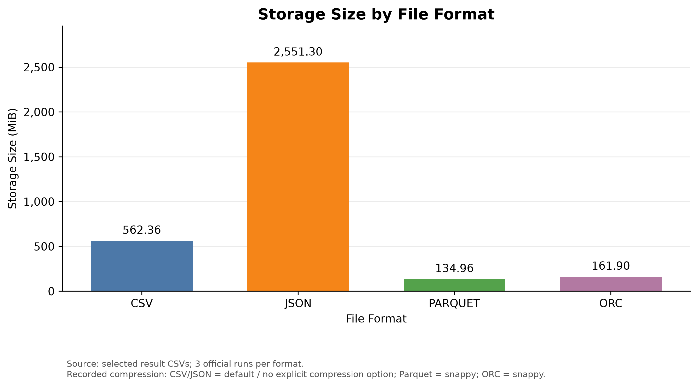
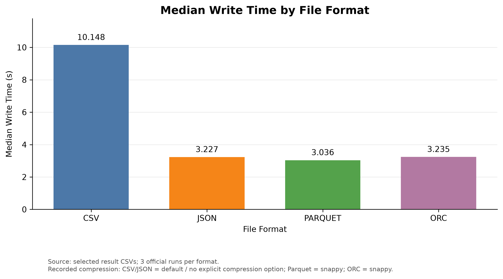
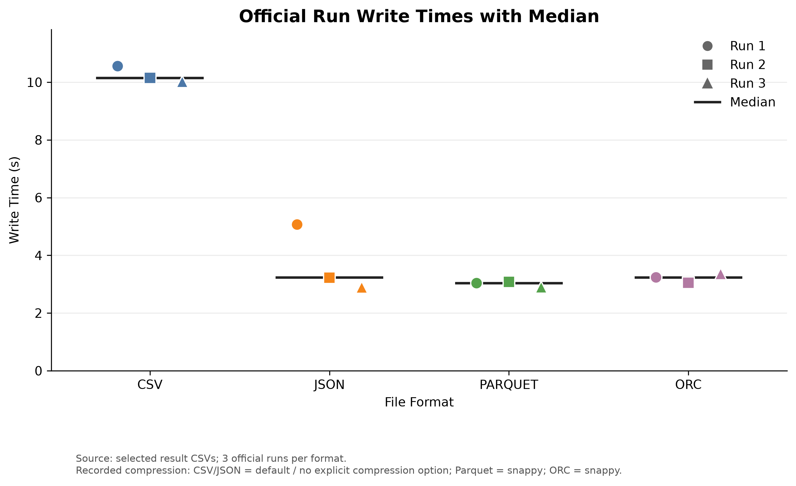
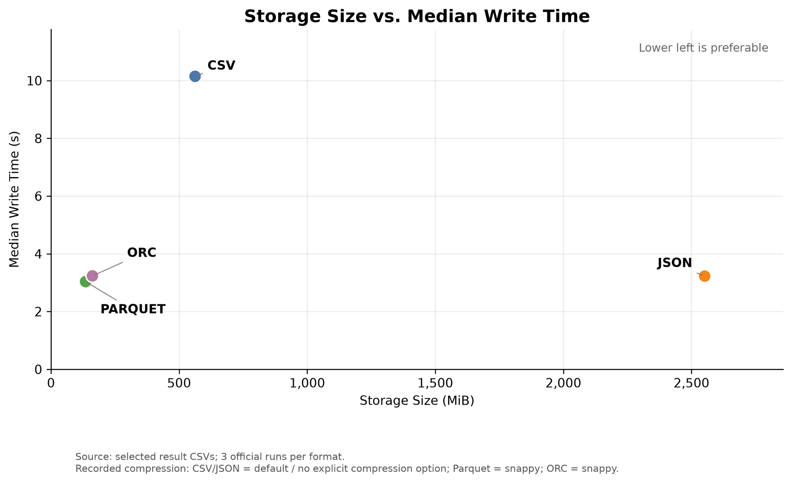

# Big Data Project Report

> **Project:** Low-level RDD Processing, File-format Benchmarking and Spark Deployment  
> **Team:** [Update team name]  
> **Last updated:** 9 October 2026 — code descriptions, notebook figures and analysis synchronized with the selected P0 results 
> **P0 update to Section 4.2:** 9 October 2026 — source-machine validation evidence recorded

## Table of Contents

1. [Project Overview](#1-project-overview)
2. [RDD Processing and Shared Variables](#2-rdd-processing-and-shared-variables)
3. [Spark Architecture and Deployment](#3-spark-architecture-and-deployment)
4. [File Formats and Partition Benchmark](#4-file-formats-and-partition-benchmark)
5. [Debugging and Performance Optimisation](#5-debugging-and-performance-optimisation)
6. [Results and Conclusion](#6-results-and-conclusion)
7. [References](#7-references)

## 1. Project Overview

### 1.1 Objective

<!-- Team lead: define problem, input, expected output and scope. -->

### 1.2 Repository Structure and Reproducibility

<!-- Describe how to run from a clean clone. -->

## 2. RDD Processing and Shared Variables

### 2.1 RDD Fundamentals

<!-- Owner: ID1. RDD definition, immutability, lineage, lazy evaluation,
transformations vs actions, fault tolerance and RDD vs DataFrame comparison. -->

### 2.2 Core RDD Pipeline

<!-- Owner: ID1. textFile -> parse -> filter -> Pair RDD -> reduceByKey -> Top 10. -->

### 2.3 Broadcast Variables and Accumulators

<!-- Owner: ID2. ip_country_map broadcast, invalid_log_counter and retry caveat. -->

### 2.4 Task 1 Result

<!-- Insert final Top 10 Countries result, invalid-record count and screenshot. -->

## 3. Spark Architecture and Deployment

### 3.1 Spark Application Architecture

<!-- Owner: ID5. Driver, Cluster Manager, Worker, Executor, Job, Stage and Task. -->

### 3.2 spark-submit and Deploy Modes

<!-- Owner: ID2 + ID5. client vs cluster, Standalone/YARN/Kubernetes. -->

### 3.3 Deployment Command and Reproducibility

<!-- Owner: ID5. Document main.py, utils.py, submit_job.sh and command. -->

## 4. File Formats and Partition Benchmark

### 4.1 Row-based versus Columnar Formats

#### 4.1.1 Storage Models and Encoding

CSV, JSON, Parquet, and ORC differ fundamentally in their data organization. CSV and JSON are record-oriented (row-based) text formats where entire records are serialized sequentially. While simple, portable, and human-readable, this layout generally requires analytical engines to scan the textual representation of each relevant record even when only a few fields are needed, offering no built-in support for type-aware storage optimization.

Conversely, Parquet and ORC use columnar binary storage, grouping values of the same column together. Parquet divides files into *row groups*, which contain contiguous *column chunks* that are further subdivided into *pages* (the basic unit for compression). ORC uses a similar structure based on *stripes*, which independently store data and indexes for their columns. This column-oriented design allows readers like Spark to access only the required columns, avoiding most physical I/O for unrequested column data.

This columnar grouping is highly advantageous for **encoding**, which is the way logical values are represented *before* general compression is applied. Because values in a single column share the same data type and often contain repeated patterns, Parquet and ORC natively apply type-aware encodings such as Dictionary Encoding (replacing repeated values with compact dictionary references), Run-Length Encoding (RLE), and bit-packing. 

It is important to distinguish this encoding from **compression**. Encoding exploits the statistical properties of a specific column, whereas compression applies a generic codec (like Snappy) to shrink the final byte stream. While CSV and JSON *can* be compressed using codecs such as gzip or Snappy, their main limitation is that they completely lack the built-in, column-aware encoding structures that make Parquet and ORC so efficient.

Ultimately, the distinction between these formats goes far beyond file syntax. CSV and JSON prioritize human readability and cross-system interoperability, whereas Parquet and ORC are purpose-built for large-scale analytical workloads, prioritizing compact storage and selective data access.

#### 4.1.2 Schema Handling

File formats differ fundamentally in how they handle schemas - the logical structure defining column names and data types required by Spark DataFrames. 

CSV files lack an embedded typed schema. While a header row provides column names, it does not define whether a field is an integer, string, or date. Consequently, Spark must either rely on a user-provided explicit schema or perform expensive schema inference by scanning the data. For example, our initial raw `flights.csv` was loaded using `inferSchema=True` before renaming columns. While convenient, inference requires extra I/O passes and risks misinterpreting ambiguous text.

JSON is partially self-describing, as individual records distinguish basic types (e.g., strings, numbers, booleans). However, a JSON dataset does not enforce a unified tabular contract; records can have missing or structurally varied fields. Like CSV, Spark must still either infer a global schema across all records or rely on a user-supplied one.

In contrast, Parquet and ORC embed typed schema metadata within their binary file structures. Spark can reconstruct the stored column names and data types from file metadata without scanning the data records to infer their types. While Spark can still perform schema evolution or merge differing schemas across multiple Parquet/ORC files, the files themselves natively carry explicit, unambiguous type definitions rather than relying on text interpretation.

**Schema enforcement and evolution.** CSV and JSON require a schema contract at read time to obtain consistent tabular types. Parquet and ORC store typed schema information when files are written, but a directory of such files does not itself provide a database-style contract governing every future write. Spark can merge mutually compatible file schemas when schema merging is enabled; this operation is disabled by default for Parquet and ORC in Spark 3.4.1.

Our canonical dataset has a recorded 31-column schema, including integer fields (`Year`, `Month`, `ArrDelay`) and the string field `Carrier`. Parquet and ORC readers recover stored field information from file metadata, but the resulting DataFrames should still be checked against `canonical_schema.json`. For example, Spark's Parquet reader makes columns nullable for compatibility. For CSV and JSON, supplying the canonical schema explicitly avoids adding schema-inference work to the planned read comparison.

#### 4.1.3 Column Pruning vs. Predicate Pushdown

**Column pruning and predicate pushdown** are distinct read optimizations in Spark. While both reduce unnecessary data loading, they operate on different parts of a query.

**Column pruning** limits the columns retrieved by a query. When a query selects a subset of fields, Spark’s optimizer propagates this projection to the data source. For columnar formats like Parquet and ORC, this yields direct physical I/O savings because unneeded column chunks are bypassed on disk. While Spark’s CSV and JSON readers can apply parser-level projection to discard unneeded fields early in memory, their row-oriented layout still requires scanning the underlying records. Thus, Parquet and ORC provide column-selective physical I/O, whereas text formats offer primarily logical projection.

**Predicate pushdown** handles row filtering (e.g., `WHERE ArrDelay > 60`). Spark 3.4.1 supports filter pushdown for Parquet, ORC, CSV, and JSON, but the physical benefits vary significantly by format. Parquet and ORC contain statistical metadata that can support data skipping. Parquet stores statistics for column chunks within row groups and may provide finer-grained page indexes, while ORC maintains statistics at file, stripe, and row-group levels. This allows Spark to evaluate a filter against the metadata and skip reading entire data blocks that cannot satisfy the condition. Because CSV and JSON lack equivalent built-in block statistics, their filter pushdown mainly allows the parser to reject individual records earlier during processing, rather than enabling metadata-driven disk skipping.

**Bloom filters** can complement min/max statistics for membership tests. A negative result rules out the queried value, while a positive result can be a false positive and requires further checking. Parquet can store Bloom filters for column chunks within row groups; ORC can store Bloom-filter indexes for selected columns and row groups. Their usefulness depends on writer configuration and reader support. These are conditional format capabilities: this write benchmark does not establish that Bloom filters or optional page indexes were present or used in the selected outputs.

This distinction directly impacts our benchmark read query:

```sql
SELECT Carrier, AVG(ArrDelay)
FROM data
GROUP BY Carrier;
```

Since this query requires only two of the 31 columns, it provides a strong opportunity to exercise column pruning. However, because it lacks a `WHERE` clause, it does not trigger predicate pushdown. Consequently, any performance differences observed during this query must not be attributed to predicate pushdown; they may instead reflect column pruning, format-specific reading and decoding behavior, compression/decompression costs, filesystem effects, and the common aggregation/shuffle work required by the query.

Additionally, selecting 2 out of 31 columns does not mean Parquet or ORC skips exactly 93.5% (29/31) of the file's bytes. Because different columns encode and compress at different rates depending on their data types and cardinality, the actual physical I/O savings depend on the specific compressed sizes of the unselected columns.

#### 4.1.4 Splitability and Distributed Spark I/O

Splitability determines whether a large file can be divided into independent chunks for parallel reading by multiple Spark tasks. In distributed processing, a non-splittable file can become a performance bottleneck because a large portion of the file may need to be processed by a single task, reducing the degree of parallelism available to Spark.

For CSV and JSON, splitability is conditional and depends heavily on record layout and compression. Standard uncompressed CSV and newline-delimited JSON can generally be split at record boundaries, allowing different byte ranges to be processed in parallel. However, splitability can be reduced or lost when the data uses a non-splittable compression codec or when records span multiple lines (e.g., multiLine=true for JSON). In these cases, Spark cannot safely use arbitrary byte-range boundaries as record boundaries, which can reduce read parallelism.

By contrast, Parquet and ORC are designed with internal structures that natively support parallel reads. Parquet organizes data into row groups, serving as logical units for parallelization. ORC divides files into independent stripes. Because row groups and stripes provide explicit structural boundaries and independently readable column data, Spark can use these structures to support parallel reads across the file.

When Spark reads data, it creates input partitions based on file size, format structure, filesystem characteristics, and configuration settings. While a Parquet row group or ORC stripe does not always translate to exactly one Spark task, their explicit internal boundaries make these formats highly suited for scalable, distributed I/O.

Ultimately, while line-oriented CSV and JSON can support parallel reading under specific configurations, their splitability remains sensitive to serialization choices. Parquet and ORC provide structured, independently readable regions by design, offering more predictable parallel I/O for large-scale analytical workloads.

**Storage-system blocks and file-format boundaries are different concepts.** HDFS stores files as blocks distributed across DataNodes. Amazon S3 stores objects and supports fetching selected byte ranges through ranged GET requests. Parquet row groups and ORC stripes are internal file-format structures that readers can use when planning access to the required data. Their boundaries should not be equated automatically with HDFS blocks, S3 upload parts or individual Spark tasks. This project's local-disk benchmark does not measure HDFS or S3 performance. [S1] [S6] [S7] [S8]

#### 4.1.5 CSV/JSON/Parquet/ORC Comparison Matrix

The characteristics discussed in Sections 4.1.1–4.1.4 are summarized below:

| Feature | CSV | JSON | Parquet | ORC |
|---|---|---|---|---|
| **Storage Organization** | Record-oriented text | Record-oriented text | Columnar binary | Columnar binary |
| **Storage Efficiency** | Low to moderate; compact syntax but lacks column-aware encoding | Low; repeated field names and syntax increase overhead | High; type-aware encoding and compression | High; type-aware encoding and compression |
| **Schema Handling** | No embedded typed schema; relies on explicit schema or inference | Partially self-describing, but still requires inference or a unified schema | Embedded typed schema metadata | Embedded typed schema metadata |
| **Type-aware Encoding** | No built-in column-aware encoding | No built-in column-aware encoding | Yes (e.g., dictionary, RLE, bit-packing) | Yes (e.g., dictionary, RLE, bit-packing, delta encoding) |
| **Column Pruning** | Limited to parser-level optimization; relies on row scans | Limited by record-oriented layout | Strong; unrequested column chunks can be avoided | Strong; unrequested column streams can be avoided |
| **Predicate Pushdown** | Supported by Spark, but lacks metadata-driven block skipping | Supported by Spark, but lacks metadata-driven block skipping | Supported; combines pushed filters with statistics for data skipping | Supported; combines pushed filters with statistics for data skipping |
| **Splitability** | Conditional; depends on record layout and compression codec | Conditional; newline-delimited JSON splits better than multiline | Naturally suited to parallel reads via row groups | Naturally suited to parallel reads via stripes |
| **Typical Analytical Use** | Data interchange and human-readable exports | Semi-structured data and nested records | Large-scale analytical processing and selective I/O | Large-scale analytical processing and selective I/O |

The core distinction among these formats is the structural information available to the reading engine. Parquet organizes row groups into contiguous column chunks and treats pages as the unit for encoding and compression, enabling selective column I/O. Similarly, ORC isolates columns within self-contained stripes and includes statistical metadata to support projection and data skipping.

It is important to note that predicate pushdown is supported for CSV and JSON in Spark 3.4.1. The difference lies in physical execution: while text-format readers can evaluate pushed filters earlier in the read and parsing path, they lack the embedded block-level statistics that allow Parquet and ORC to skip large physical regions when the metadata proves that those regions cannot satisfy the predicate.

The storage-efficiency labels in this matrix are qualitative. Actual file sizes depend heavily on the dataset, encoding decisions, compression codecs, null distributions, and writer configurations. The empirical storage results for this project's specific dataset and configuration are detailed in Section 4.2.

#### 4.1.6 Format-specific Technical Discussion

While CSV, JSON, Parquet, and ORC can represent the same logical dataset, their underlying designs serve different storage priorities, resulting in distinct performance profiles in Spark.

**CSV (Comma-Separated Values)** is a record-oriented text format using delimiters to separate fields. Its primary strengths are portability, human readability, and broad compatibility across tools and systems. However, because CSV stores values as text and lacks embedded data types, readers must rely on an explicit schema or interpret types during ingestion. It also incurs parsing overhead to handle quoting and escaping rules. Lacking column-aware encoding or embedded statistics, CSV is better suited for data interchange and simple exports than large-scale analytical scanning.

**JSON (JavaScript Object Notation)** is a text-based format offering greater structural flexibility. Each record contains explicit field names and can represent nested objects, arrays, and null values, making it highly useful for semi-structured data. This flexibility introduces substantial storage overhead, as field names and structural syntax are repeatedly serialized across records. In Spark, standard newline-delimited JSON (where each record is a single line) supports distributed reading better than multiline JSON. Still, JSON lacks the column-oriented encoding and block-level statistics that enable the storage-level optimizations available in Parquet and ORC.

**Parquet** is a binary columnar format optimized for analytical workloads. It organizes data into row groups containing separate column chunks, enabling Spark to read only the columns requested by a query. Within these chunks, Parquet can apply type-aware encoding and general-purpose compression, reducing both the storage footprint and I/O. Its embedded schema and statistical metadata support advanced optimizations like column pruning and predicate-based data skipping. Parquet also handles nested data structures well, making it versatile for complex analytical schemas.

**ORC (Optimized Row Columnar)** is a binary columnar format similarly designed for large-scale analytics. It organizes records into stripes, storing individual columns as separate streams. ORC files contain detailed schema information and statistics at multiple structural levels (file, stripe, and row group) to support efficient projection and metadata-driven data skipping for supported predicates. It utilizes type-specific encoding techniques such as dictionary encoding, Run-Length Encoding (RLE), bit-packing, and delta encoding. This physical organization minimizes disk I/O when reading selected columns or filtered data regions.

In summary, CSV and JSON prioritize **interoperability, readability, and flexible data exchange**, whereas Parquet and ORC prioritize **typed storage, compact representation, and efficient analytical access**. Parquet and ORC provide significantly richer storage-level optimizations for Spark, while CSV and JSON remain useful when simplicity and portability outweigh analytical performance.

#### 4.1.7 Implications for Our Read Query

The structural differences between these formats directly impact the read query used in this project:

```sql
SELECT Carrier, AVG(ArrDelay)
FROM data
GROUP BY Carrier;
```

The canonical Flight Delays dataset contains 31 columns, yet this query requires only two: `Carrier` for grouping and `ArrDelay` for aggregation. This makes the workload highly suitable for observing the effects of column pruning. When Spark reads Parquet or ORC, their columnar layouts allow the reader to access the required column chunks or streams while avoiding physical reads of unrequested column data. While CSV and JSON can benefit from parser-level projection during reading, their record-oriented text representation does not permit the same degree of column-selective physical I/O.

Because this query contains no `WHERE` clause, it does not exercise predicate pushdown. Any performance differences between formats must not be attributed to filter-based data skipping. A separately designed query with a filter condition would be required to evaluate predicate pushdown. The project protocol maintains this distinction and recommends examining the physical execution plan to verify column pruning independently.

Furthermore, the query performs a `GROUP BY Carrier` and computes `AVG(ArrDelay)`. This means all four formats execute common aggregation and shuffle operations after the values are read. Consequently, the final Read Query Time does not measure storage-format scanning in isolation; it reflects the combined cost of file I/O, parsing or decoding, decompression, column pruning, aggregation, and shuffle processing.

For a controlled comparison, the read benchmark should keep execution conditions identical across all formats. Specifically, CSV and JSON should be read using the previously saved canonical schema rather than relying on schema inference during the timed workload, while Parquet and ORC can recover their stored schema metadata directly. This avoids introducing schema-inference overhead as an additional variable in the comparison.

### 4.2 Write Benchmark: Size and Time

#### 4.2.1 Benchmark Objective and Scope

The objective of this benchmark is to empirically compare the **Disk Storage Size** and **Write Execution Time** of CSV, JSON, Parquet, and ORC when serializing the canonical 2015 Flight Delays dataset. To prevent upstream parsing, schema inference, and data preparation from being included in the measured write times, the canonical DataFrame was persisted using `StorageLevel.DISK_ONLY` and materialized before any timed write operations began.

The measured Write Execution Time represents the end-to-end Spark `.save()` operation. This includes accessing the persisted input, format-specific serialization and encoding, applicable compression, filesystem writing, and output-commit work. It excludes initial dataset loading, canonicalization, schema inference, materialization, output-size calculation, and result export. 

Importantly, this experiment serves as a **format-plus-compression comparison** rather than a pure format baseline: Parquet and ORC used the active Spark session compression setting of Snappy, whereas CSV and JSON were written without explicit compression options.

#### 4.2.2 Canonical Dataset

The benchmark uses the 2015 Flight Delays and Cancellations dataset as the canonical input. To ensure that differences in storage size and write time are not caused by dataset alterations, the same canonical DataFrame, with an identical row population, column set, and null values, was used for all four formats:

*   **Row Count:** 5,819,079 rows.
*   **Column Count:** 31 columns (none removed).
*   **Column Standardization:** Four fields were renamed (`YEAR` → `Year`, `MONTH` → `Month`, `AIRLINE` → `Carrier`, `ARRIVAL_DELAY` → `ArrDelay`).
*   **Null Policy:** All 105,071 null values in `ArrDelay` were retained without imputation or row removal.
*   **Data Preparation:** No filtering or deduplication was applied, preserving the full population.

Retaining the original null values is important because a missing arrival delay is semantically distinct from a zero delay. Furthermore, using this identical logical dataset provides a consistent baseline, ensuring that the comparison reflects differences in file-format serialization and the benchmark's compression configuration rather than variations in data cleaning or preprocessing.

##### *Supplementary Data Quality Findings*

* **Carrier reference consistency:** The supplied `airlines.csv` lookup contains **14 unique carrier codes**, each associated with a nonblank airline name. All eight specified lookup checks passed, including completeness, surrounding whitespace, code shape, key uniqueness, and exact coverage of the carrier codes recorded in the accepted P0 snapshot. This establishes consistency with the supplied reference table rather than independent certification of IATA assignments.

* **Arrival-delay missingness:** A supplementary review of the accepted Parquet output found **105,071 missing `ArrDelay` values** out of **5,819,079 records** (**1.81%**). All missing values occur in records marked as cancelled (**89,884; 85.55% of missing delays**) or diverted (**15,187; 14.45% of missing delays**). The **5,714,008 records** with both flags equal to zero have no missing arrival delays. Neither status flag contains null values or values outside the expected 0/1 domain.

* **Query interpretation:** Spark SQL excludes null values when computing `AVG(ArrDelay)`. The resulting mean therefore describes records with an observed arrival delay. `COUNT(*)` and `COUNT(ArrDelay)` have different denominators: the former counts all records, while the latter counts recorded delay values.

* **Scope and data policy:** These supplementary findings are recorded in `01_dataset_screening.ipynb`. The status-by-missingness analysis was performed on the accepted Parquet output and matched the two corresponding P0 totals. The existing dataset, retained null values, and benchmark outputs remain unchanged.

#### 4.2.3 Benchmark Protocol

To evaluate all formats under consistent conditions, the benchmark followed a repeatable execution protocol. The same materialized canonical DataFrame was used for every write, without applying any `repartition()` or `coalesce()` operations during the format comparison.

Execution proceeded in a fixed order: **CSV → JSON → Parquet → ORC**. One warm-up write was executed for each format before the three official rounds. The warm-up writes called the same write helper, but their returned timings were discarded and excluded from the official result records.

Write Execution Time was captured using Python's `time.perf_counter()` immediately surrounding the Spark `.format(fmt).save(output_path)` action. The reported write time for each format is the **median of the three official runs**, which reduces sensitivity to an unusually fast or slow individual run.

Disk Storage Size was calculated after each write by recursively summing the complete file lengths of generated `part-*` files. This includes metadata embedded inside those data files, such as format headers and footers, while excluding auxiliary files such as `_SUCCESS` and CRC sidecars. The metric represents logical data-file bytes, rather than allocated filesystem blocks. The final reported size describes the output remaining after the third official run.

#### 4.2.4 Compression Configuration

Compression settings varied across the formats, as the benchmark relied on the active Spark session configurations rather than applying standardized overrides. CSV (written with `header=true`) and JSON were written without specific compression options. Meanwhile, Parquet and ORC used the active Spark session compression setting of Snappy.

| Format | Writer Configuration | Compression Used |
|---|---|---|
| CSV | `header=true` | No explicit compression option |
| JSON | No additional options | No explicit compression option |
| Parquet | No per-write compression override | Snappy |
| ORC | No per-write compression override | Snappy |

Because Parquet and ORC utilized Snappy while CSV and JSON did not specify a codec, the storage-size and write-time results reflect a combination of file format and compression settings rather than structural differences alone. The compact sizes of Parquet and ORC may therefore reflect both their columnar encoding mechanisms and the use of Snappy compression.

#### 4.2.5 Selected P0 Write Benchmark Results

This report retains the selected P0 result snapshot from `output/format_benchmark/write_benchmark_runs.csv` and `output/format_benchmark/write_benchmark_summary.csv`. We identified these files as the selected standalone result set. Their twelve official-run records and four summary medians passed internal consistency checks during P0.

Each reported write time is the median of three official runs. The storage values describe the final official-run `part-*` files. At P0 acceptance, the output file counts and byte totals matched the selected summary and synchronized manifest. Subsequent formatting and visualization work introduced no new Spark benchmark measurements.

The selected write results are the standalone CSV files `output/format_benchmark/write_benchmark_runs.csv` and `output/format_benchmark/write_benchmark_summary.csv`, identified as the final standalone run. Their twelve measured records and four summary medians passed internal consistency checks during P0. Each reported Write Execution Time is the median of three official runs. The summary reports the final-run `part-*` file sizes; the current output file counts and byte totals match those values.

| Format | Compression | Median Write Time (s) | Disk Storage Size (MiB) | Part Files |
|---|---|---:|---:|---:|
| **CSV** | No explicit compression option | 10.148 | 562.36 | 16 |
| **JSON** | No explicit compression option | 3.227 | 2,551.30 | 16 |
| **Parquet** | Snappy | 3.036 | 134.96 | 16 |
| **ORC** | Snappy | 3.235 | 161.90 | 16 |

These measurements used a consistent 5,819,079-row, 31-column DataFrame with 16 input partitions under a shared Spark session configuration. The measured storage size for each format remained consistent across the runs. 

Storage is reported in MiB (calculated as `size_bytes / 1024²`), which clarifies the benchmark's historical `size_mb` field name. The performance implications of these results are detailed in Section **4.2.6**.

**Output acceptance.** On 9 October 2026, all four current outputs passed contract and aggregate validation against the current raw input on the machine: 31 fields with matching names, order and types; 5,819,079 rows; matching null counts across all columns, including 105,071 null `ArrDelay` values; Year/Month coverage; and matching per-Carrier row counts, non-null delay counts and delay sums for 14 carriers. File counts and byte totals also matched the synchronized manifest.

The validation ran with Python 3.11.9 and Spark 3.4.1, using `local[*]` and eight SQL shuffle partitions. These are validation-runtime observations and do not establish the historical write runtime. Evidence is stored in `output/id4_handoff/output_acceptance.json`, SHA-256 `cc97e7b6e50851e6936cac8b77d08ae1d929c421c342714c421f75a1b6987b7a`. The checks establish contract and aggregate agreement, not full row-by-row equality or receiver-machine acceptance.

#### 4.2.6 Interpretation and Figures

The four figures below use the selected P0 result CSVs. They present the same measurements as Section 4.2.5 and do not represent a new benchmark execution.

**Figure 1. Storage footprint**



* **Parquet has the smallest recorded output**, at **134.96 MiB**, followed by ORC (**161.90 MiB**), CSV (**562.36 MiB**) and JSON (**2,551.30 MiB**).
* Relative to CSV, the recorded output sizes are approximately **76.0% lower for Parquet** and **71.2% lower for ORC**. JSON occupies approximately **4.54 times** the CSV output size.
* These differences are consistent with the storage mechanisms discussed in Section 4.1. However, the measurements combine format layout, encoding and the recorded compression configurations; they do not isolate the contribution of each mechanism. [S1] [S2] [S6]

**Figure 2. Median write execution time**



* **Parquet has the lowest recorded median write time**, at **3.036 s**. JSON (**3.227 s**) and ORC (**3.235 s**) have similar medians, while CSV has the highest median at **10.148 s**.
* CSV's median write time is approximately **3.34 times** Parquet's median. These are comparisons of elapsed time in seconds.
* JSON produces the largest output but has a lower median write time than CSV. Output size alone therefore does not explain the observed timing order.

**Figure 3. Variation between official runs**



The individual measurements reveal variation that is not visible in the median-only comparison:

| Format | Minimum Write Time (s) | Maximum Write Time (s) | Observed Range (s) |
|---|---:|---:|---:|
| CSV | 10.018 | 10.557 | 0.539 |
| JSON | 2.890 | 5.067 | 2.177 |
| Parquet | 2.895 | 3.082 | 0.187 |
| ORC | 3.050 | 3.358 | 0.308 |

* **JSON has the largest observed range**, approximately **2.177 s**, while Parquet has the smallest observed absolute range, approximately **0.187 s**.
* JSON and ORC have medians that differ by approximately **0.008 s**, but their three recorded measurements span different intervals. Similar medians can therefore accompany different observed variation.
* These are descriptive findings from **three official runs per format**. They do not establish long-term variability or a statistically significant ranking among formats with similar timings.

**Figure 4. Combined storage and write-time comparison**



* **Parquet has both the smallest recorded output and the lowest recorded median write time** in the selected run set.
* ORC's output is approximately **93.7% smaller than JSON's**, while their median write times are similar. CSV uses less storage than JSON but has a higher median write time.
* Parquet's favorable position applies to the two metrics measured here. Read-query performance and partitioning behavior remain separate empirical questions for Section 4.3.

**Relationship to the theoretical discussion**

| Theoretical consideration | Observation in the selected benchmark | Interpretation limit |
|---|---|---|
| Columnar formats can combine type-aware encoding with compression. | Parquet and ORC produce smaller outputs than CSV and JSON. | The experiment does not isolate encoding from codec effects. |
| Encoding and compression require processing and can also reduce output bytes. | Parquet has both the smallest output and the lowest median write time. | The timing outcome depends on the combined execution costs for the workload. |
| End-to-end write time includes several execution and I/O components. | JSON produces more bytes than CSV but has a lower median write time. | Identifying the cause requires additional profiling. |
| Repeated measurements reveal variation hidden by a summary statistic. | JSON and ORC have similar medians but different observed ranges. | Three measurements provide limited evidence about repeatability. |

The timed operation includes access to the `DISK_ONLY` persisted input, serialization, encoding, applicable compression, task execution, filesystem writes and output-commit work. These measurements do not isolate individual components. Accordingly, the report does not attribute a format's timing or variation to a particular CPU, cache, garbage-collection or disk mechanism.

#### 4.2.7 Limitations

Several limitations apply to these benchmark results. First, the experiment ran on a single local machine using `local[*]`, rather than a multi-node Spark cluster. Consequently, write times reflect local hardware and storage behavior, and performance may differ in distributed environments like HDFS or cloud object storage. Furthermore, hardware specifications were not documented, limiting precise reproducibility.

Second, each format was measured using three official runs after a single warm-up, with a fixed execution order (CSV → JSON → Parquet → ORC). While using the median helps mitigate outliers, the small number of runs leaves room for runtime variability. Additionally, writes shared the same storage environment, and the operating system page cache remained uncontrolled between runs.

Third, compression was not consistent across formats. Parquet and ORC utilized Snappy, whereas CSV and JSON lacked an explicit compression option. Thus, differences in storage size and write time reflect a combination of format design and compression configuration, rather than the isolated effects of row-oriented versus columnar structures.

Finally, the benchmark measures end-to-end Spark write execution, including data access, serialization, compression, filesystem writes, and commit operations, without isolating individual factors like CPU cost or disk bandwidth. Accordingly, these results represent observations for this specific dataset, configuration, and environment, rather than broad performance rankings across other scenarios.

Persisting with `DISK_ONLY` moves the initial upstream preparation outside the measured writes, while the timed operation still accesses persisted data through the storage path. This benchmark therefore does not represent writes from an exclusively memory-resident input.

Historical provenance is incomplete: the exact producer-script checksum, precise execution time and full runtime/hardware inventory for the selected write run were not established. The current script checksum and the later output-validation evidence do not reconstruct those missing records. Output validation compares the current datasets with the current raw input and does not independently prove their identity with the historical run. Receiver-machine verification remains outstanding.

The saved P0 historical-producer status remains `UNVERIFIED`, and receiver validation in that acceptance record remains `NOT_PERFORMED_HERE`. Subsequent formatting checks, figure generation and documentation updates do not change those evidence scopes.

### 4.3 Read and Partition Benchmark

<!-- Owner: ID4. Query time, repartition, coalesce, partitionBy and small-file problem. -->

## 5. Debugging and Performance Optimisation

### 5.1 Data Skew and Slow Joins

<!-- Owner: ID6. Hot keys, salting, repartitioning and when broadcast join is valid. -->

### 5.2 Garbage Collection and Tungsten

<!-- Owner: ID6. Reducing GC pressure, not eliminating GC. -->

### 5.3 Driver OOM and Executor OOM

<!-- Owner: ID6. Separate causes and mitigations. -->

## 6. Results and Conclusion

<!-- Owner: ID6. Summarise validated results and limitations. -->

## 7. References

<!-- Use consistent citation format. -->
