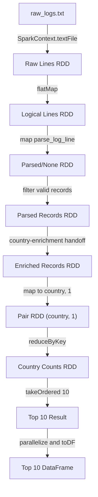

# Big Data Project Report

> **Project:** Low-level RDD Processing, File-format Benchmarking and Spark Deployment  
> **Team:** [Update team name]  
> **Last updated:** [YYYY-MM-DD]

## Table of Contents

1. [Project Overview](#1-project-overview)
2. [RDD Processing and Shared Variables](#2-rdd-processing-and-shared-variables)
3. [Spark Architecture and Deployment](#3-spark-architecture-and-deployment)
4. [File Formats and Partition Benchmark](#4-file-formats-and-partition-benchmark)
5. [Debugging and Performance Optimisation](#5-debugging-and-performance-optimisation)
6. [Results and Conclusion](#6-results-and-conclusion)
7. [References](#7-references)

## 1. Project Overview

### 1.1 Objective

<!-- Team lead: define problem, input, expected output and scope. -->

### 1.2 Repository Structure and Reproducibility

<!-- Describe how to run from a clean clone. -->

## 2. RDD Processing and Shared Variables

### 2.1 RDD Fundamentals

A **Resilient Distributed Dataset (RDD)** is Spark's low-level abstraction for
a collection of records distributed across partitions and processed in parallel.
RDDs are immutable: an operation does not update an existing RDD, but creates a
new one. They are also resilient because Spark records how each RDD depends on
its predecessors. This dependency history, or **lineage**, allows Spark to
recompute a lost partition from its source and the required transformations
without maintaining a full replica of every intermediate dataset.

RDD transformations are evaluated lazily. Calls such as `flatMap()`, `map()`,
`filter()`, and `reduceByKey()` first extend the lineage and the associated
directed acyclic graph (DAG); computation begins only when an action requires a
result. In Task 1, `reduceByKey()` is also a transformation, but it introduces a
shuffle boundary because values with the same key may reside in different
partitions. The relevant actions are `count()` and `takeOrdered(10)`. In
particular, `count()` materialises the cached parsed RDD so that every partition
is evaluated before the malformed-record accumulator is inspected. This makes
the accumulator useful for validation while avoiding normal downstream lineage
re-evaluation; the detailed accumulator limitations are discussed in Section
2.3.

Lineage is the basis of RDD fault tolerance. If an executor loses a partition,
Spark can reconstruct only the missing data by replaying its dependencies.
Caching or persistence can reduce the cost of repeated computation, but it does
not replace lineage: a lost cached partition is still recovered from the
recorded transformations.

| Criterion | RDD | DataFrame |
|---|---|---|
| Data model | Distributed collection of records without a required schema | Tabular data with named columns and a schema |
| Abstraction level | Low-level record and partition API | High-level relational API |
| Optimisation | Limited automatic optimisation because record semantics are opaque to Spark | Logical and physical plans are optimised by Spark's query engine |
| Control | Fine-grained control over custom transformations and partition-level processing | Declarative control through column expressions, SQL, joins, and aggregations |
| Typical use cases | Unstructured input, custom parsers, and low-level algorithms | Structured ETL, analytical queries, and schema-based processing |

Task 1 deliberately uses RDDs because `data/raw_logs.txt` contains raw web
access-log text that requires custom parsing, and the assignment explicitly
requires Spark's Low-Level API. A DataFrame is introduced only after the RDD
pipeline has produced the small, structured Top 10 result.

### 2.2 Core RDD Pipeline

Task 1 processes `data/raw_logs.txt`, a generated Common/Combined Log Format
dataset containing 10,000 records: 9,000 valid records and 1,000 malformed
records. Its conceptual flow is:

`raw_logs.txt` -> `SparkContext.textFile()` -> `flatMap()` ->
`map(parse_log_line)` -> `filter(valid records)` -> Pair RDD ->
`reduceByKey()` -> Top 10.

`SparkContext.textFile()` loads the file as an RDD whose elements are raw text
records. `flatMap(_expand_text_record)` then normalises each raw record into one
or more logical lines before parsing; for the generated one-record-per-line
input, it preserves one logical line per record. The following `map()` invokes
`parse_log_line` through `_parse_with_counter`. The parser validates the IPv4
address, timestamp and request layout, numeric HTTP status in the valid range,
and the request method, endpoint, and HTTP version. A valid line becomes a
`LogRecord` dictionary with `ip`, `timestamp`, `method`, `endpoint`, and
`status_code`; malformed input becomes `None`. The subsequent `filter()` removes
these `None` values, leaving only parsed records.

After the downstream country-enrichment handoff described in Section 2.3, each
enriched record is mapped to the Pair RDD entry `(country, 1)`. This is the
integration point for the shared-variable step rather than an implementation of
that step in the ID1.3 pipeline. `reduceByKey(add)` combines entries with the
same country into `(country, access_count)`. Equal keys must be grouped across
partitions, so this transformation causes a shuffle; its map-side local
combining reduces the amount of data transferred over the network.

Finally, `takeOrdered(10, key=lambda item: (-item[1], item[0]))` returns the ten
countries with the highest access counts, using country name as a deterministic
tie-breaker. Only this small result is parallelised and converted to a DataFrame
with the columns `country` and `access_count`.


```mermaid
flowchart TD
    A[raw_logs.txt] -->|SparkContext.textFile| B[Raw Lines RDD]
    B -->|flatMap| C[Logical Lines RDD]
    C -->|map parse_log_line| D[Parsed/None RDD]
    D -->|filter valid records| E[Parsed Records RDD]
    E -->|country-enrichment handoff| F[Enriched Records RDD]
    F -->|map to country, 1| G["Pair RDD (country, 1)"]
    G -->|reduceByKey| H[Country Counts RDD]
    H -->|takeOrdered 10| I[Top 10 Result]
    I -->|parallelize and toDF| J[Top 10 DataFrame]
```

**Figure 1. RDD lineage for the Task 1 log-processing pipeline.**

The following concise excerpt from `src/rdd_processing.py` shows the core
operations across the parsing, aggregation, and result-conversion functions:

```python
def build_parsed_rdd(
    spark_context: Any,
    input_path: str,
    invalid_log_counter: Any = None,
    cache_result: bool = False,
):
    raw_rdd = spark_context.textFile(input_path)
    logical_lines_rdd = raw_rdd.flatMap(_expand_text_record)
    parsed_or_none_rdd = logical_lines_rdd.map(
        lambda line: _parse_with_counter(line, invalid_log_counter)
    )
    parsed_rdd = parsed_or_none_rdd.filter(lambda record: record is not None)

    if cache_result:
        parsed_rdd.cache()
        parsed_rdd.count()

    return parsed_rdd


def aggregate_country_access(enriched_rdd: Any):
    country_pairs = enriched_rdd.map(lambda record: (record["country"], 1))
    return country_pairs.reduceByKey(add)


def to_top10_dataframe(country_counts_rdd: Any, spark: Any):
    top_ten = country_counts_rdd.takeOrdered(
        10, key=lambda item: (-item[1], item[0])
    )
    if not top_ten:
        return spark.createDataFrame([], "country string, access_count long")

    return spark.sparkContext.parallelize(top_ten).toDF(
        ["country", "access_count"]
    )
```

### 2.3 Broadcast Variables and Accumulators

When Spark executes a transformation, the function passed to it (for example the
lambda inside `map()`) is serialised and shipped to **every task** on the
executors. Any variable the function references is copied along with it. This
creates two problems: a large read-only variable is re-sent many times over, and
any change an executor makes to its copy never travels back to the driver.

**Shared variables** are the mechanism Spark provides for exactly these two
problems. Spark offers two kinds, serving opposite directions of data flow:

| Kind | Direction | Property | Purpose |
|---|---|---|---|
| Broadcast variable | Driver → Executor | Read-only | Distribute shared lookup data |
| Accumulator | Executor → Driver | Add-only | Aggregate statistics during execution |

#### 2.3.1 Broadcast Variable

A **broadcast variable** is a read-only value that the driver sends to each
executor **exactly once** and that the executor then caches in memory, instead
of shipping it with every task.

The driver creates one with `sc.broadcast(value)`. Spark splits the value into
blocks and distributes them peer-to-peer: an executor that already holds a block
can forward it to another executor, so the load on the driver does not grow
linearly with the number of nodes. On the executor side, code reads the value
through the `.value` attribute.

In this project, a broadcast variable carries the `ip_country_map` lookup table,
which maps an IPv4 `/24` prefix to a country name. Every record needs this table
during the enrichment step, so without broadcasting it would be serialised again
for each task:

```python
# Driver
ip_country_broadcast = sc.broadcast(IP_COUNTRY_MAP)

# Executor
def enrich_with_country(record):
    prefix = record["ip"].rsplit(".", 1)[0]
    record["country"] = ip_country_broadcast.value.get(prefix)
    return record

enriched_rdd = parsed_rdd.map(enrich_with_country)
```

A concrete illustration: suppose a job has 200 tasks and the lookup table is
10 MB. Without broadcasting, Spark transfers `200 × 10 MB = 2 GB` over the
network. With broadcasting, it transfers 10 MB to each executor — 100 MB across
10 executors, roughly a twenty-fold reduction.

A broadcast variable is **immutable**. If the source data changes after
broadcasting, the distributed copy does not update itself; the variable must be
released with `unpersist()` or `destroy()` and a new one broadcast in its place.

**When not to use a broadcast variable:**

1. **The data is too large for executor memory.** A broadcast variable must fit
   entirely in the memory of *every* executor. A table of several gigabytes will
   trigger `OutOfMemoryError` or push executors into a garbage-collection loop.
   For large data, a shuffle join lets Spark partition the work instead.
2. **The data is trivially small.** For a single constant or a list of a few
   elements, the bookkeeping cost of a broadcast variable outweighs the benefit;
   letting Spark serialise it with the closure is enough.
3. **The data is used once, or changes constantly.** Broadcasting pays off
   through repeated reuse. If the value is consulted only once, or must be
   destroyed and rebuilt every few operations, the distribution cost is never
   recovered.
4. **The data must be written to from executors.** Broadcast variables are
   read-only; mutating `.value` on an executor changes only that local copy.
   That requirement belongs to an accumulator.

#### 2.3.2 Accumulator

An **accumulator** is an add-only variable that lets executors send figures back
to the driver. The driver creates one with `sc.accumulator(0)`; each task keeps a
local copy and calls `.add()` on it; when a task **completes**, Spark sends its
local contribution to the driver and merges it into the running total.

Only the driver may read `.value`. Reading `.value` on an executor raises an
error, because at that point only the local value of the currently running task
exists, not the global total.

In this project, an accumulator counts malformed log records without a second
pass over the data and without stopping the job:

```python
# Driver
invalid_log_counter = sc.accumulator(0)

# Executor
def parse_with_counter(line):
    record = parse_log_line(line)
    if record is None:
        invalid_log_counter.add(1)
    return record

parsed_rdd = raw_rdd.map(parse_with_counter).filter(lambda r: r is not None)
parsed_rdd.cache()
parsed_rdd.count()                  # action that materialises the whole dataset

print(invalid_log_counter.value)    # driver only, and only after an action
```

Because Spark evaluates lazily, `invalid_log_counter.value` is **meaningful only
after an action has run**. Reading it beforehand always returns 0 — not because
there are no malformed records, but because the lineage has not been executed at
all.

#### 2.3.3 Limitation: accumulators are not exactly-once

The guarantee Spark offers depends on where `.add()` is called:

| Location of `.add()` | Spark's guarantee |
|---|---|
| Inside an **action** (for example `foreach`) | **Exactly-once** — Spark discards updates from retried tasks |
| Inside a **transformation** (for example `map`) | **No guarantee** — the count may be inflated or short |

Within a transformation, three situations distort the count:

1. **A task fails and is retried.** If a task dies partway through, Spark
   reschedules that partition. The contribution of the failed attempt may or may
   not already have been merged, which can double-count.
2. **Speculative execution.** With `spark.speculation=true`, Spark launches a
   duplicate of a slow task. Both copies add to the accumulator even though only
   one result is used.
3. **Lineage recomputation (the most common cause).** An RDD does not retain its
   results. If an uncached RDD feeds two actions, Spark replays the whole lineage
   for the second one, and the `map` containing `.add()` runs again from the
   start — doubling the count.

**The mitigation used in this project** is to cache the parsed and filtered RDD,
then materialise it exactly once with a single action before any downstream
action runs:

```python
parsed_rdd.cache()     # or .persist()
parsed_rdd.count()     # materialises the whole dataset exactly once
```

`count()` is preferred over `collect()`, which pulls the entire dataset to the
driver and risks exhausting driver memory, and over `take(n)`, which reads only
enough elements to satisfy `n` and therefore leaves the remaining partitions
unvisited, producing an undercount.

Even with caching, this remains risk reduction rather than a guarantee: it does
**not** make an accumulator exactly-once. If a cached partition is lost, Spark
rebuilds it from the lineage and the count drifts again. Accumulators are
therefore suited to observability and debugging figures, and should **not** be
treated as the source of truth for a business result. Where an exact number is
required, derive it from a deterministic transformation over the cached RDD —
for example `raw_rdd.count() - parsed_rdd.count()`.

#### 2.3.4 Classification of malformed records

The generator `src/generate_logs.py` produces `data/raw_logs.txt` with 90% valid
records and 10% malformed ones. The malformed 10% is split evenly across **four
error types**, which are precisely the cases where `parse_log_line()` returns
`None` and the accumulator counts.

The four types are checked **in the priority order below, stopping at the first
match**, so every malformed record belongs to exactly one type:

| # | Error type | Condition | Example |
|---|---|---|---|
| 1 | **Missing field** | Fewer fields parsed than the schema requires | `10.10.1.7 - - [22/Sep/2026:08:15:03 +0700] "GET /cart HTTP/1.1" 200` (no `bytes`) |
| 2 | **Malformed IPv4** | All fields present, but the IP field is not valid IPv4 | `999.12.44 - - [...] "GET / HTTP/1.1" 200 1234` |
| 3 | **Non-numeric status code** | All fields present, IP valid, status does not parse as an integer | `10.20.1.9 - - [...] "GET / HTTP/1.1" OK 1234` |
| 4 | **Malformed request** | All fields present, IP and status valid, but the method, endpoint or HTTP version is structurally wrong | `10.30.1.4 - - [...] "GET-only" 200 1234` |

The priority order is essential because one record can violate several
conditions at once. A line that both omits the `bytes` field and carries a bad
IP is classified as type 1, not type 2 — until the fields have been separated,
nothing can be concluded about the contents of any individual field. Because of
this rule, the four type counts always sum to exactly the number of malformed
records, with no record counted twice.

#### 2.3.5 Verification results

Executed on PySpark 3.5.9 (`local[*]`, OpenJDK 17) against a 10,000-line
`data/raw_logs.txt`:

| Measure | Result |
|---|---|
| Valid records | 9,000 (90.00%) |
| `invalid_log_counter.value` | 1,000 (10.00%) |
| Count after three further downstream actions | still 1,000 — no double counting |
| Records resolved to a country by the broadcast lookup | 9,000 of 9,000, across 14 countries |
| Sum of values from `reduceByKey(country)` | 9,000 = the number of valid records |
| Valid plus malformed | 9,000 + 1,000 = 10,000 = total input lines |

### 2.4 Task 1 Result

The Task 1 pipeline was validated end to end against the 10,000-record
synthetic access-log dataset. The validation covered log parsing, malformed-row
filtering, Broadcast IP-to-Country enrichment, Pair RDD aggregation,
`takeOrdered(10)`, and the final DataFrame conversion.

Parsing produced 9,000 valid records and safely rejected 1,000 malformed
records without terminating the Spark job. After materialization,
`invalid_log_counter` reported 1,000 and remained stable across repeated actions
on the cached parsed RDD.

The Broadcast map enriched all 9,000 valid records, leaving no record without a
country. This map-side lookup did not require a distributed join. The enriched
records were then mapped to `(country, 1)` pairs and aggregated with
`reduceByKey()` into `(country, access_count)` results for 14 countries. The
aggregated counts preserved all 9,000 valid records.

#### Validation Summary

| Metric | Result |
|---|---:|
| Total input records | 10,000 |
| Valid parsed records | 9,000 |
| Malformed records | 1,000 |
| Enriched records | 9,000 |
| Records without country | 0 |
| Distinct countries | 14 |
| Aggregated access count | 9,000 |
| Top 10 rows | 10 |
| Unit tests | 15/15 PASS |
| Accumulator stability | YES |

#### Top 10 Countries by Access Count

| Rank | Country | Access Count |
|------|---------|-------------:|
| 1 | Vietnam | 1967 |
| 2 | United States | 1676 |
| 3 | Japan | 1059 |
| 4 | Singapore | 780 |
| 5 | Germany | 617 |
| 6 | India | 575 |
| 7 | South Korea | 505 |
| 8 | Brazil | 428 |
| 9 | Australia | 357 |
| 10 | France | 322 |

Broadcast enrichment and the Pair RDD `reduceByKey()` aggregation operated
correctly and preserved all 9,000 valid records. The final Top 10 result was
converted to a DataFrame with the `country` and `access_count` columns. Task 1
end-to-end validation: **PASS**.

## 3. Spark Architecture and Deployment

### 3.1 Spark Application Architecture

<!-- Owner: ID5. Driver, Cluster Manager, Worker, Executor, Job, Stage and Task. -->

### 3.2 spark-submit and Deploy Modes

#### 3.2.1 What deploy mode decides

A Spark application always comprises two kinds of process. The **driver** runs
`main()`, builds the `SparkContext`, analyses the lineage, splits the job into
stages and tasks, and receives the results. The **executors** are the worker
processes that run those tasks and hold cached data.

Executors **always** run on cluster nodes. The only thing `--deploy-mode`
decides is: **where the driver runs.**

```text
client mode                              cluster mode
-----------------------------------      -----------------------------------
[Submit machine]                         [Submit machine]
  └── Driver  ◄──── results ────┐          └── spark-submit (exits after submit)
        │                       │                     │
        ▼                       │                     ▼
[Cluster]                       │        [Cluster]
  Executor 1 ───────────────────┤          Driver  ◄── runs INSIDE the cluster
  Executor 2 ───────────────────┤            ├── Executor 1
  Executor 3 ───────────────────┘            ├── Executor 2
                                             └── Executor 3
```

> `--deploy-mode` is unrelated to `--master local[*]`. In `local` mode there is
> no cluster at all — the driver and executors share a single JVM on one
> machine — and `--deploy-mode` is ignored.

#### 3.2.2 `--deploy-mode client`

The driver runs on the machine that issued `spark-submit`, which makes that
machine a live component of the application.

- Driver logs, `print()` output and stack traces appear directly in the
  terminal; results of `collect()`, `take()` and `show()` are displayed
  immediately.
- All scheduling traffic crosses the network between the submit machine and the
  cluster.
- **Closing the terminal or losing the network kills the application** — once
  the driver is gone, the executors are reclaimed.
- The submit machine must accept inbound connections from the executors back to
  the driver, which is often impossible behind NAT, a VPN or a firewall.
- The driver consumes local CPU and memory, so `collect()` on a large dataset
  exhausts the laptop's memory rather than the cluster's.

**Use for:** development, debugging, demonstrations, and interactive notebooks
(`spark-shell`, `pyspark`, Jupyter — these tools run *only* in client mode
because they require an interactive REPL loop).

#### 3.2.3 `--deploy-mode cluster`

The cluster manager allocates a container or node inside the cluster to host the
driver; `spark-submit` merely submits the application and exits.

- The submit machine can be shut down immediately afterwards and the job
  continues.
- The driver shares the cluster's internal network with the executors, so
  scheduling latency is far lower.
- The driver consumes cluster resources, declared with `--driver-memory` and
  `--driver-cores`.
- **Logs are not visible directly** — they must be retrieved through the Spark
  History Server, `yarn logs -applicationId <id>` or `kubectl logs`.
- The cluster manager can restart the driver automatically when it dies
  (`--supervise` on Standalone, `spark.yarn.maxAppAttempts` on YARN).
- Dependencies must live somewhere the cluster can reach (HDFS, S3) or be
  shipped with the job; they **cannot** be referenced by a local path on the
  submit machine.

**Use for:** production runs, long-running jobs, scheduled jobs and jobs
submitted from CI/CD.

#### 3.2.4 Comparison of client and cluster mode

| Criterion | `client` | `cluster` |
|---|---|---|
| Driver location | Submit machine | Node inside the cluster |
| Executor location | Inside the cluster | Inside the cluster |
| Viewing driver logs | Directly in the terminal | History Server / `yarn logs` / `kubectl logs` |
| Shutting down the submit machine | Application dies | Application keeps running |
| Scheduling latency | High (across WAN/VPN) | Low (within the cluster) |
| Driver resources | Local CPU and memory | Cluster resources |
| Automatic driver restart | No | Yes, if enabled |
| Network requirement | Executors must reach the submit machine | None |
| Dependency location | Local paths work | Must be on shared storage (HDFS/S3) |
| Interactive shell | Supported | Not supported |
| Typical use | Development, debugging, demos | Production, scheduled jobs |

#### 3.2.5 The three cluster managers

A **cluster manager** allocates resources — CPU, memory, containers — to a Spark
application. It answers *where the machines come from* to run the driver and
executors, which is a separate question from *where the driver runs*, decided by
the deploy mode.

> Mesos was formerly a fourth cluster manager but was deprecated in Spark 3.2
> and removed in Spark 4.0, so it is not covered here.

**Standalone** ships with the Spark distribution itself and consists of a master
process and worker processes. Nothing beyond Spark and a JVM is required.
`--master spark://<master-host>:7077`

- *Strengths:* the simplest to set up, lightweight, few moving parts. Well
  suited to a cluster dedicated to Spark.
- *Weaknesses:* runs Spark only, so resources cannot be shared with Hive, Flink
  or MapReduce; queueing and access control are rudimentary (FIFO by default);
  the master is a single point of failure unless configured for high
  availability with ZooKeeper.

**YARN** is the resource manager of the Hadoop ecosystem. Spark runs as an
ordinary YARN application in which an ApplicationMaster negotiates containers
with the ResourceManager. `--master yarn`

- *Strengths:* mature in enterprise environments; shares one cluster across
  several frameworks; offers hierarchical queues, quotas and priorities through
  the Capacity and Fair schedulers; integrates with Kerberos; exploits data
  locality with HDFS.
- *Weaknesses:* requires operating a full Hadoop cluster; configuration is
  involved; containers share host-level libraries, making dependency isolation
  between jobs difficult.
- In `cluster` mode the driver runs *inside* the ApplicationMaster. In `client`
  mode the ApplicationMaster only requests containers while the driver stays on
  the submit machine.

**Kubernetes** support has been generally available since Spark 3.1. The driver
and each executor run in their own pod.
`--master k8s://https://<api-server>:<port>`

- *Strengths:* thorough dependency isolation, since each job carries its own
  container image; fits cloud-native infrastructure and CI/CD; shares a cluster
  with other kinds of workload.
- *Weaknesses:* requires Kubernetes operational knowledge; pod start-up time
  adds latency to short jobs; the shuffle service and temporary storage need
  additional configuration.
- Primarily used in `cluster` mode; `client` mode requires the driver to sit in
  a pod with an address the executors can call back to.

| Criterion | Standalone | YARN | Kubernetes |
|---|---|---|---|
| Additional installation | None (ships with Spark) | Hadoop cluster | Kubernetes cluster |
| Shared with other frameworks | No | Yes | Yes |
| Dependency isolation | Weak | Moderate | Strong (container image) |
| Queues and quotas | Rudimentary (FIFO) | Strong (Capacity/Fair) | Namespaces and quotas |
| Security and authentication | Basic | Kerberos | RBAC and secrets |
| Operational complexity | Low | High | High |
| HDFS data locality | Only if co-located | Best | Weak (storage is separate) |
| Deploy modes supported | client and cluster | client and cluster | mainly cluster |

#### 3.2.6 Measured constraint: Python workers do not inherit `sys.path`

This subsection reports figures measured on a real machine rather than theory.

On PySpark 3.5 — the version pinned in `requirements.txt` (`>=3.5,<4`) — Python
workers **do not inherit the driver's `sys.path`**. A worker that cannot import
the module holding a pickled function dies at stage 0: the JVM reports
`Connection reset by peer`, which is in fact the worker failing to `import`
`rdd_processing` while unpickling a function that references it.

Because this repository keeps its modules in `src/`, the workers' working
directory never contains them, so the failure occurs **even when the job is
launched from the repository root**. This was measured against the repository
layout itself:

| Module location | Launched from repository root | PySpark |
|---|---|---|
| Repository root (earlier scaffold) | 3/3 passed | 3.5.9 |
| **`src/` (this repository)** | **fails — worker dies** | 3.5.9 |
| `src/`, with `src` on the worker's path | 11/11 checks passed | 3.5.9 |
| Either location | passes | 4.2.0 |

The cause was established by a controlled experiment: holding the launch
directory fixed and varying only the worker process's `PYTHONPATH`. Without it
the run failed; with it the run passed, reporting exactly 9,000 valid records
and 1,000 malformed ones. The cause is therefore conclusively the failed module
import, not networking, caching or the data itself. The underlying reason is
that Spark pickles module-level functions **by reference** — module name plus
qualified name — so the worker must be able to import that module.

Consequences for deployment. Note that, unlike a layout with modules at the
repository root, the `src/` layout leaves no configuration in which this can be
ignored:

| Situation | Impact |
|---|---|
| `local[*]`, launched from the repository root | **Fails** — `src/` is not on the workers' path |
| `local[*]`, with `src` exported on `PYTHONPATH` or shipped with `--py-files` | Passes |
| `cluster` mode | Fails unless the modules are shipped; the workers are on other machines, so no local path helps |

The standard remedy in the Spark documentation is to ship the modules with the
application:

```bash
spark-submit \
  --master <master> \
  --deploy-mode cluster \
  --py-files src/rdd_processing.py,src/generate_logs.py \
  src/main.py --input <input-path>
```

**This remedy could not be verified on the Windows machine used here.** Both
`--py-files` and `sc.addPyFile()` route through Hadoop's `FileUtil.chmod`, which
requires `winutils.exe`; without `HADOOP_HOME` the call fails while registering
the file, before the job starts. This is a limitation of Windows rather than of
the `--py-files` mechanism, and should be confirmed on the real deployment
environment.

### 3.3 Deployment Command and Reproducibility

<!-- Owner: ID5. Document main.py, utils.py, submit_job.sh and command. -->

## 4. File Formats and Partition Benchmark

### 4.1 Row-based versus Columnar Formats

<!-- Owner: ID3. CSV/JSON versus Parquet/ORC. -->

### 4.2 Write Benchmark: Size and Time

<!-- Owner: ID3. One canonical result table; include compression configuration. -->

### 4.3 Read and Partition Benchmark

<!-- Owner: ID4. Query time, repartition, coalesce, partitionBy and small-file problem. -->

### 4.3 Read and Partition Benchmark

### 4.3 Read and Partition Benchmark

#### 4.3.1 Read Query Benchmark

The read benchmark evaluates how efficiently CSV, JSON, Parquet, and ORC execute the same analytical query:

```sql
SELECT Carrier, AVG(ArrDelay)
FROM data
GROUP BY Carrier;
```

The query accesses only two columns, `Carrier` and `ArrDelay`, from the 31-column canonical dataset. Therefore, it provides an appropriate workload for observing the practical benefit of column pruning in columnar formats.

To keep the comparison consistent, CSV and JSON were read using the previously defined canonical schema rather than performing schema inference during the timed runs. Parquet and ORC recovered their stored schema directly from file metadata.

For each format, one warm-up query was executed and excluded from measurement. Three official runs were then performed, with `.collect()` used to trigger full Spark execution. The median execution time was used as the final Read Query Time.

| Format | Run 1 (s) | Run 2 (s) | Run 3 (s) | Median Read Time (s) |
|---|---:|---:|---:|---:|
| CSV | 2.786 | 2.586 | 2.396 | **2.586** |
| JSON | 2.321 | 2.496 | 2.368 | **2.368** |
| Parquet | 0.350 | 0.414 | 0.397 | **0.397** |
| ORC | 0.430 | 0.404 | 0.345 | **0.404** |

All four formats returned 14 result rows, corresponding to the 14 distinct carriers in the dataset, confirming that the same logical query was executed successfully for each format.

The results show a clear difference between the row-oriented text formats and the columnar binary formats. Parquet achieved the lowest median query time at approximately **0.397 seconds**, closely followed by ORC at **0.404 seconds**. In comparison, JSON required approximately **2.368 seconds**, while CSV required **2.586 seconds**.

Under this benchmark configuration, Parquet was therefore approximately **6.5 times faster than CSV** and approximately **6.0 times faster than JSON** for the tested query. ORC demonstrated nearly identical performance to Parquet.

These results are consistent with the storage characteristics described in Section 4.1. Because the query requires only two out of 31 columns, Parquet and ORC can exploit their columnar layouts to avoid reading unrequested column data. CSV and JSON may perform parser-level projection, but their record-oriented text representation still requires substantially more parsing of the underlying records.

However, the measured Read Query Time should not be interpreted as pure file-scan time. The benchmark includes file access, parsing or decoding, decompression, column pruning, aggregation, and Spark shuffle operations required by the `GROUP BY`. Furthermore, because the query contains no `WHERE` condition, the observed advantage cannot be attributed to predicate pushdown or metadata-based row-group skipping.

Within this dataset and execution environment, the experiment therefore provides empirical evidence that Parquet and ORC are considerably more suitable than CSV and JSON for selective analytical queries involving a small subset of columns.

---

#### 4.3.2 Partition Control

A **partition** is a chunk of a dataset that Spark can process independently. During a Spark stage, each partition is typically processed by one task. Therefore, the number and size of partitions directly influence parallelism, scheduling overhead, memory usage, and the physical files produced during write operations.

Too few partitions may reduce available parallelism and cause individual tasks to process large amounts of data, increasing memory pressure. Conversely, too many partitions may generate many small tasks, increasing scheduling overhead and potentially producing a large number of small output files.

Partition control therefore aims to balance:

- parallelism;
- per-task workload;
- scheduling overhead; and
- output file size.

A common initial estimate is:

```text
Number of partitions ≈ Dataset size / Target partition size
```

A target around **128 MB** may be used as an initial rule of thumb, but there is no universally optimal partition size. The appropriate number depends on the workload, cluster resources, data distribution, file format, and downstream access pattern.

Spark computational partitioning should also be distinguished from storage partitioning.

- **Spark/DataFrame partitions** determine how records are distributed for computation and can be changed using `repartition()` and `coalesce()`.
- **Storage partitions** are created using `partitionBy()` during writes and physically organize files into directories based on column values. This organization can later support **partition pruning**, allowing Spark to avoid reading directories that cannot satisfy a filter on the partition columns.

---

#### 4.3.3 `repartition()` and `coalesce()`

Both `repartition()` and `coalesce()` modify the number of DataFrame partitions, but they use different execution strategies.

`repartition()` can either increase or decrease the partition count. It performs a shuffle that redistributes records across the cluster and is therefore a wide transformation. This redistribution generally produces more balanced partitions but introduces additional network, serialization, and shuffle overhead.

`coalesce()` is primarily used to reduce the number of partitions. It normally avoids a full shuffle by combining existing partitions into a smaller number of partitions. This makes it less expensive in many situations, although the resulting partition sizes may be less evenly balanced.

In general:

- `repartition()` is appropriate when data needs to be redistributed evenly or when the number of partitions must be increased.
- `coalesce()` is appropriate when the main objective is to reduce the number of partitions while minimizing shuffle overhead.

The project evaluates these behaviors by writing the same Parquet dataset using:

```python
df.repartition(20)
```

and:

```python
df.coalesce(2)
```

The resulting number of files, average file size, total output size, and write execution time were then measured.

---

#### 4.3.4 Small File Problem

The **Small File Problem** occurs when a dataset is represented by a large number of very small files.

Although individual small files are valid, large collections of them can reduce performance because Spark and the underlying filesystem must repeatedly perform metadata lookup, file discovery, file opening, task creation, and scheduling operations.

Common causes include:

- writing data with too many Spark partitions;
- using `partitionBy()` with high-cardinality or highly skewed columns;
- frequent streaming or micro-batch writes;
- repeatedly appending small amounts of data; and
- filtering a dataset significantly while retaining the original large partition count.

The problem can be mitigated by:

- controlling output partition counts using `repartition()` or `coalesce()`;
- avoiding excessively high-cardinality storage partition columns;
- batching data before writing where possible; and
- periodically compacting existing small files into fewer, larger files.

File compaction can be implemented using Spark jobs with `repartition()` or `coalesce()`, while table formats such as Delta Lake, Apache Iceberg, and Apache Hudi also provide optimization mechanisms for managing file layout.

---

#### 4.3.5 Partition Control Experiment

The partition experiment used the canonical Parquet dataset as its input and evaluated three different output strategies:

1. `repartition(20)` — redistribute the dataset into 20 Spark partitions before writing;
2. `coalesce(2)` — reduce the dataset to two Spark partitions before writing;
3. `partitionBy("Year", "Month")` — physically organize the output into storage directories according to `Year` and `Month`.

The measured results were:

| Experiment | Write Time (s) | Part Files | Total Size (MiB) | Average File Size (MiB) |
|---|---:|---:|---:|---:|
| `repartition(20)` | 12.987 | 20 | 149.56 | 7.48 |
| `coalesce(2)` | 11.995 | 2 | 135.49 | 67.75 |
| `partitionBy(Year, Month)` | 8.599 | 27 | 136.92 | 5.07 |

These results demonstrate that Spark partition count has a direct effect on the number and size of output files.

With `repartition(20)`, Spark explicitly redistributed the dataset into 20 partitions before the write. As expected, the resulting Parquet dataset contained **20 part files**, with an average size of approximately **7.48 MiB**. Although redistribution can produce more balanced partitions, the experiment required a full shuffle, contributing to the highest observed write time of approximately **12.99 seconds**.

Using `coalesce(2)` reduced the output to only **two part files**, each averaging approximately **67.75 MiB**. This produced substantially larger files and avoided the proliferation of small output files. The write completed in approximately **12.00 seconds**, slightly faster than `repartition(20)` in this run. The result is consistent with the lower-shuffle design of `coalesce()`, although the difference is small enough that it should not be treated as a universal performance guarantee.

The `partitionBy("Year", "Month")` experiment produced **27 part files** across the physical partition directory structure and completed in approximately **8.60 seconds**. Since the dataset contains only the year 2015 and 12 months, the storage layout is logically organized into directories such as:

```text
Year=2015/
    Month=1/
    Month=2/
    ...
    Month=12/
```

However, the number of storage directories does **not** imply that exactly one data file will exist per directory. Multiple Spark tasks may write files into the same partition directory, which explains why 12 month values resulted in 27 physical part files.

This distinction is important: `partitionBy()` controls the **directory organization of stored data**, whereas `repartition()` and `coalesce()` primarily control the **Spark execution partitions** that feed the write operation.

---

#### 4.3.6 Interpretation of the Partition Results

The experiment illustrates the trade-off between parallelism and file granularity.

`repartition(20)` produced the greatest degree of output parallelism among the tested computational partition strategies, but also generated twenty relatively small files. For a dataset of approximately 150 MiB, an average file size of only around 7.48 MiB is considerably below the commonly used large-file target ranges for analytical storage. Increasing the partition count further would likely worsen the Small File Problem.

`coalesce(2)` moved in the opposite direction. By reducing the dataset to two partitions, it generated only two relatively large Parquet files. This layout reduces file-discovery and file-opening overhead for future reads. However, excessively aggressive coalescing on larger datasets could reduce write parallelism and create disproportionately large tasks.

The `partitionBy("Year", "Month")` output addresses a different problem. Its primary purpose is not to reduce the number of files but to organize the dataset according to common filtering dimensions. A later query such as:

```sql
SELECT *
FROM flights
WHERE Year = 2015
  AND Month = 7;
```

can potentially read only the corresponding `Year=2015/Month=7` directory instead of scanning the entire dataset. This optimization is known as **partition pruning**.

However, storage partitioning also increases the risk of small files. In this experiment, the partitioned output contained 27 files with an average size of approximately **5.07 MiB**, smaller than both the `repartition(20)` and `coalesce(2)` outputs. Therefore, although `partitionBy()` can improve filtered reads, it must be applied carefully. Partitioning on columns with very high cardinality could create a large number of directories and many small files.

The results therefore illustrate that these operations should not be treated as interchangeable optimizations:

- `repartition()` primarily redistributes data and controls computational parallelism;
- `coalesce()` efficiently reduces computational partitions and output file counts;
- `partitionBy()` creates a physical directory layout designed primarily for later query pruning.

The appropriate strategy depends on the objective of the workload rather than on minimizing the partition count alone.

---

#### 4.3.7 Limitations

The same experimental limitations described for the write benchmark also apply to the read and partition experiments. All tests were executed using `local[*]` on a single machine, so the results do not capture network shuffle behavior or distributed filesystem characteristics that would occur in a multi-node Spark cluster.

Only three official read runs were performed for each format, and operating-system caching was not explicitly controlled. Therefore, the absolute timing values should be interpreted as results for the tested environment rather than universal performance expectations.

The partition experiments were also executed once per strategy rather than through repeated benchmark rounds. Their measured write times are therefore useful for illustrating observed behavior but provide weaker evidence for direct timing comparisons than the three-run median protocol used for the format benchmark.

Finally, the experiment records average output file size, but an average alone does not measure partition balance. Two outputs can have the same average while containing substantially different minimum and maximum file sizes. A more detailed experiment could additionally record the smallest and largest part files to quantify partition-size skew.

Overall, the benchmark demonstrates two complementary findings. First, Parquet and ORC substantially outperform CSV and JSON for the tested selective analytical query. Second, Spark partition-management strategies materially influence the number, size, and physical organization of output files, demonstrating the practical trade-off between parallel processing, write cost, storage organization, and the Small File Problem.

## 5. Debugging and Performance Optimisation

### 5.1 Data Skew and Slow Joins

<!-- Owner: ID6. Hot keys, salting, repartitioning and when broadcast join is valid. -->

### 5.2 Garbage Collection and Tungsten

<!-- Owner: ID6. Reducing GC pressure, not eliminating GC. -->

### 5.3 Driver OOM and Executor OOM

<!-- Owner: ID6. Separate causes and mitigations. -->

## 6. Results and Conclusion

<!-- Owner: ID6. Summarise validated results and limitations. -->

## 7. References

<!-- Use consistent citation format. -->
