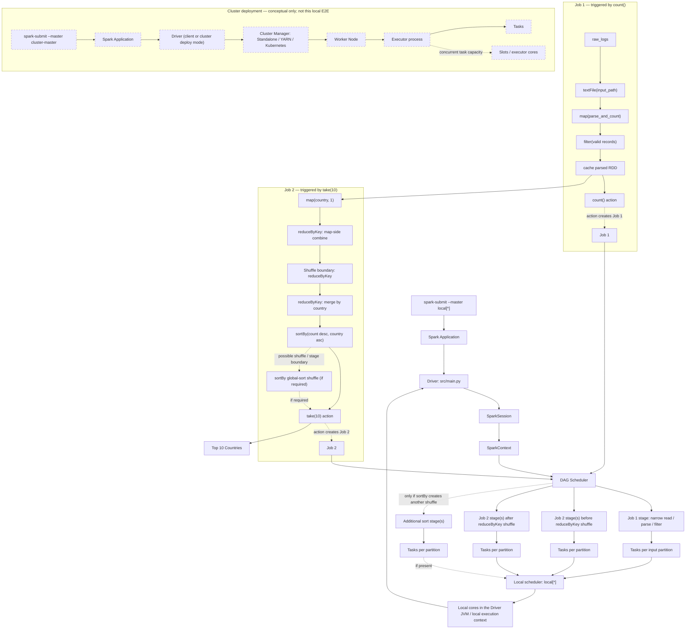

# Spark Application Runtime Architecture

The diagram combines the project's local RDD execution path with a separate,
conceptual cluster-deployment branch. Only the `local[*]` path represents the
project demo; cluster deployment has not been tested.

RDD transformations build lineage/DAG lazily; an action triggers a job. The DAG
Scheduler divides that job into stages according to dependencies and shuffle
boundaries, then stages run as tasks over partitions. In this pipeline,
`reduceByKey` has a shuffle boundary; `sortBy` may introduce another shuffle and
stage boundary depending on runtime behavior. The diagram describes stage
groups, not fixed stage or task counts: exact execution depends on Spark runtime,
input partitions, and configuration.

In `local[*]`, tasks use the local scheduler and local cores in the Driver JVM;
there is no separate Worker Node or Executor process. The dashed cluster branch
shows a conceptual distributed deployment only and is not a tested execution
path for this project.
