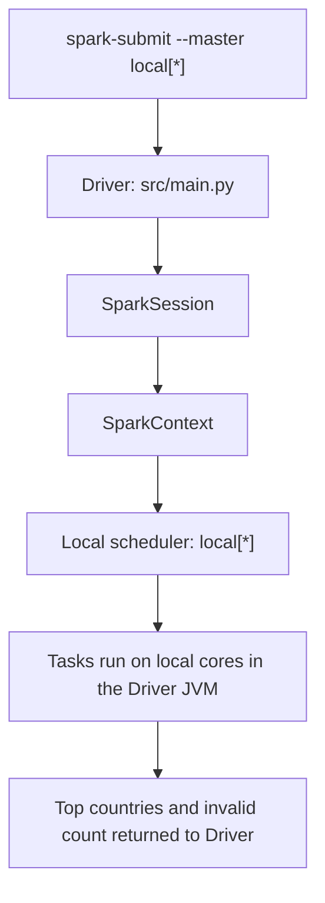
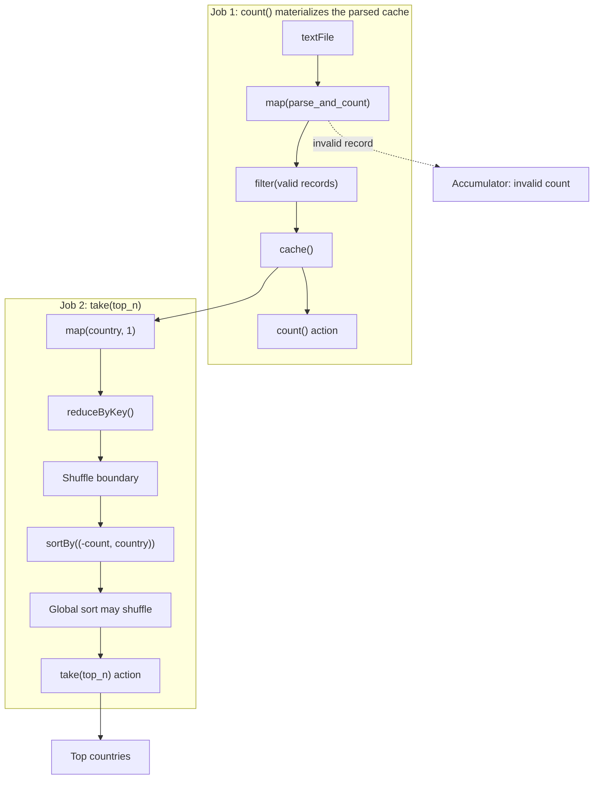
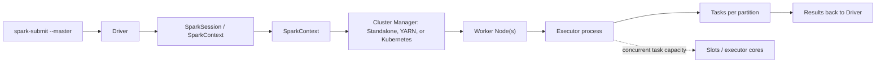

# Spark Runtime Architecture

The project submits `src/main.py` with `spark-submit`. The default `local[*]`
mode is the execution mode used for the demo. The cluster diagram below is a
conceptual deployment view; this project has not been tested on YARN,
Kubernetes, or a multi-node Standalone cluster.

## Local Demo Flow

In local mode there is no separate Cluster Manager, Worker Node, or Executor
process. `local[*]` lets Spark run local tasks using the available cores.

## RDD Jobs and Lineage

`count()` and `take()` are separate actions and create separate jobs. The
accumulator is updated while `parse_and_count` handles malformed rows; the
`count()` result is the number of valid parsed rows. The DAG Scheduler divides
work into stages at shuffle boundaries. Exact stage layout depends on Spark's
execution details and partition configuration.

## Conceptual Cluster Deployment

This conceptual view distinguishes a Worker Node (the machine/resource host)
from an Executor (an application process launched on a worker). Slots describe
potential concurrent task capacity, commonly related to executor cores; they
are not separate Spark processes. This cluster topology is explanatory only,
not a claim of successful cluster execution for this project.