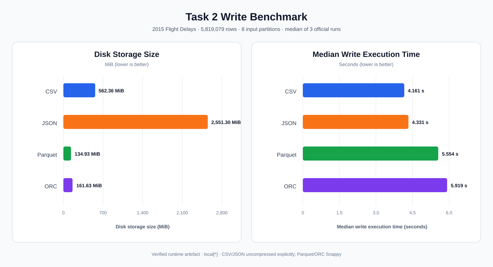

# Task 2 Benchmark Results

This is a verified runtime artefact derived directly from the generated Task 2
summary CSV files. It records the current measured evidence for slides and the
live demo; it does not replace or revise Section 4 of `REPORT.md`.

## Dataset contract

| Measure | Value |
|---|---:|
| Rows | 5,819,079 |
| Columns | 31 |
| Year | 2015 |
| Month range | 1–12 |
| Distinct carriers | 14 |
| Null `ArrDelay` values | 105,071 |
| Input partitions | 8 |

## Write benchmark

| Format | Median write (s) | Size (MiB) | Part files |
|---|---:|---:|---:|
| CSV | 4.161 | 562.36 | 8 |
| JSON | 4.331 | 2,551.30 | 8 |
| Parquet | 5.554 | 134.93 | 8 |
| ORC | 5.919 | 161.63 | 8 |

CSV and JSON use no explicit compression option. Parquet and ORC use Snappy.
JSON is substantially larger because every record repeats its field keys and
the benchmark does not explicitly compress JSON output.

## Read benchmark

| Format | Median read (s) |
|---|---:|
| CSV | 1.892 |
| JSON | 4.333 |
| Parquet | 0.256 |
| ORC | 0.245 |

## Partition experiment

| Experiment | Time (s) | Part files | Size (MiB) | Average file size (MiB) |
|---|---:|---:|---:|---:|
| `repartition(20)` | 9.007 | 20 | 150.21 | 7.51 |
| `coalesce(2)` | 8.237 | 2 | 135.57 | 67.78 |
| `partitionBy(Year, Month)` | 6.525 | 19 | 136.92 | 7.21 |

The 19 part files produced by `partitionBy(Year, Month)` do not contradict the
12 distinct months. Directory partition values and physical part-file counts
are different concepts: multiple upstream write tasks can create files within
the same logical year/month partition directory.

## Protocol and limitations

- The benchmark ran locally with `local[*]`.
- Write and read results use three official runs per format after the configured
  warm-up; the tables report their medians.
- Each partition strategy has one observed write-timing run, so those three
  timings should not be interpreted as medians.
- Operating-system file cache state was not controlled between measurements.
- The observed Spark `MemoryManager` warning was not an out-of-memory failure;
  the benchmark completed and produced the summary files used here.
- The source dataset and generated benchmark outputs are local runtime data and
  are not committed to the repository.

Runtime sources: `output/format_benchmark/write_benchmark_summary.csv`,
`output/partition_test/read_benchmark_summary.csv`, and
`output/partition_test/partition_benchmark_summary.csv`.
